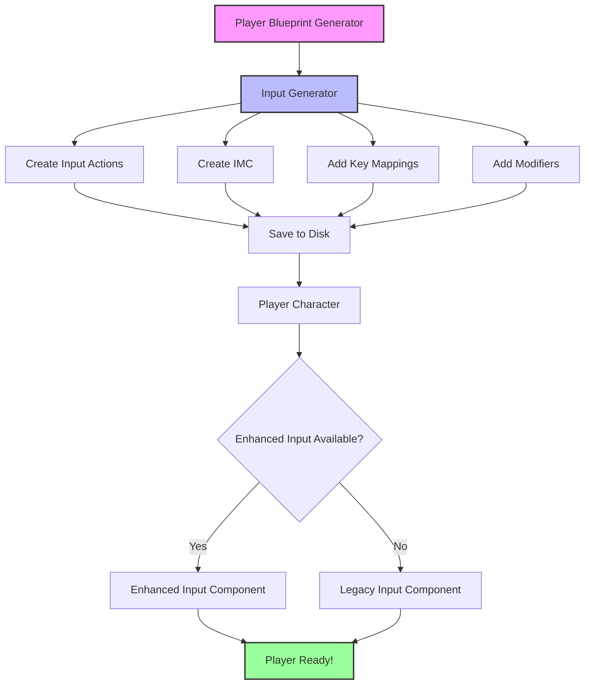

# Enhanced Input System — 🔥 KILLER FEATURE

**Enhanced Input System в Avatar Studio QS** — это **единственная в своем роде** система автоматической генерации полностью настроенного Enhanced Input для Unreal Engine 5.

То, что в обычном UE5 требует **часов ручной работы** в редакторе, здесь делается **автоматически одной кнопкой**.

---

## Проблема в обычном Unreal Engine 5

### Стандартный процесс настройки Enhanced Input:

1. **Создать Input Actions вручную** (10 ассетов) — **10 минут**
2. **Создать Input Mapping Context** — **2 минуты**
3. **Настроить привязки клавиш** (WASD, мышь, и т.д.) — **15 минут**
4. **Добавить Input Modifiers** для каждой клавиши:
   - W: Swizzle Input Axis Values (YXZ)
   - S: Swizzle + Negate
   - A: Swizzle (XZY) + Negate
   - D: Swizzle (XZY)
   - MouseY: Swizzle + Negate (для инвертированного взгляда)
   - **Время:** **30-40 минут**
5. **Настроить Input Component в C++** — **20 минут**
6. **Добавить fallback на Legacy Input** для UE4 — **15 минут**

**ИТОГО: ~1.5-2 часа работы**

И это нужно повторять для **каждого** проекта!

---

## Решение в Avatar Studio QS

### Сколько времени нужно?

1. Нажать **"Create Character"** в NPC Data Table
2. Выбрать анимации
3. Нажать **"Generate"**

**ИТОГО: 30 секунд**

Система **автоматически**:
- ✅ Создает 10 Input Actions с правильными типами
- ✅ Создает Input Mapping Context
- ✅ Добавляет все привязки клавиш
- ✅ **Программно добавляет Input Modifiers** (Swizzle, Negate)
- ✅ Сохраняет все на диск
- ✅ Настраивает fallback на Legacy Input
- ✅ **Игрок готов к игре сразу после создания!**

---

## Архитектура системы



---

## Компоненты системы

### 1. Input Generator (`FAS_QS_Player_InputGenerator`)

**Назначение:** Программное создание Input Assets

**Файлы:**
- `AS_QS_Player_InputGenerator.h`
- `AS_QS_Player_InputGenerator.cpp`

**Функции:**

#### A. Проверка доступности
```cpp
bool IsEnhancedInputAvailable()
```
Проверяет, доступен ли Enhanced Input (UE 5.0+)

#### B. Создание Input Actions
```cpp
UInputAction* CreateInputAction(
    const FString& ActionName,
    const FString& ValueType,
    const FString& PackagePath
)
```

Создает Input Action с правильным типом:
- **Axis2D** — для WASD (Move) и мыши (Look)
- **Axis1D** — для колеса мыши (Zoom)
- **Digital** — для кнопок (Jump, Interact, и т.д.)

#### C. Создание Input Mapping Context
```cpp
UInputMappingContext* GenerateInputMappingContext(
    const FString& BasePackagePath
)
```

Создает IMC и добавляет:
- Все key mappings (WASD, мышь, кнопки)
- **Input Modifiers** через `FAS_QS_InputUtils`
- Сохраняет на диск

**Путь сохранения:** `/Game/QuestSystem/Input/`

---

### 2. Input Utilities (`FAS_QS_InputUtils`)

**Назначение:** Программное добавление Input Modifiers

**Файлы:**
- `AS_QS_InputUtils.h`
- `AS_QS_InputUtils.cpp`

**Это уникальная утилита, которой НЕТ в публичном доступе!**

#### Методы:

##### A. AddSwizzle
```cpp
static void AddSwizzle(
    FEnhancedActionKeyMapping& Mapping,
    UObject* Outer,
    EInputAxisSwizzle Order
)
```

Добавляет модификатор **Swizzle Input Axis Values** для перестановки осей.

**Примеры:**
- `YXZ` — для W/S (клавиша → ось X вектора)
- `XZY` — для A/D (клавиша → ось Y вектора)

##### B. AddNegate
```cpp
static void AddNegate(
    FEnhancedActionKeyMapping& Mapping,
    UObject* Outer
)
```

Добавляет модификатор **Negate** для инверсии значения.

**Примеры:**
- S: Negate (движение назад)
- A: Negate (движение влево)
- MouseY: Negate (инвертированный взгляд)

##### C. AddDeadZone
```cpp
static void AddDeadZone(
    FEnhancedActionKeyMapping& Mapping,
    UObject* Outer,
    float Lower = 0.2f,
    float Upper = 1.0f
)
```

Добавляет модификатор **Dead Zone** для геймпадов.

##### D. AddScalar
```cpp
static void AddScalar(
    FEnhancedActionKeyMapping& Mapping,
    UObject* Outer,
    FVector ScaleFactor
)
```

Добавляет модификатор **Scalar** для масштабирования значения.

---

### 3. Enhanced Input Component (`UPlayerInputComponent_Enhanced`)

**Назначение:** Обработка Enhanced Input во время игры

**Файлы:**
- `PlayerInputComponent_Enhanced.h`
- `PlayerInputComponent_Enhanced.cpp`

**Функции:**

#### A. Инициализация
```cpp
void InitializeEnhancedInput(UInputComponent* PlayerInputComponent)
```

1. Загружает Input Actions из ассетов
2. Добавляет IMC в Enhanced Input Subsystem
3. Привязывает Input Actions к callback-функциям

#### B. Загрузка ассетов
```cpp
void LoadInputActions()
```

Загружает все 10 Input Actions из `/Game/QuestSystem/Input/`:
- `IA_Player_Move`
- `IA_Player_Look`
- `IA_Player_Zoom`
- `IA_Player_Jump`
- `IA_Player_Interact`
- `IA_Player_ToggleRun`
- `IA_Player_Sprint`
- `IA_Player_Crouch`
- `IA_Player_Aim`
- `IA_Player_Attack`

#### C. Callback-функции

Все callback-функции делегируют обработку через `IPlayerInputHandlerInterface`:

```cpp
void OnMove(const FInputActionValue& Value)
{
    const FVector2D MoveValue = Value.Get<FVector2D>();
    IPlayerInputHandlerInterface::Execute_HandleMove(GetOwner(), MoveValue);
}
```

Это обеспечивает **совместимость** с Legacy Input — обе системы используют один интерфейс!

---

### 4. Player Character (`AAS_PlayerCharacter`)

**Назначение:** Главный класс игрока с автоматическим fallback

**Файлы:**
- `AS_PlayerCharacter.h`
- `AS_PlayerCharacter.cpp`

**Ключевые особенности:**

#### A. Переменная-переключатель
```cpp
UPROPERTY(EditAnywhere, BlueprintReadWrite, Category = "Input")
bool bUseEnhancedInput = true;
```

Позволяет переключаться между Enhanced и Legacy Input в редакторе.

#### B. Два компонента ввода
```cpp
UPROPERTY()
TObjectPtr<UPlayerInputComponent_Legacy> LegacyInputComponent;

UPROPERTY()
TObjectPtr<UPlayerInputComponent_Enhanced> EnhancedInputComponent;
```

Оба компонента создаются в конструкторе, но используется только один.

#### C. Автоматический fallback
```cpp
void SetupPlayerInputComponent(UInputComponent* PlayerInputComponent)
{
    bool bShouldUseEnhanced = bUseEnhancedInput;
    
    // Проверяем доступность Enhanced Input
    if (bShouldUseEnhanced)
    {
        #if ENGINE_MAJOR_VERSION >= 5
        if (!EnhancedInputComponent || 
            !Cast<UEnhancedInputComponent>(PlayerInputComponent))
        {
            bShouldUseEnhanced = false;
        }
        #else
        bShouldUseEnhanced = false;
        #endif
    }
    
    // Инициализируем выбранную систему
    if (bShouldUseEnhanced)
    {
        EnhancedInputComponent->InitializeEnhancedInput(PlayerInputComponent);
    }
    else
    {
        LegacyInputComponent->InitializeInput(PlayerInputComponent);
    }
}
```

**Логика fallback:**
1. Проверяет `bUseEnhancedInput`
2. Проверяет версию движка (UE 5.0+)
3. Проверяет наличие компонента
4. Проверяет тип `PlayerInputComponent`
5. Если хоть одна проверка провалилась → **автоматически переключается на Legacy Input**

---

## Созданные Input Actions

| Input Action | Тип | Назначение | Клавиши |
|--------------|-----|------------|---------|
| `IA_Player_Move` | Axis2D | Движение WASD | W, A, S, D |
| `IA_Player_Look` | Axis2D | Взгляд мышью | MouseX, MouseY |
| `IA_Player_Zoom` | Axis1D | Зум камеры | MouseWheel |
| `IA_Player_Jump` | Digital | Прыжок | SpaceBar |
| `IA_Player_Interact` | Digital | Взаимодействие | E |
| `IA_Player_ToggleRun` | Digital | Переключение бег/ходьба | CapsLock |
| `IA_Player_Sprint` | Digital | Спринт | LeftShift |
| `IA_Player_Crouch` | Digital | Присесть | LeftControl |
| `IA_Player_Aim` | Digital | Прицеливание | RightMouseButton |
| `IA_Player_Attack` | Digital | Атака | LeftMouseButton |

---

## Конфигурация Input Modifiers

### WASD (Move - Axis2D)

```cpp
// W: Движение вперед (Key → Vector.X)
auto& W = NewIMC->MapKey(IA_Move, EKeys::W);
FAS_QS_InputUtils::AddSwizzle(W, NewIMC, EInputAxisSwizzle::YXZ);

// S: Движение назад (Key → -Vector.X)
auto& S = NewIMC->MapKey(IA_Move, EKeys::S);
FAS_QS_InputUtils::AddSwizzle(S, NewIMC, EInputAxisSwizzle::YXZ);
FAS_QS_InputUtils::AddNegate(S, NewIMC);

// D: Движение вправо (Key → Vector.Y)
auto& D = NewIMC->MapKey(IA_Move, EKeys::D);
FAS_QS_InputUtils::AddSwizzle(D, NewIMC, EInputAxisSwizzle::XZY);

// A: Движение влево (Key → -Vector.Y)
auto& A = NewIMC->MapKey(IA_Move, EKeys::A);
FAS_QS_InputUtils::AddSwizzle(A, NewIMC, EInputAxisSwizzle::XZY);
FAS_QS_InputUtils::AddNegate(A, NewIMC);
```

**Результат:** Плавное 2D движение во всех направлениях

### Mouse (Look - Axis2D)

```cpp
// MouseY: Взгляд вверх/вниз (инвертированный)
auto& MouseY = NewIMC->MapKey(IA_Look, EKeys::MouseY);
FAS_QS_InputUtils::AddSwizzle(MouseY, NewIMC, EInputAxisSwizzle::YXZ);
FAS_QS_InputUtils::AddNegate(MouseY, NewIMC);

// MouseX: Взгляд влево/вправо
NewIMC->MapKey(IA_Look, EKeys::MouseX);
```

**Результат:** Плавный контроль камеры

---

## Почему это уникально?

### Сравнение с индустрией:

| Функция | Avatar Studio QS | Типичные плагины | Epic примеры |
|---------|------------------|------------------|--------------|
| Создание Input Actions | ✅ Автоматически | ❌ Вручную | ⚠️ Пример в коде |
| Создание IMC | ✅ Автоматически | ❌ Вручную | ⚠️ Пример в коде |
| **Добавление Modifiers** | ✅ **Программно** | ❌ Вручную | ❌ Нет |
| Сохранение на диск | ✅ Автоматически | ❌ Вручную | ❌ Нет |
| Проверка существования | ✅ Да | ❌ Нет | ❌ Нет |
| Fallback на Legacy | ✅ Автоматически | ❌ Нет | ❌ Нет |
| Готовый к игре результат | ✅ **Да** | ❌ Нет | ❌ Нет |

**В публичном доступе НЕТ аналогов**, которые:
- Программно создают полностью настроенный Enhanced Input
- Добавляют модификаторы автоматически
- Делают игрока "готовым к игре" одной кнопкой

---

## Workflow: Создание игрока с Enhanced Input

### Шаг 1: Создайте NPC Data Table
- Нажмите **"Create NPC Asset"** во вкладке NPCs
- Укажите имя (например, `DT_PlayerCharacters`)

### Шаг 2: Добавьте строку для игрока
- Добавьте новую строку с ID (например, `Player_Warrior`)
- Установите флаг **`bIsPlayerCharacter = true`**

### Шаг 3: Нажмите "Create Character"
- Выберите анимации (Idle, Walk, Run, Jump)
- Нажмите **"Generate"**

### Результат:
Система автоматически создаст:
- ✅ `ABP_Player_Warrior` — Animation Blueprint
- ✅ `BS_Player_Warrior_Locomotion` — BlendSpace
- ✅ `BP_Player_Warrior` — Actor Blueprint
- ✅ **10 Input Actions** в `/Game/QuestSystem/Input/`
- ✅ **IMC_Player** с настроенными модификаторами
- ✅ **Готовый к игре персонаж!**

### Шаг 4: Играйте!
- Разместите `BP_Player_Warrior` на уровне
- Установите его как Default Pawn в Game Mode
- Запустите игру — **всё работает!**

---

## Технические детали

### Версионная совместимость

Вся система обернута в проверки версии:

```cpp
#if ENGINE_MAJOR_VERSION >= 5
    // Enhanced Input код
#else
    // Fallback на Legacy Input
#endif
```

Это гарантирует:
- ✅ Работу на UE 5.0+
- ✅ Автоматический fallback на UE 4.x
- ✅ Отсутствие ошибок компиляции на старых версиях

### Build Dependencies

Модуль `EnhancedInput` добавлен в оба Build.cs:
- `Avatar_Studio_QS.Build.cs`
- `Avatar_Studio_QS_RT.Build.cs`

```csharp
PrivateDependencyModuleNames.AddRange(new string[]
{
    "EnhancedInput",
    // ...
});
```

### Проверка существования

Перед созданием ассетов система проверяет их существование:

```cpp
if (DoesAssetExist(FullPackageName))
{
    // Загружаем существующий ассет
    return Cast<UInputAction>(AssetPath.TryLoad());
}
```

Это предотвращает:
- ❌ Дублирование ассетов
- ❌ Перезапись существующих настроек
- ✅ Позволяет безопасно вызывать генератор многократно

---

## Расширение системы

### Добавление нового Input Action

1. Добавьте имя в `InputActionNames`:
```cpp
const TArray<FString> InputActionNames = {
    TEXT("Move"),
    TEXT("Look"),
    // ...
    TEXT("YourNewAction")  // Новое действие
};
```

2. Создайте Input Action в `GenerateInputActions`:
```cpp
CreateInputAction(TEXT("YourNewAction"), TEXT("Digital"), InputPath);
```

3. Добавьте привязку в `GenerateInputMappingContext`:
```cpp
if (IA_YourNewAction)
{
    NewIMC->MapKey(IA_YourNewAction, EKeys::F);
}
```

4. Добавьте UPROPERTY в `PlayerInputComponent_Enhanced.h`:
```cpp
UPROPERTY(EditAnywhere, BlueprintReadOnly, Category = "Enhanced Input|Actions")
TObjectPtr<UInputAction> IA_YourNewAction;
```

5. Загрузите в `LoadInputActions`:
```cpp
IA_YourNewAction = LoadObject<UInputAction>(nullptr, *(BasePath + TEXT("/IA_Player_YourNewAction.IA_Player_YourNewAction")));
```

6. Привяжите в `InitializeEnhancedInput`:
```cpp
if (IA_YourNewAction)
{
    EnhancedInputComponent->BindAction(IA_YourNewAction, ETriggerEvent::Triggered, this, &UPlayerInputComponent_Enhanced::OnYourNewAction);
}
```

7. Добавьте callback:
```cpp
void UPlayerInputComponent_Enhanced::OnYourNewAction(const FInputActionValue& Value)
{
    IPlayerInputHandlerInterface::Execute_HandleYourNewAction(GetOwner());
}
```

---

## Заключение

**Enhanced Input System в Avatar Studio QS** — это **пионерское решение**, которое:

- 🏆 **Экономит часы работы** — то, что обычно занимает 1.5-2 часа, делается за 30 секунд
- 🔥 **Уникально** — нет аналогов в публичном доступе
- ✅ **Полностью автоматизировано** — от создания до сохранения на диск
- 🎯 **Готово к игре** — игрок работает сразу после создания
- 🛡️ **Надежно** — автоматический fallback на Legacy Input
- 🔧 **Расширяемо** — легко добавлять новые действия

Это **killer feature**, который делает Avatar Studio QS **единственным в своем роде** плагином для Unreal Engine!

---

**Далее:** [Runtime Systems](runtime_systems.md)
