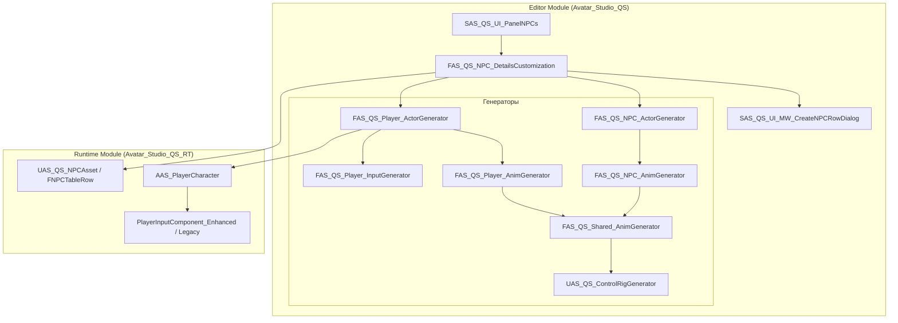
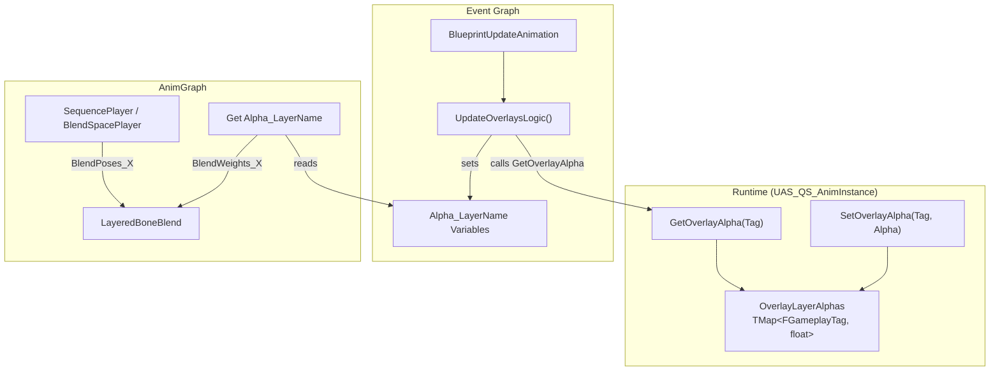
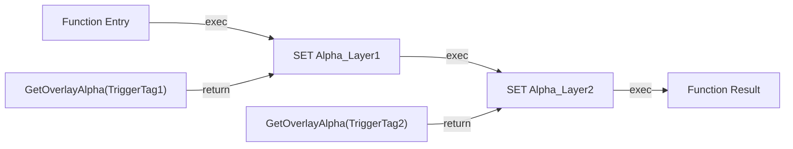
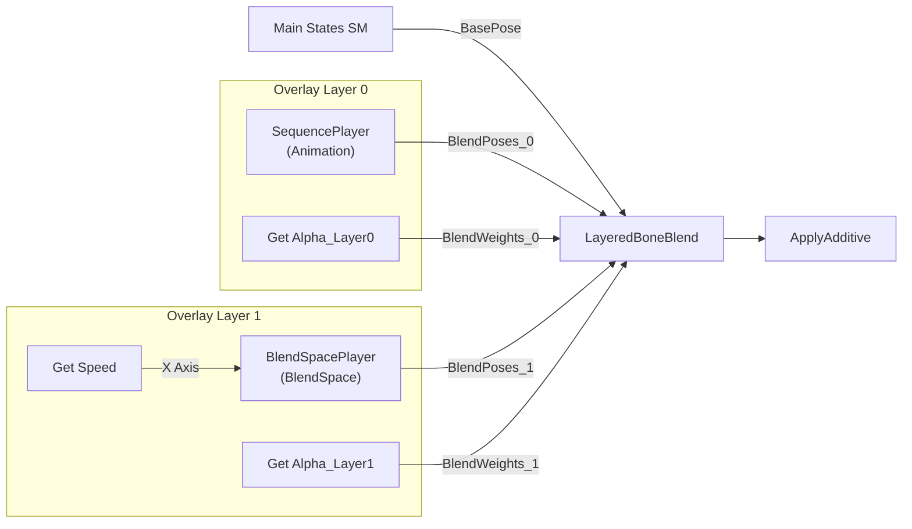
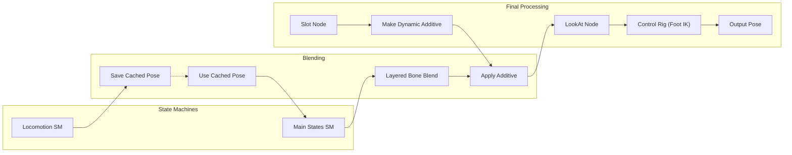
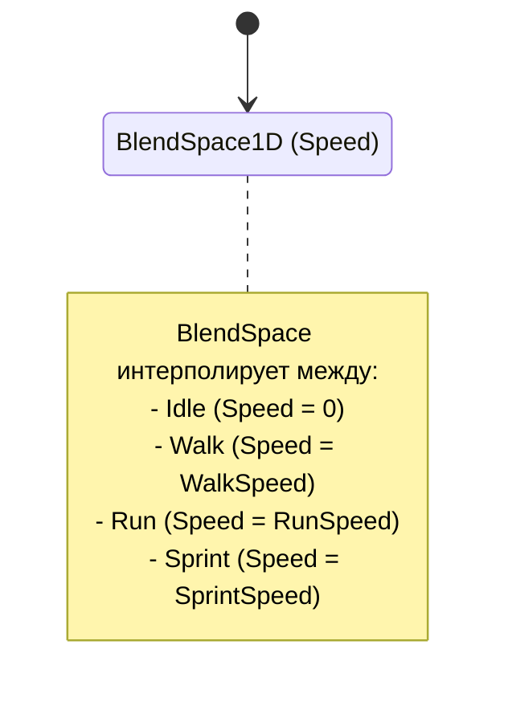
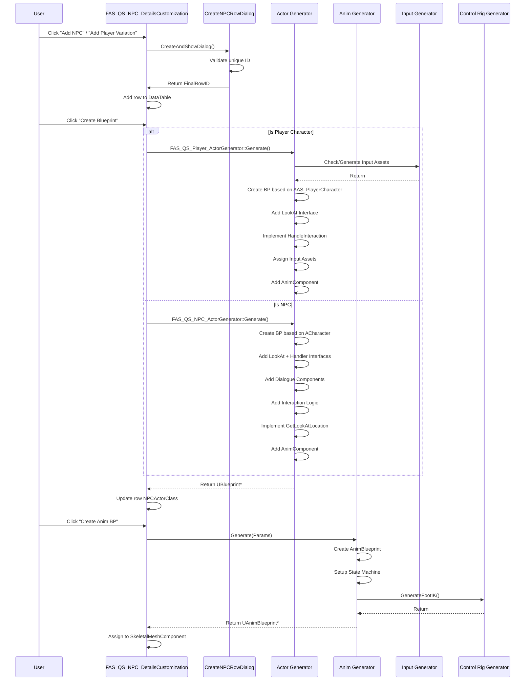

# Анализ системы создания NPC и Главного Героя (ГГ)

## Обзор

Плагин Avatar Studio QS предоставляет комплексную систему для автоматизированного создания персонажей — как NPC, так и Главного Героя (Player Character). Система включает генерацию Blueprint-актеров, Animation Blueprint, Control Rig для Foot IK, а также полную интеграцию с системами диалогов, взаимодействия и ввода.

---

## Архитектура системы



---

## Структуры данных

### FNPCTableRow (Строка таблицы персонажей)

**Файл:** `Avatar_Studio_QS_RT/Public/NPCs/AS_QS_NPCAsset.h`

Основная структура данных для хранения информации о персонаже:

| Поле | Тип | Описание |
|------|-----|----------|
| `NPCActorClass` | `TSoftClassPtr<AActor>` | Ссылка на Blueprint-класс персонажа |
| `DisplayName` | `FText` | Локализуемое имя для UI |
| `Portrait` | `TSoftObjectPtr<UTexture2D>` | Портрет для диалогов |
| `CharacterVoiceAssets` | `TArray<TSoftObjectPtr<UAS_DS_VoiceAsset>>` | Голосовые ассеты |
| `FactionIDs` | `TArray<FName>` | Идентификаторы фракций |
| `PersonalityTraits` | `TArray<FGameplayTag>` | Теги личности |
| `RaceTag` | `FGameplayTag` | Тег расы |
| `GenderTag` | `FGameplayTag` | Тег пола |
| `NPCStatusTag` | `FGameplayTag` | Текущий статус |
| `bIsPlayerCharacter` | `bool` | Флаг для различия NPC/ГГ |

### UAS_QS_NPCAsset (DataTable)

Класс `UDataTable`, содержащий записи `FNPCTableRow`. Предоставляет:
- Автоматическую привязку к `FNPCTableRow`
- Временное хранилище `LastSelectedRowName` для UI редактора

---

## Генераторы NPC

### FAS_QS_NPC_ActorGenerator

**Файлы:** 
- `Avatar_Studio_QS/Public/NPCs/Generators/AS_QS_NPC_ActorGenerator.h`
- `Avatar_Studio_QS/Private/NPCs/Generators/AS_QS_NPC_ActorGenerator.cpp`

**Основная функция:** `Generate(FName RowName, const FString& BasePackagePath, const FGameplayTag& GenderTag, const FGameplayTag& RaceTag)`

#### Процесс генерации NPC Blueprint:

1. **Создание Blueprint-ассета**
   - Базовый класс: `ACharacter`
   - Формат имени: `BP_{RowName}`
   - Путь: `{BasePackagePath}/Blueprints/`

2. **Добавление интерфейсов**
   - `UAS_QS_LookAtInterface` — для системы взгляда
   - `UAS_IS_HandlerInterface` — для системы взаимодействия

3. **Настройка коллизии капсулы**
   - Установка `ECR_Block` для канала Visibility

4. **Добавление компонентов диалога** (метод `AddDialogueComponents`):
   - `UBPC_DialogueExecutor` — исполнитель диалогов
   - `UAudioComponent` — аудио компонент для голоса
   - `UAS_QS_LookAtControllerComponent` — контроллер взгляда
   - `USphereComponent` (PerceptionSphere) — радиус восприятия (1000 ед.)
   - `UAS_IS_ScannerComponent` — сканер объектов

5. **Добавление логики взаимодействия** (метод `AddInteractionLogic`):
   - `UAS_IS_InterComponent` — компонент взаимодействия
   - `UAS_IS_PointComponent` — точка-маркер для UI (Z=85)
   - Генерация Blueprint-графа для `HandleInteraction`:
     - Event → Print String → RequestDialogue

6. **Переменная NPC_ID**
   - Тип: `FName`
   - Категория: "Dialogue"
   - Значение: имя строки из таблицы

7. **Реализация интерфейса GetLookAtLocation** (метод `ImplementLookAtInterface`):
   - Приоритет 1: Сокет "head"
   - Приоритет 2: Кость "head"
   - Fallback: Позиция капсулы + смещение (0, 0, 80)

8. **Автоматическое присвоение тегов и меша**
   - Вызов `FAS_QS_EditorTagger::AssignTagToBlueprint` для пола и расы
   - Вызов `FAS_QS_Shared_MeshHelper::AssignSkeletalMeshByGender`

9. **Добавление AnimComponent**
   - `UAS_QS_AnimComponent` — для анимационной логики

---

## Генераторы Главного Героя (ГГ)

### FAS_QS_Player_ActorGenerator

**Файлы:**
- `Avatar_Studio_QS/Public/NPCs/Generators/AS_QS_Player_ActorGenerator.h`
- `Avatar_Studio_QS/Private/NPCs/Generators/AS_QS_Player_ActorGenerator.cpp`

**Основная функция:** `Generate(FName RowName, const FString& BasePackagePath, const FGameplayTag& GenderTag, const FGameplayTag& RaceTag)`

#### Отличия от NPC генератора:

| Аспект | NPC | Player Character |
|--------|-----|------------------|
| Базовый класс | `ACharacter` | `AAS_PlayerCharacter` |
| Переменная ID | `NPC_ID` | `Character_ID` |
| Input система | Нет | Enhanced Input + Input Actions |
| Компоненты камеры | Нет | Spring Arm + Camera |
| Взаимодействие | Только как цель | Инициатор + цель |

#### Процесс генерации ГГ Blueprint:

1. **Генерация Input ассетов** (если еще не существуют):
   - Input Actions (Move, Look, Zoom, Jump, Interact, etc.)
   - Input Mapping Context (IMC_Player)

2. **Назначение Input Assets в Blueprint**
   - Поиск `PlayerInputComponent_Enhanced` в CDO
   - Установка `InputMappingContext` и всех `IA_*`

3. **Добавление LookAt интерфейса**

4. **Переменная Character_ID**
   - Категория: "Character Data"

5. **Реализация интерфейсов** (метод `ImplementInterfaces`):
   - `HandleInteraction` — Print String
   - `GetLookAtLocation` — аналогично NPC

6. **Авто-присвоение тегов и меша**

7. **AnimComponent**

---

## Базовый класс AAS_PlayerCharacter

**Файл:** `Avatar_Studio_QS_RT/Public/NPCs/AS_PlayerCharacter.h`

### Наследование:
```
ACharacter
    ├── IPlayerInputHandlerInterface
    └── IAS_IS_HandlerInterface
```

### Компоненты:

| Компонент | Класс | Назначение |
|-----------|-------|------------|
| `EnhancedInputComponent` | `UPlayerInputComponent_Enhanced` | Enhanced Input (UE5+) |
| `LegacyInputComponent` | `UPlayerInputComponent_Legacy` | Legacy Input |
| `CameraBoom` | `USpringArmComponent` | Держатель камеры |
| `FollowCamera` | `UCameraComponent` | Камера от 3-го лица |
| `ScannerComponent` | `UAS_IS_ScannerComponent` | Поиск интерактивных объектов |
| `InteractionManager` | `UAS_IS_PlayerInteractionComponent` | Менеджер взаимодействий |
| `InteractionComponent` | `UAS_IS_InterComponent` | Как цель для других |
| `InteractionPoint` | `UAS_IS_PointComponent` | UI-маркер |
| `DialogueExecutor` | `UBPC_DialogueExecutor` | Обработка диалогов |
| `VoiceAudioComponent` | `UAudioComponent` | Голос и липсинг |
| `LookAtController` | `UAS_QS_LookAtControllerComponent` | Поворот головы |

### Параметры движения:

| Параметр | Значение по умолчанию |
|----------|----------------------|
| `WalkSpeed` | 200 |
| `RunSpeed` | 600 |
| `SprintSpeed` | 900 |

### Параметры камеры:

| Параметр | Значение |
|----------|----------|
| `ThirdPersonCameraSocketOffsetY` | 40 |
| `ThirdPersonCameraSocketOffsetZ` | 60 |
| `MinZoomLength` | 50 |
| `MaxZoomLength` | 800 |
| `ZoomStep` | 40 |
| `HeadSocketName` | "head" |

### Input Handlers:
- `HandleMove_Implementation`
- `HandleLook_Implementation`
- `HandleZoom_Implementation`
- `HandleJump_Implementation`
- `RequestInteraction_Implementation`
- `HandleToggleRun_Implementation`
- `HandleSprintPressed/Released_Implementation`
- `HandleCrouch_Implementation`
- `HandleAimPressed/Released_Implementation`
- `HandleAttackPressed/Released_Implementation`

---

## Генератор Input System

### FAS_QS_Player_InputGenerator

**Файл:** `Avatar_Studio_QS/Public/NPCs/Generators/AS_QS_Player_InputGenerator.h`

#### Создаваемые Input Actions:

| Action Name | Value Type |
|-------------|------------|
| `IA_Player_Move` | Axis2D |
| `IA_Player_Look` | Axis2D |
| `IA_Player_Zoom` | Axis1D |
| `IA_Player_Jump` | Digital |
| `IA_Player_Interact` | Digital |
| `IA_Player_ToggleRun` | Digital |
| `IA_Player_Sprint` | Digital |
| `IA_Player_Crouch` | Digital |
| `IA_Player_Aim` | Digital |
| `IA_Player_Attack` | Digital |

#### Путь сохранения:
`/Game/QuestSystem/Input/`

---

## Модальное окно создания Animation Blueprint

### SAS_QS_UI_MW_CreateAnimBPDialog

**Файл:** `Avatar_Studio_QS/Public/NPCs/UI/AS_QS_UI_MW_CreateAnimBPDialog.h`

Модальное окно с **3 вкладками** для настройки параметров генерации Animation Blueprint.

#### Вкладка 1: Skeleton Setup

| Элемент UI | Описание |
|------------|----------|
| Bone Tree View | Дерево костей скелета для выбора |
| Set Blend Bone | Кнопка выбора кости для блендинга |
| Set LookAt Bone | Кнопка выбора кости для системы взгляда |
| IK Control Rig | Выбор Control Rig класса для Foot IK |
| Create Control Rig | Кнопка создания нового Control Rig |

#### Вкладка 2: Animation States

| Параметр | Тип | Описание |
|----------|-----|----------|
| `IdleAnimation` | `UAnimSequence` | Анимация покоя |
| `WalkAnimation` | `UAnimSequence` | Анимация ходьбы |
| `RunAnimation` | `UAnimSequence` | Анимация бега |
| `SprintAnimation` | `UAnimSequence` | Анимация спринта |
| `JumpStartAnimation` | `UAnimSequence` | Старт прыжка |
| `JumpLoopAnimation` | `UAnimSequence` | Парение в воздухе |
| `JumpEndAnimation` | `UAnimSequence` | Приземление |
| `WalkSpeed` | `float` | Скорость ходьбы (200) |
| `RunSpeed` | `float` | Скорость бега (600) |
| `SprintSpeed` | `float` | Скорость спринта (900) |
| `SprintAnimationPlayRate` | `float` | Множитель скорости спринт-анимации (1.2) |

#### Вкладка 3: Overlay Layers

Настройка дополнительных слоев анимации (наложение на базовую локомоцию):

| Поле | Тип | Описание |
|------|-----|----------|
| `OverlayName` | `FName` | Уникальное имя слоя (используется для имени переменной) |
| `TriggerTag` | `FGameplayTag` | Тег для активации слоя через Gameplay Tags |
| `Animation` | `UAnimSequence` | Анимация наложения (используется если BlendSpace пуст) |
| `BlendSpace` | `UBlendSpace` | BlendSpace для динамического смешивания (приоритетнее Animation) |
| `BoneFilter` | `FName` | Кость-фильтр для LayeredBoneBlend (по умолчанию "spine_01") |
| `bLooping` | `bool` | Зацикливание анимации |
| `bStartActive` | `bool` | Активация слоя при спавне персонажа |

#### Режимы работы:

| Режим | Описание |
|-------|----------|
| **Create** | Создание нового Animation Blueprint |
| **Edit** | Редактирование существующего (данные загружаются из `UAS_QS_AnimBPConfigData`) |

---

## Система Overlay Layers (Полный разбор)

### Архитектура системы



### UAS_QS_AnimInstance (Runtime Class)

**Файл:** `Avatar_Studio_QS_RT/Public/NPCs/AS_QS_AnimInstance.h`

Базовый класс Animation Instance с поддержкой Overlay System:

```cpp
UCLASS()
class UAS_QS_AnimInstance : public UAnimInstance
{
    // Хранилище весов смешивания для слоев
    UPROPERTY(BlueprintReadOnly, Category = "Overlay System")
    TMap<FGameplayTag, float> OverlayLayerAlphas;
    
    // Установка альфы слоя (вызывается из геймплейного кода)
    UFUNCTION(BlueprintCallable, Category = "Overlay System")
    void SetOverlayAlpha(FGameplayTag Tag, float Alpha);
    
    // Получение текущей альфы (используется генерированной функцией)
    UFUNCTION(BlueprintPure, Category = "Overlay System")
    float GetOverlayAlpha(FGameplayTag Tag) const;
};
```

#### Другие свойства AnimInstance:

| Свойство | Тип | Описание |
|----------|-----|----------|
| `Speed` | `float` | Текущая скорость персонажа |
| `LocomotionState` | `ELocomotionState` | Состояние (Walking/Running/Sprinting) |
| `bIsInAir` | `bool` | В воздухе? |
| `JumpState` | `EJumpState` | Фаза прыжка (None/JumpStart/JumpLoop/JumpEnd) |
| `bShouldMove` | `bool` | Флаг перехода Land → Locomotion |
| `VerticalVelocity` | `float` | Вертикальная скорость |
| `bShouldFall` | `bool` | Разрешение перехода Jump → Fall |

---

### Генерация: UpdateOverlayVariables()

Создаёт функцию `UpdateOverlaysLogic` в Blueprint и переменные для каждого слоя:

#### Этап 1: Создание переменных

Для каждого `FASAnimOverlayConfig` создаётся переменная:
```
Alpha_{OverlayName} : float
```

#### Этап 2: Наполнение функции



#### Этап 3: Интеграция в Event Graph

Функция `UpdateOverlaysLogic` автоматически вставляется в цепочку `BlueprintUpdateAnimation`:

```
Event BlueprintUpdateAnimation → UpdateOverlaysLogic() → [остальная логика]
```

---

### Генерация: UpdateOverlayLayers()

Пересоздаёт `LayeredBoneBlend` узел в AnimGraph и подключает плееры:

#### Процесс:

1. **Поиск и удаление** старого `LayeredBoneBlend` узла
2. **Создание нового** узла с настройками для каждого слоя:
   - `LayerSetup` — `FBranchFilter` с `BoneFilter` из конфига
   - `BlendWeights` — инициализируются в 0.0
   - `bMeshSpaceRotationBlend = true`
   - `bMeshSpaceScaleBlend = true`
3. **Восстановление связи** BasePose от Main States SM
4. **Создание плееров** для каждого слоя:
   - Если есть `BlendSpace` → `UAnimGraphNode_BlendSpacePlayer`
   - Иначе если есть `Animation` → `UAnimGraphNode_SequencePlayer`
5. **Подключение к LayeredBoneBlend**:
   - Поза → `BlendPoses_X`
   - Alpha переменная → `BlendWeights_X`

#### Структура узлов:



---

### Runtime API

#### Активация слоя:

```cpp
// Из геймплейного кода
if (UAS_QS_AnimInstance* AnimInst = Cast<UAS_QS_AnimInstance>(Character->GetMesh()->GetAnimInstance()))
{
    // Включить слой с тегом "State.Torch"
    AnimInst->SetOverlayAlpha(FGameplayTag::RequestGameplayTag("State.Torch"), 1.0f);
    
    // Выключить слой
    AnimInst->SetOverlayAlpha(FGameplayTag::RequestGameplayTag("State.Torch"), 0.0f);
    
    // Плавный переход (0.5 = полупрозрачность)
    AnimInst->SetOverlayAlpha(FGameplayTag::RequestGameplayTag("State.Torch"), 0.5f);
}
```

#### Проверка состояния:

```cpp
float CurrentAlpha = AnimInst->GetOverlayAlpha(FGameplayTag::RequestGameplayTag("State.Torch"));
```

---

### FASAnimOverlayConfig (Структура конфигурации слоя)

**Файл:** `Avatar_Studio_QS_RT/Public/Animation/AS_QS_AnimBPConfig.h`

```cpp
USTRUCT(BlueprintType)
struct FASAnimOverlayConfig
{
    UPROPERTY(EditAnywhere, BlueprintReadWrite, Category = "Overlay")
    FName OverlayName;

    UPROPERTY(EditAnywhere, BlueprintReadWrite, Category = "Overlay")
    FGameplayTag TriggerTag;

    UPROPERTY(EditAnywhere, BlueprintReadWrite, Category = "Overlay")
    TSoftObjectPtr<UAnimSequence> Animation;

    UPROPERTY(EditAnywhere, BlueprintReadWrite, Category = "Overlay")
    TSoftObjectPtr<UBlendSpace> BlendSpace;

    UPROPERTY(EditAnywhere, BlueprintReadWrite, Category = "Overlay")
    FName BoneFilter = FName("spine_01");

    UPROPERTY(EditAnywhere, BlueprintReadWrite, Category = "Overlay")
    bool bLooping = true;

    UPROPERTY(EditAnywhere, BlueprintReadWrite, Category = "Overlay")
    bool bStartActive = false;
};
```

---

## Генераторы Animation Blueprint

### FAS_QS_Shared_AnimGenerator

**Файлы:**
- `Avatar_Studio_QS/Public/NPCs/Generators/AS_QS_Shared_AnimGenerator.h`
- `Avatar_Studio_QS/Private/NPCs/Generators/AS_QS_Shared_AnimGenerator.cpp`

Ядро системы генерации анимации. Используется NPC и Player генераторами.

#### Основные методы:

| Метод | Назначение |
|-------|------------|
| `PopulateAnimGraph` | Создание основного AnimGraph (LookAt, Slot, StateMachines, ControlRig) |
| `ConfigureAnimGraphNodes` | Настройка созданных нод (Slot Name, LookAt Bone, LayeredBlend) |
| `ConfigureEventGraph` | Создание переменных управления (LookAtLocation_Control, LookAtAlpha_Control) |
| `PopulateLocoStateMachine` | Наполнение State Machine "Locomotion" состояниями Idle/Walk/Run |
| `PopulateMainStateMachine` | Наполнение "Main States" логикой прыжков |
| `SaveConfigToAsset` | Сохранение параметров в `UAS_QS_AnimBPConfigData` |
| `UpdateOverlayVariables` | Генерация переменных и логики для Overlay Layers |
| `UpdateOverlayLayers` | Подключение слоев к LayeredBoneBlend |

#### Архитектура AnimGraph:



#### Ноды в AnimGraph:

| Нода | Класс | Назначение |
|------|-------|------------|
| Locomotion SM | `UAnimGraphNode_StateMachine` | Базовые состояния (Idle, Walking, Running, Sprint) |
| Save Cached Pose | `UAnimGraphNode_SaveCachedPose` | Кэширование позы локомоции |
| Main States SM | `UAnimGraphNode_StateMachine` | Прыжки (JumpStart, JumpFall, JumpLand, Locomotion) |
| Layered Bone Blend | `UAnimGraphNode_LayeredBoneBlend` | Наложение Overlay слоев |
| Apply Additive | `UAnimGraphNode_ApplyAdditive` | Аддитивные анимации из Slot |
| Slot | `UAnimGraphNode_Slot` | Слот для Montage |
| Make Dynamic Additive | `UAnimGraphNode_MakeDynamicAdditive` | Конвертация в аддитив |
| LookAt | `UAnimGraphNode_LookAt` | Поворот головы в точку |
| Control Rig | `UAnimGraphNode_ControlRig` | Foot IK логика |

---

## State Machine: Locomotion

Внутренняя структура машины состояний "Locomotion":



**Создание BlendSpace1D:**
- Ось параметра: Speed
- Минимум: 0 (Idle)
- Максимум: SprintSpeed

---

## State Machine: Main States (Прыжки)

```mermaid
stateDiagram-v2
    [*] --> Locomotion
    Locomotion --> JumpStart: bIsJumping
    Locomotion --> JumpFall: bIsInAir AND NOT bIsJumping
    JumpStart --> JumpFall: Animation Finished
    JumpFall --> JumpLand: NOT bIsInAir
    JumpLand --> Locomotion: Animation Finished
    
    state Locomotion {
        note: Use Cached Pose "Locomotion"
    }
    state JumpStart {
        note: JumpStartAnimation
    }
    state JumpFall {
        note: JumpLoopAnimation (loop)
    }
    state JumpLand {
        note: JumpEndAnimation
    }
```

#### Правила переходов:

| Переход | Условие |
|---------|---------|
| Locomotion → JumpStart | `bIsJumping == true` |
| Locomotion → JumpFall | `bIsInAir && !bIsJumping` (упал с уступа) |
| JumpStart → JumpFall | Анимация завершена |
| JumpFall → JumpLand | `bIsInAir == false` |
| JumpLand → Locomotion | Анимация завершена |

---

## FAnimBPGenerationData (Параметры генерации)

```cpp
struct FAnimBPGenerationData
{
    // Skeleton Setup
    FName BlendBone;
    FName LookAtBone;
    TSoftClassPtr<UControlRig> IKControlRigClass;
    USkeletalMesh* PreviewMesh;
    
    // Animation States
    TSoftObjectPtr<UAnimSequence> IdleAnimation;
    TSoftObjectPtr<UAnimSequence> WalkAnimation;
    TSoftObjectPtr<UAnimSequence> RunAnimation;
    TSoftObjectPtr<UAnimSequence> SprintAnimation;
    TSoftObjectPtr<UAnimSequence> JumpStartAnimation;
    TSoftObjectPtr<UAnimSequence> JumpLoopAnimation;
    TSoftObjectPtr<UAnimSequence> JumpEndAnimation;
    
    // Speed Settings
    float WalkSpeed = 200.0f;
    float RunSpeed = 600.0f;
    float SprintSpeed = 900.0f;
    float SprintAnimationPlayRate = 1.2f;
    
    // Overlay Layers
    TArray<FASAnimOverlayConfig> OverlayLayers;
};
```

---

## UAS_QS_AnimBPConfigData (Хранение настроек)

**Файл:** `Avatar_Studio_QS_RT/Public/Animation/AS_QS_AnimBPConfig.h`

`UBlueprintExtension`, сохраняемый внутри Animation Blueprint для хранения настроек генерации.

Позволяет:
- Редактировать AnimBP повторно с сохранёнными параметрами
- Изменять Overlay Layers без потери данных

---

## FAS_QS_NPC_AnimGenerator / FAS_QS_Player_AnimGenerator

**Методы:**
```cpp
UAnimBlueprint* Generate(
    FName RowName,
    const FString& BasePackagePath,
    USkeleton* TargetSkeleton,
    const FAnimBPGenerationData& Params
);
```

Обёртки над `FAS_QS_Shared_AnimGenerator`, вызывающие общую логику для конкретного типа персонажа.

---

## Control Rig Generator

### UAS_QS_ControlRigGenerator

**Файл:** `Avatar_Studio_QS/Public/NPCs/Generators/AS_QS_ControlRigGenerator.h`

#### FASControlRigBoneSettings (Настройки костей):

| Поле | Значение по умолчанию |
|------|----------------------|
| `PelvisBone` | "pelvis" |
| `ThighBone_L` | "thigh_l" |
| `CalfBone_L` | "calf_l" |
| `FootBone_L` | "foot_l" |
| `ThighBone_R` | "thigh_r" |
| `CalfBone_R` | "calf_r" |
| `FootBone_R` | "foot_r" |

#### Методы:
- `CreateControlRigAsset` — создание ассета Control Rig
- `GenerateFootIK` — генерация Foot IK логики
- `SetPreviewMesh` — установка Preview Mesh
- `SpawnNodesAndLinks` — создание нод и связей в графе

---

## UI Редактора

### FAS_QS_NPC_DetailsCustomization

**Файл:** `Avatar_Studio_QS/Public/NPCs/Details/AS_QS_NPC_Details.h`

Кастомизация Details-панели для `UAS_QS_NPCAsset`:

#### Секции UI:
1. **Core Setup** — Actor Class, Skeletal Mesh, Anim Class
2. **Identification & Presentation** — Display Name, Portrait, Voice Banks
3. **Characteristics & Affiliation** — Factions, Tags (Race, Gender, Status)
4. **Personality Traits**
5. **Asset Usage** — Where NPC is used (Quests, Dialogues, Spawns)

#### Ключевые методы:
- `OnCreateBlueprintClicked` — вызов генератора Actor Blueprint
- `OnCreateAnimBlueprintClicked` — вызов генератора Anim Blueprint
- `OnSyncMeshClicked` — синхронизация меша между Actor и AnimBP

### SAS_QS_UI_MW_CreateNPCRowDialog

**Файл:** `Avatar_Studio_QS/Public/NPCs/UI/AS_QS_UI_MW_CreateNPCRowDialog.h`

Модальное окно для создания новой строки в DataTable:
- Автоматический префикс на основе папки
- Поле для ввода уникального суффикса
- Валидация уникальности имени

---

## Диаграмма процесса создания персонажа



---

## Сводная таблица компонентов

| Категория | NPC | Player Character |
|-----------|-----|------------------|
| Базовый C++ класс | `ACharacter` | `AAS_PlayerCharacter` |
| Генератор Actor | `FAS_QS_NPC_ActorGenerator` | `FAS_QS_Player_ActorGenerator` |
| Генератор Anim | `FAS_QS_NPC_AnimGenerator` | `FAS_QS_Player_AnimGenerator` |
| ID переменная | `NPC_ID` | `Character_ID` |
| Input System | ❌ | ✅ Enhanced + Legacy |
| Camera System | ❌ | ✅ Spring Arm + Camera |
| Dialogue Executor | ✅ | ✅ |
| Audio Component | ✅ | ✅ |
| LookAt Controller | ✅ | ✅ |
| Scanner Component | ✅ | ✅ |
| Interaction Component | ✅ | ✅ |
| Interaction Point | ✅ | ✅ |
| AnimComponent | ✅ | ✅ |
| Perception Sphere | ✅ | ❌ |

---

## Файловая структура

```
Source/
├── Avatar_Studio_QS/ (Editor Module)
│   ├── Private/NPCs/
│   │   ├── Commands/AS_QS_NPCListCommands.cpp
│   │   ├── Details/AS_QS_NPC_Details.cpp
│   │   ├── Factory/AS_QS_NPCAssetFactory.cpp
│   │   ├── Generators/
│   │   │   ├── AS_QS_ControlRigGenerator.cpp
│   │   │   ├── AS_QS_NPC_ActorGenerator.cpp
│   │   │   ├── AS_QS_NPC_AnimGenerator.cpp
│   │   │   ├── AS_QS_Player_ActorGenerator.cpp
│   │   │   ├── AS_QS_Player_AnimGenerator.cpp
│   │   │   ├── AS_QS_Player_InputGenerator.cpp
│   │   │   └── AS_QS_Shared_AnimGenerator.cpp
│   │   └── UI/
│   │       ├── AS_QS_UI_MW_CreateAnimBPDialog.cpp
│   │       ├── AS_QS_UI_MW_CreateNPCRowDialog.cpp
│   │       ├── AS_QS_UI_MW_CreateNPCTableDialog.cpp
│   │       └── AS_QS_UI_PanelNPCs.cpp
│   └── Public/NPCs/... (соответствующие .h файлы)
│
└── Avatar_Studio_QS_RT/ (Runtime Module)
    ├── Private/
    │   ├── Animation/AS_QS_AnimBPConfig.cpp
    │   └── NPCs/
    │       ├── AS_PlayerCharacter.cpp
    │       ├── AS_QS_AnimInstance.cpp
    │       ├── PlayerInputComponent_Enhanced.cpp
    │       └── PlayerInputComponent_Legacy.cpp
    └── Public/
        ├── Animation/AS_QS_AnimBPConfig.h
        └── NPCs/
            ├── AS_QS_AnimInstance.h
            ├── AS_QS_NPCAsset.h
            ├── AS_PlayerCharacter.h
            ├── PlayerInputComponent_Enhanced.h
            └── PlayerInputComponent_Legacy.h
```

---

## Заключение

Система создания персонажей в Avatar Studio QS представляет собой мощный инструментарий, позволяющий:

1. **Автоматизировать** создание Actor и Animation Blueprint'ов
2. **Унифицировать** структуру компонентов для NPC и ГГ
3. **Интегрировать** системы диалогов, взаимодействия и анимации
4. **Поддерживать** как Enhanced Input (UE5+), так и Legacy Input
5. **Генерировать** Control Rig для Foot IK
6. **Управлять** наложением анимаций через Overlay Layers с Gameplay Tags

Ключевые преимущества:
- Единый DataTable для хранения данных персонажей
- Автоматическое присвоение тегов и мешей по полу
- Готовые шаблоны Blueprint-графов для взаимодействия
- Модульная архитектура генераторов
- Система Overlay Layers для динамического наложения анимаций
- Сохранение настроек генерации в `UAS_QS_AnimBPConfigData` для повторного редактирования
