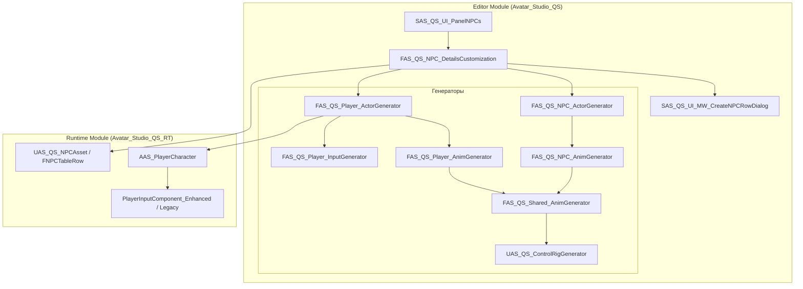
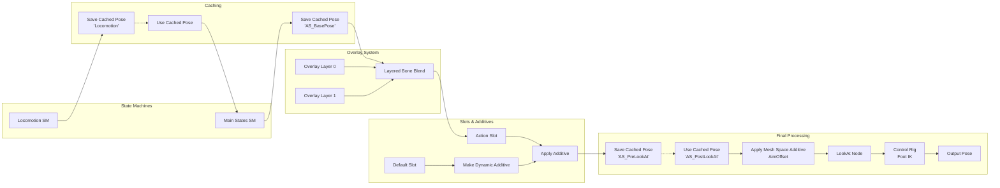
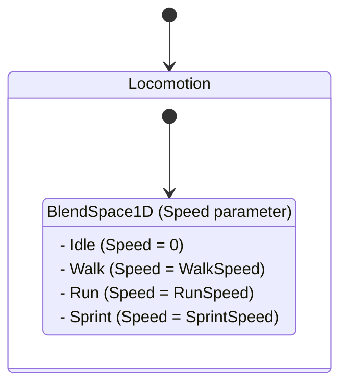
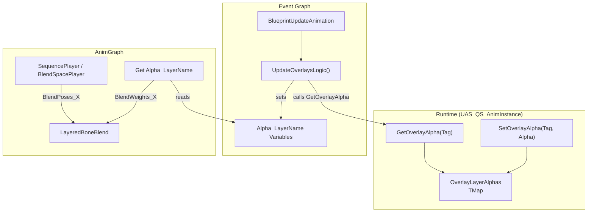
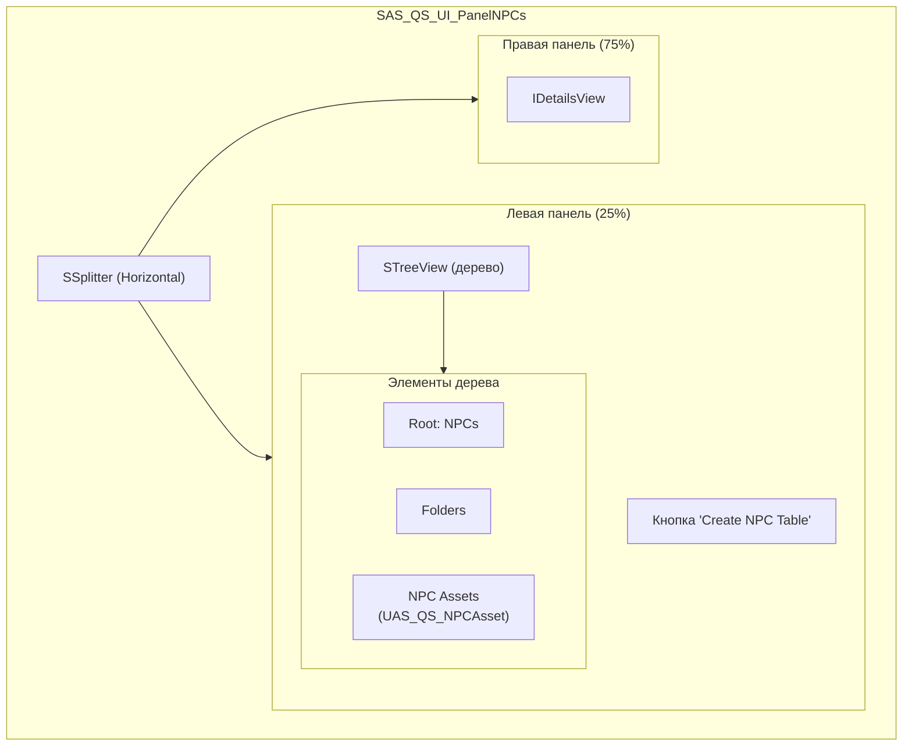

# Подробный анализ системы создания NPC и Главного Героя (ГГ) в Avatar Studio QS

## Содержание

1. [Общая архитектура системы](#1-общая-архитектура-системы)
2. [Структура данных FNPCTableRow](#2-структура-данных-fnpctablerow)
3. [Генератор NPC (FAS_QS_NPC_ActorGenerator)](#3-генератор-npc-fas_qs_npc_actorgenerator)
4. [Генератор Главного Героя (FAS_QS_Player_ActorGenerator)](#4-генератор-главного-героя-fas_qs_player_actorgenerator)
5. [Базовый класс AAS_PlayerCharacter](#5-базовый-класс-aas_playercharacter)
6. [Генератор Animation Blueprint](#6-генератор-animation-blueprint)
7. [Система Overlay Layers](#7-система-overlay-layers)
8. [Control Rig Generator](#8-control-rig-generator)
9. [UI Редактора NPC](#9-ui-редактора-npc)
10. [Модальные окна](#10-модальные-окна)
11. [Файловая структура](#11-файловая-структура)
12. [Сводная таблица компонентов](#12-сводная-таблица-компонентов)
13. [Проблемы и рекомендации](#13-проблемы-и-рекомендации)

---

## 1. Общая архитектура системы

Система создания персонажей разделена на две основные части:
- **NPC (Non-Player Character)** — персонажи управляемые AI
- **Player Character (ГГ)** — персонаж управляемый игроком

### Ключевые компоненты:

| Компонент | Назначение | Файл |
|-----------|------------|------|
| `FNPCTableRow` | Структура данных персонажа | `AS_QS_NPCAsset.h` |
| `UAS_QS_NPCAsset` | DataTable для хранения NPC | `AS_QS_NPCAsset.h` |
| `FAS_QS_NPC_ActorGenerator` | Генератор Blueprint для NPC | `AS_QS_NPC_ActorGenerator.cpp` |
| `FAS_QS_Player_ActorGenerator` | Генератор Blueprint для ГГ | `AS_QS_Player_ActorGenerator.cpp` |
| `FAS_QS_Shared_AnimGenerator` | Общая логика AnimBP | `AS_QS_Shared_AnimGenerator.cpp` |
| `AAS_PlayerCharacter` | Базовый C++ класс ГГ | `AS_PlayerCharacter.h` |

### Диаграмма архитектуры:



---

## 2. Структура данных FNPCTableRow

**Файл:** `Source/Avatar_Studio_QS_RT/Public/NPCs/AS_QS_NPCAsset.h`

Основная структура данных для хранения информации о персонаже:

```cpp
USTRUCT(BlueprintType)
struct AVATAR_STUDIO_QS_RT_API FNPCTableRow : public FTableRowBase
{
    GENERATED_BODY()

    // --- Игровые параметры и связь с Blueprint (ВАЖНЕЙШЕЕ ПОЛЕ - ПЕРВЫМ) ---
    UPROPERTY(EditAnywhere, BlueprintReadWrite, Category = "NPC Data", 
              meta = (DisplayName = "NPC Actor Class", 
                      RequiredAssetDataTags = "NativeParentClass;Blueprint"))
    TSoftClassPtr<AActor> NPCActorClass; // Класс Blueprint Actor этого NPC

    // --- Отображение и идентификация ---
    UPROPERTY(EditAnywhere, BlueprintReadWrite, Category = "NPC Data")
    FText DisplayName; // Локализуемое имя для UI

    UPROPERTY(EditAnywhere, BlueprintReadWrite, Category = "NPC Data")
    TSoftObjectPtr<UTexture2D> Portrait; // Портрет для диалоговых окон

    /** Ассеты "банков голоса", которые используются для этого персонажа. */
    UPROPERTY(EditAnywhere, BlueprintReadWrite, Category = "NPC Data", 
              meta = (DisplayName = "Character Voice Banks"))
    TArray<TSoftObjectPtr<UAS_DS_VoiceAsset>> CharacterVoiceAssets;

    UPROPERTY(EditAnywhere, BlueprintReadWrite, Category = "NPC Data")
    TArray<FName> FactionIDs; // Идентификатор фракции NPC

    // --- Расширенные параметры ---
    UPROPERTY(EditAnywhere, BlueprintReadWrite, Category = "NPC Data")
    TArray<FGameplayTag> PersonalityTraits; // Теги, описывающие личность

    UPROPERTY(EditAnywhere, BlueprintReadWrite, Category = "NPC Data")
    FGameplayTag RaceTag; // Тег расы

    UPROPERTY(EditAnywhere, BlueprintReadWrite, Category = "NPC Data")
    FGameplayTag GenderTag; // Тег пола

    UPROPERTY(EditAnywhere, BlueprintReadWrite, Category = "NPC Data")
    FGameplayTag NPCStatusTag; // Текущий статус NPC

    /** Если true, эта строка описывает вариацию Главного Героя, а не обычного NPC. */
    UPROPERTY(EditAnywhere, BlueprintReadOnly, Category = "Character Type")
    bool bIsPlayerCharacter = false;

    FNPCTableRow()
        : NPCActorClass(nullptr)
        , DisplayName(FText::GetEmpty())
        , Portrait(nullptr)
        , RaceTag(FGameplayTag())
        , GenderTag(FGameplayTag())
        , NPCStatusTag(FGameplayTag())
    {
    }
};
```

### UAS_QS_NPCAsset (DataTable)

```cpp
UCLASS(BlueprintType, meta = (DisplayName = "NPC Data Table"))
class AVATAR_STUDIO_QS_RT_API UAS_QS_NPCAsset : public UDataTable
{
    GENERATED_BODY()

public:
    // --- ВРЕМЕННОЕ ХРАНИЛИЩЕ ДЛЯ СОСТОЯНИЯ UI РЕДАКТОРА ---
    UPROPERTY(Transient)
    FName LastSelectedRowName; // Не будет сохраняться на диск

    // Конструктор
    UAS_QS_NPCAsset()
    {
        // Устанавливаем базовую структуру строки для этой таблицы
        RowStruct = FNPCTableRow::StaticStruct();
    }
};
```

---

## 3. Генератор NPC (FAS_QS_NPC_ActorGenerator)

**Файл:** `Source/Avatar_Studio_QS/Private/NPCs/Generators/AS_QS_NPC_ActorGenerator.cpp`

### Основная функция:

```cpp
UBlueprint* FAS_QS_NPC_ActorGenerator::Generate(
    FName RowName, 
    const FString& BasePackagePath, 
    const FGameplayTag& GenderTag, 
    const FGameplayTag& RaceTag
);
```

### Процесс генерации:

#### Шаг 1: Создание Blueprint-ассета

```cpp
const FString NewBPName = TEXT("BP_") + RowName.ToString();
const FString PackagePath = FPaths::Combine(BasePackagePath, RowName.ToString());
const FString FullPackageName = FPaths::Combine(PackagePath, NewBPName);

// Проверка существования
if (FPackageName::DoesPackageExist(FullPackageName))
{
    FMessageDialog::Open(EAppMsgType::Ok, FText::Format(
        LOCTEXT("AssetAlreadyExists", "An asset named '{0}' already exists at path '{1}'."),
        FText::FromString(NewBPName),
        FText::FromString(PackagePath)
    ));
    return nullptr;
}

// Создание пакета
UPackage* NewPackage = CreatePackage(*FullPackageName);
NewPackage->SetDirtyFlag(true);

// Создание Blueprint
UBlueprint* NewBlueprint = FKismetEditorUtilities::CreateBlueprint(
    ACharacter::StaticClass(),  // Базовый класс для NPC
    NewPackage,
    FName(*NewBPName),
    BPTYPE_Normal,
    UBlueprint::StaticClass(),
    UBlueprintGeneratedClass::StaticClass()
);
```

#### Шаг 2: Настройка коллизии капсулы

```cpp
if (ACharacter* CDO = Cast<ACharacter>(NewBlueprint->GeneratedClass->GetDefaultObject()))
{
    if (UCapsuleComponent* Capsule = CDO->GetCapsuleComponent())
    {
        // Убеждаемся, что капсула БЛОКИРУЕТ лучи Visibility
        Capsule->SetCollisionResponseToChannel(ECC_Visibility, ECR_Block);
    }
}
```

#### Шаг 3: Добавление интерфейсов

```cpp
// --- Handler Interface ---
if (UClass* HandlerInterfaceClass = UAS_IS_HandlerInterface::StaticClass())
{
    bool bAlreadyImplemented = false;
    for (const FBPInterfaceDescription& Desc : NewBlueprint->ImplementedInterfaces)
    {
        if (Desc.Interface == HandlerInterfaceClass)
        {
            bAlreadyImplemented = true;
            break;
        }
    }
    if (!bAlreadyImplemented)
    {
        FBPInterfaceDescription NewDesc;
        NewDesc.Interface = HandlerInterfaceClass;
        NewBlueprint->ImplementedInterfaces.Add(NewDesc);
    }
}

FBlueprintEditorUtils::MarkBlueprintAsStructurallyModified(NewBlueprint);
FKismetEditorUtilities::CompileBlueprint(NewBlueprint); // Компиляция для создания графов интерфейса
```

#### Шаг 4: Добавление компонентов (метод `AddDialogueComponents`)

```cpp
void FAS_QS_NPC_ActorGenerator::AddDialogueComponents(UBlueprint* Blueprint)
{
    const FScopedTransaction Transaction(LOCTEXT("AddDialogueComponentsTransaction", "Add Dialogue Components"));
    Blueprint->Modify();

    // 1. BPC_DialogueExecutor
    if (!HasComponent<UBPC_DialogueExecutor>(Blueprint))
    {
        USCS_Node* NewNode = Blueprint->SimpleConstructionScript->CreateNode(
            UBPC_DialogueExecutor::StaticClass(), 
            TEXT("DialogueExecutor")
        );
        Blueprint->SimpleConstructionScript->AddNode(NewNode);
    }

    // 2. AudioComponent для голоса
    if (!HasComponent<UAudioComponent>(Blueprint))
    {
        USCS_Node* NewNode = Blueprint->SimpleConstructionScript->CreateNode(
            UAudioComponent::StaticClass(), 
            TEXT("VoiceAudioComponent")
        );
        if (UAudioComponent* AudioTemplate = GetComponentTemplate<UAudioComponent>(NewNode, Blueprint))
        {
            AudioTemplate->bAutoActivate = false;
        }
        Blueprint->SimpleConstructionScript->AddNode(NewNode);
    }

    // 3. LookAtControllerComponent
    if (!HasComponent<UAS_QS_LookAtControllerComponent>(Blueprint))
    {
        USCS_Node* NewNode = Blueprint->SimpleConstructionScript->CreateNode(
            UAS_QS_LookAtControllerComponent::StaticClass(), 
            TEXT("LookAtController")
        );
        Blueprint->SimpleConstructionScript->AddNode(NewNode);
    }

    // 4. PerceptionSphere (1000 единиц)
    if (!HasComponent<USphereComponent>(Blueprint, TEXT("PerceptionSphere")))
    {
        USCS_Node* SphereNode = Blueprint->SimpleConstructionScript->CreateNode(
            USphereComponent::StaticClass(), 
            TEXT("PerceptionSphere")
        );
        if (USphereComponent* SphereTemplate = GetComponentTemplate<USphereComponent>(SphereNode, Blueprint))
        {
            SphereTemplate->SetSphereRadius(1000.0f);
        }
        
        // Прикрепляем к Mesh
        if (USCS_Node* MeshNode = FindMeshNode(Blueprint))
        {
            MeshNode->AddChildNode(SphereNode);
        }
    }

    // 5. ScannerComponent
    if (!HasComponent<UAS_IS_ScannerComponent>(Blueprint))
    {
        USCS_Node* NewNode = Blueprint->SimpleConstructionScript->CreateNode(
            UAS_IS_ScannerComponent::StaticClass(), 
            TEXT("ScannerComponent")
        );
        Blueprint->SimpleConstructionScript->AddNode(NewNode);
    }
}
```

#### Шаг 5: Добавление логики взаимодействия

Компоненты:
- `UAS_IS_InterComponent` — компонент взаимодействия
- `UAS_IS_PointComponent` — точка-маркер для UI (Z=85)

Генерация Blueprint-графа для `HandleInteraction`:

```cpp
void FAS_QS_NPC_ActorGenerator::AddInteractionLogic(UBlueprint* Blueprint)
{
    // Добавление компонентов
    AddInterComponent(Blueprint);
    AddPointComponent(Blueprint);
    
    // Генерация графа
    UEdGraph* EventGraph = FBlueprintEditorUtils::FindEventGraph(Blueprint);
    
    // Создание нод:
    // 1. Event HandleInteraction
    UK2Node_Event* EventNode = NewObject<UK2Node_Event>(EventGraph);
    EventNode->EventReference.SetExternalMember(
        GET_FUNCTION_NAME_CHECKED(IAS_IS_HandlerInterface, HandleInteraction),
        UAS_IS_HandlerInterface::StaticClass()
    );
    EventNode->bOverrideFunction = true;
    
    // 2. Print String
    UK2Node_CallFunction* PrintStringNode = CreatePrintStringNode(EventGraph, 
        TEXT("NPC was interacted with!"));
    
    // 3. Get Dialogue Manager
    UK2Node_CallFunction* GetDialogueManagerNode = CreateFunctionCallNode(EventGraph,
        UDialogueManager::StaticClass(), 
        GET_FUNCTION_NAME_CHECKED(UDialogueManager, GetDialogueManager));
    
    // 4. Request Dialogue
    UK2Node_CallFunction* RequestDialogueNode = CreateFunctionCallNode(EventGraph,
        UDialogueManager::StaticClass(),
        GET_FUNCTION_NAME_CHECKED(UDialogueManager, RequestDialogue));
    
    // Соединение нод:
    // Event → Print String → RequestDialogue
    // Self → TargetNPC
    // Interactor → Interactor
}
```

#### Шаг 6: Переменная NPC_ID

```cpp
void FAS_QS_NPC_ActorGenerator::AddAndSetNpcIdVariable(UBlueprint* Blueprint, FName NpcId)
{
    const FName VarName = FName("NPC_ID");
    
    if (FBlueprintEditorUtils::FindNewVariableIndex(Blueprint, VarName) != INDEX_NONE) 
        return;

    const FScopedTransaction Transaction(LOCTEXT("AddNpcIdVariableTransaction", "Add NPC ID Variable"));
    Blueprint->Modify();

    // Создание переменной типа FName
    FEdGraphPinType VarType(UEdGraphSchema_K2::PC_Name, NAME_None, nullptr, 
                            EPinContainerType::None, false, FEdGraphTerminalType());
    FBlueprintEditorUtils::AddMemberVariable(Blueprint, VarName, VarType);

    int32 VarIndex = FBlueprintEditorUtils::FindNewVariableIndex(Blueprint, VarName);
    if (VarIndex != INDEX_NONE)
    {
        FBPVariableDescription& VarDesc = Blueprint->NewVariables[VarIndex];
        VarDesc.PropertyFlags |= (CPF_Edit | CPF_BlueprintVisible);
        VarDesc.PropertyFlags &= ~CPF_DisableEditOnInstance;
        VarDesc.Category = LOCTEXT("DialogueCategory", "Dialogue");
        VarDesc.DefaultValue = NpcId.ToString();
    }

    FBlueprintEditorUtils::MarkBlueprintAsStructurallyModified(Blueprint);
}
```

#### Шаг 7: Автоматическое присвоение тегов и меша

```cpp
// Авто-присвоение Gender Tag
if (GenderTag.IsValid())
{
    FAS_QS_EditorTagger::AssignTagToBlueprint(GenderTag, NewBlueprint, nullptr);
    
    // Авто-присвоение Skeletal Mesh по полу
    FAS_QS_Shared_MeshHelper::AssignSkeletalMeshByGender(NewBlueprint, GenderTag);
}

// Авто-присвоение Race Tag
if (RaceTag.IsValid())
{
    FAS_QS_EditorTagger::AssignTagToBlueprint(RaceTag, NewBlueprint, nullptr);
}
```

#### Шаг 8: Добавление AnimComponent и GazeTargetComponent

```cpp
// AnimComponent
if (!HasComponent<UAS_QS_AnimComponent>(Blueprint))
{
    USCS_Node* NewNode = Blueprint->SimpleConstructionScript->CreateNode(
        UAS_QS_AnimComponent::StaticClass(), 
        TEXT("AnimComponent")
    );
    Blueprint->SimpleConstructionScript->AddNode(NewNode);
}

// GazeTargetComponent
if (!HasComponent<UAS_QS_GazeTargetComponent>(Blueprint))
{
    USCS_Node* NewNode = Blueprint->SimpleConstructionScript->CreateNode(
        UAS_QS_GazeTargetComponent::StaticClass(),
        TEXT("GazeTargetComponent")
    );
    
    // Настройка параметров
    if (UAS_QS_GazeTargetComponent* GazeTargetTemplate = 
        GetComponentTemplate<UAS_QS_GazeTargetComponent>(NewNode, Blueprint))
    {
        GazeTargetTemplate->GazeInfo.Priority = 80;
        GazeTargetTemplate->GazeInfo.StareDuration = FVector2D(3.0f, 5.0f);
        GazeTargetTemplate->GazeInfo.bRequiresLineOfSight = false;
        GazeTargetTemplate->GazeInfo.bIsDialogueTarget = false;
    }
    
    Blueprint->SimpleConstructionScript->AddNode(NewNode);
}
```

---

## 4. Генератор Главного Героя (FAS_QS_Player_ActorGenerator)

**Файл:** `Source/Avatar_Studio_QS/Private/NPCs/Generators/AS_QS_Player_ActorGenerator.cpp`

### Отличия от NPC генератора:

| Аспект | NPC | Player Character |
|--------|-----|------------------|
| Базовый класс | `ACharacter` | `AAS_PlayerCharacter` |
| Input система | ❌ Нет | ✅ Enhanced + Legacy |
| Camera System | ❌ Нет | ✅ Spring Arm + Camera |
| ID переменная | `NPC_ID` | `Character_ID` |
| Perception Sphere | ✅ Есть | ❌ Нет |
| Dialogue Components | ✅ Добавляются | ✅ Уже встроены |

### Процесс генерации:

#### Шаг 1: Создание Blueprint

```cpp
UBlueprint* NewBlueprint = FKismetEditorUtilities::CreateBlueprint(
    AAS_PlayerCharacter::StaticClass(),  // <-- Отличие: базовый класс ГГ
    NewPackage,
    FName(*NewBPName),
    BPTYPE_Normal,
    UBlueprint::StaticClass(),
    UBlueprintGeneratedClass::StaticClass()
);
```

#### Шаг 2: Генерация Input ассетов

```cpp
#if WITH_EDITOR
if (!FAS_QS_Player_InputGenerator::DoInputAssetsExist())
{
    // Создаем Input Actions
    FAS_QS_Player_InputGenerator::GenerateInputActions(BasePackagePath);
    
    // Создаем Input Mapping Context
    FAS_QS_Player_InputGenerator::GenerateInputMappingContext(BasePackagePath);
}

// Назначаем Input Assets в Blueprint
AssignInputAssetsToBlueprint(NewBlueprint, BasePackagePath);
#endif
```

#### Шаг 3: Назначение Input Assets

```cpp
bool FAS_QS_Player_ActorGenerator::AssignInputAssetsToBlueprint(
    UBlueprint* Blueprint, 
    const FString& BasePackagePath)
{
    const FString InputPath = TEXT("/Game/QuestSystem/Input");
    
    // Загружаем IMC_Player
    const FString IMCPath = FPaths::Combine(InputPath, TEXT("IMC_Player.IMC_Player"));
    UObject* IMCObject = LoadObject<UObject>(nullptr, *IMCPath);
    
    // Загружаем Input Actions
    TMap<FString, UObject*> InputActions;
    const TArray<FString> ActionNames = {
        TEXT("Move"), TEXT("Look"), TEXT("Zoom"), TEXT("Jump"), 
        TEXT("Interact"), TEXT("ToggleRun"), TEXT("Sprint"), 
        TEXT("Crouch"), TEXT("Aim"), TEXT("Attack")
    };
    
    for (const FString& ActionName : ActionNames)
    {
        const FString ActionPath = FPaths::Combine(InputPath, 
            FString::Printf(TEXT("IA_Player_%s.IA_Player_%s"), *ActionName, *ActionName));
        if (UObject* Action = LoadObject<UObject>(nullptr, *ActionPath))
        {
            InputActions.Add(ActionName, Action);
        }
    }
    
    // Находим PlayerInputComponent_Enhanced в CDO
    AActor* CDO = Cast<AActor>(Blueprint->GeneratedClass->GetDefaultObject());
    for (UActorComponent* Component : CDO->GetComponents())
    {
        if (Component->GetClass()->GetName().Contains(TEXT("PlayerInputComponent_Enhanced")))
        {
            // Назначаем IMC
            if (FProperty* IMCProperty = Component->GetClass()->FindPropertyByName(TEXT("InputMappingContext")))
            {
                if (FObjectProperty* ObjectProp = CastField<FObjectProperty>(IMCProperty))
                {
                    ObjectProp->SetObjectPropertyValue_InContainer(Component, IMCObject);
                }
            }
            
            // Назначаем Input Actions
            for (const auto& Pair : InputActions)
            {
                const FString PropertyName = FString::Printf(TEXT("IA_%s"), *Pair.Key);
                if (FProperty* ActionProperty = Component->GetClass()->FindPropertyByName(*PropertyName))
                {
                    if (FObjectProperty* ObjectProp = CastField<FObjectProperty>(ActionProperty))
                    {
                        ObjectProp->SetObjectPropertyValue_InContainer(Component, Pair.Value);
                    }
                }
            }
            break;
        }
    }
    
    FKismetEditorUtilities::CompileBlueprint(Blueprint);
    return true;
}
```

#### Шаг 4: Добавление переменной Character_ID

```cpp
void FAS_QS_Player_ActorGenerator::AddAndSetCharacterIdVariable(
    UBlueprint* Blueprint, 
    FName CharacterId)
{
    const FName VarName = FName("Character_ID");  // <-- Отличие: другое имя
    
    if (FBlueprintEditorUtils::FindNewVariableIndex(Blueprint, VarName) != INDEX_NONE)
    {
        // Переменная существует - обновляем значение
        FBPVariableDescription& VarDesc = Blueprint->NewVariables[VarIndex];
        VarDesc.DefaultValue = CharacterId.ToString();
    }
    else
    {
        // Создаем новую переменную
        FEdGraphPinType VarType(UEdGraphSchema_K2::PC_Name, NAME_None, nullptr,
                                EPinContainerType::None, false, FEdGraphTerminalType());
        FBlueprintEditorUtils::AddMemberVariable(Blueprint, VarName, VarType);
        
        int32 VarIndex = FBlueprintEditorUtils::FindNewVariableIndex(Blueprint, VarName);
        FBPVariableDescription& VarDesc = Blueprint->NewVariables[VarIndex];
        VarDesc.PropertyFlags |= (CPF_Edit | CPF_BlueprintVisible);
        VarDesc.PropertyFlags &= ~CPF_DisableEditOnInstance;
        VarDesc.Category = LOCTEXT("CharacterDataCategory", "Character Data");  // <-- Отличие: другая категория
        VarDesc.DefaultValue = CharacterId.ToString();
    }

    FBlueprintEditorUtils::MarkBlueprintAsStructurallyModified(Blueprint);
}
```

---

## 5. Базовый класс AAS_PlayerCharacter

**Файл:** `Source/Avatar_Studio_QS_RT/Public/NPCs/AS_PlayerCharacter.h`

### Наследование:

```
ACharacter
    ├── IPlayerInputHandlerInterface
    └── IAS_IS_HandlerInterface
```

### Компоненты (уже встроены в C++):

```cpp
UCLASS()
class AVATAR_STUDIO_QS_RT_API AAS_PlayerCharacter : public ACharacter
{
    GENERATED_BODY()

public:
    AAS_PlayerCharacter(const FObjectInitializer& ObjectInitializer);

    // --- Input Components ---
    UPROPERTY(VisibleAnywhere, BlueprintReadOnly, Category = "Input")
    TObjectPtr<UPlayerInputComponent_Enhanced> EnhancedInputComponent;

    UPROPERTY(VisibleAnywhere, BlueprintReadOnly, Category = "Input")
    TObjectPtr<UPlayerInputComponent_Legacy> LegacyInputComponent;

    // --- Camera Components ---
    UPROPERTY(VisibleAnywhere, BlueprintReadOnly, Category = "Camera")
    TObjectPtr<USpringArmComponent> CameraBoom;

    UPROPERTY(VisibleAnywhere, BlueprintReadOnly, Category = "Camera")
    TObjectPtr<UCameraComponent> FollowCamera;

    // --- Interaction Components ---
    UPROPERTY(VisibleAnywhere, BlueprintReadOnly, Category = "Interaction")
    TObjectPtr<UAS_IS_ScannerComponent> ScannerComponent;

    UPROPERTY(VisibleAnywhere, BlueprintReadOnly, Category = "Interaction")
    TObjectPtr<UAS_IS_PlayerInteractionComponent> InteractionManager;

    UPROPERTY(VisibleAnywhere, BlueprintReadOnly, Category = "Interaction")
    TObjectPtr<UAS_IS_InterComponent> InteractionComponent;

    UPROPERTY(VisibleAnywhere, BlueprintReadOnly, Category = "Interaction")
    TObjectPtr<UAS_IS_PointComponent> InteractionPoint;

    // --- Dialogue Components ---
    UPROPERTY(VisibleAnywhere, BlueprintReadOnly, Category = "Dialogue")
    TObjectPtr<UBPC_DialogueExecutor> DialogueExecutor;

    UPROPERTY(VisibleAnywhere, BlueprintReadOnly, Category = "Dialogue")
    TObjectPtr<UAudioComponent> VoiceAudioComponent;

    // --- Gaze Components ---
    UPROPERTY(VisibleAnywhere, BlueprintReadOnly, Category = "Gaze")
    TObjectPtr<UAS_QS_LookAtControllerComponent> LookAtController;

    // --- Animation Components ---
    UPROPERTY(VisibleAnywhere, BlueprintReadOnly, Category = "Animation")
    TObjectPtr<UAS_QS_AnimComponent> AnimComponent;

    // --- Movement Parameters ---
    UPROPERTY(EditAnywhere, BlueprintReadWrite, Category = "Movement")
    float WalkSpeed = 200.0f;

    UPROPERTY(EditAnywhere, BlueprintReadWrite, Category = "Movement")
    float RunSpeed = 600.0f;

    UPROPERTY(EditAnywhere, BlueprintReadWrite, Category = "Movement")
    float SprintSpeed = 900.0f;

    // --- Camera Parameters ---
    UPROPERTY(EditAnywhere, BlueprintReadWrite, Category = "Camera")
    float ThirdPersonCameraSocketOffsetY = 40.0f;

    UPROPERTY(EditAnywhere, BlueprintReadWrite, Category = "Camera")
    float ThirdPersonCameraSocketOffsetZ = 60.0f;

    UPROPERTY(EditAnywhere, BlueprintReadWrite, Category = "Camera")
    float MinZoomLength = 50.0f;

    UPROPERTY(EditAnywhere, BlueprintReadWrite, Category = "Camera")
    float MaxZoomLength = 800.0f;

    UPROPERTY(EditAnywhere, BlueprintReadWrite, Category = "Camera")
    float ZoomStep = 40.0f;

    UPROPERTY(EditAnywhere, BlueprintReadWrite, Category = "Camera")
    FName HeadSocketName = FName("head");
};
```

### Input Handlers:

```cpp
// Movement
void HandleMove_Implementation(const FVector2D& Input);
void HandleLook_Implementation(const FVector2D& Input);
void HandleZoom_Implementation(float Input);

// Actions
void HandleJump_Implementation();
void RequestInteraction_Implementation();
void HandleToggleRun_Implementation();
void HandleSprintPressed_Implementation();
void HandleSprintReleased_Implementation();
void HandleCrouch_Implementation();
void HandleAimPressed_Implementation();
void HandleAimReleased_Implementation();
void HandleAttackPressed_Implementation();
void HandleAttackReleased_Implementation();
```

---

## 6. Генератор Animation Blueprint

### FAnimBPGenerationData (параметры генерации):

**Файл:** `Source/Avatar_Studio_QS/Public/NPCs/Generators/AS_QS_Shared_AnimGenerator.h`

```cpp
struct FAnimBPGenerationData
{
    // --- Skeleton Setup ---
    UPROPERTY()
    FName BlendBone;

    UPROPERTY()
    FName LookAtBone;

    UPROPERTY()
    TSoftClassPtr<UControlRig> IKControlRigClass;

    UPROPERTY()
    USkeletalMesh* PreviewMesh;

    // --- Animation States ---
    UPROPERTY()
    TSoftObjectPtr<UAnimSequence> IdleAnimation;

    UPROPERTY()
    TSoftObjectPtr<UAnimSequence> WalkAnimation;

    UPROPERTY()
    TSoftObjectPtr<UAnimSequence> RunAnimation;

    UPROPERTY()
    TSoftObjectPtr<UAnimSequence> SprintAnimation;

    UPROPERTY()
    TSoftObjectPtr<UAnimSequence> JumpStartAnimation;

    UPROPERTY()
    TSoftObjectPtr<UAnimSequence> JumpLoopAnimation;

    UPROPERTY()
    TSoftObjectPtr<UAnimSequence> JumpEndAnimation;

    // --- Speed Settings ---
    UPROPERTY()
    float WalkSpeed = 200.0f;

    UPROPERTY()
    float RunSpeed = 600.0f;

    UPROPERTY()
    float SprintSpeed = 900.0f;

    UPROPERTY()
    float SprintAnimationPlayRate = 1.2f;

    // --- Overlay Layers ---
    UPROPERTY()
    TArray<FASAnimOverlayConfig> OverlayLayers;
};
```

### Структура генерируемого AnimGraph:



### State Machine: Locomotion



### State Machine: Main States (Прыжки)

```mermaid
stateDiagram-v2
    [*] --> Locomotion
    
    Locomotion --> JumpStart: bIsJumping
    Locomotion --> JumpFall: bIsInAir AND NOT bIsJumping
    
    JumpStart --> JumpFall: Animation Finished
    JumpFall --> JumpLand: NOT bIsInAir
    JumpLand --> Locomotion: Animation Finished
    
    state Locomotion {
        note: Use Cached Pose "Locomotion"
    }
    
    state JumpStart {
        note: JumpStartAnimation
    }
    
    state JumpFall {
        note: JumpLoopAnimation (loop)
    }
    
    state JumpLand {
        note: JumpEndAnimation
    }
```

### Правила переходов:

| Переход | Условие |
|---------|---------|
| Locomotion → JumpStart | `bIsJumping == true` |
| Locomotion → JumpFall | `bIsInAir && !bIsJumping` (упал с уступа) |
| JumpStart → JumpFall | Анимация завершена |
| JumpFall → JumpLand | `bIsInAir == false` |
| JumpLand → Locomotion | Анимация завершена |

---

## 7. Система Overlay Layers

### FASAnimOverlayConfig:

**Файл:** `Source/Avatar_Studio_QS_RT/Public/Animation/AS_QS_AnimBPConfig.h`

```cpp
USTRUCT(BlueprintType)
struct FASAnimOverlayConfig
{
    GENERATED_BODY()

    UPROPERTY(EditAnywhere, BlueprintReadWrite, Category = "Overlay")
    FName OverlayName;

    UPROPERTY(EditAnywhere, BlueprintReadWrite, Category = "Overlay")
    FGameplayTag TriggerTag;

    UPROPERTY(EditAnywhere, BlueprintReadWrite, Category = "Overlay")
    TSoftObjectPtr<UAnimSequence> Animation;

    UPROPERTY(EditAnywhere, BlueprintReadWrite, Category = "Overlay")
    TSoftObjectPtr<UBlendSpace> BlendSpace;

    UPROPERTY(EditAnywhere, BlueprintReadWrite, Category = "Overlay")
    FName BoneFilter = FName("spine_01");

    UPROPERTY(EditAnywhere, BlueprintReadWrite, Category = "Overlay")
    bool bLooping = true;

    UPROPERTY(EditAnywhere, BlueprintReadWrite, Category = "Overlay")
    bool bStartActive = false;
};
```

### Архитектура системы:



### UAS_QS_AnimInstance (Runtime Class):

```cpp
UCLASS()
class AVATAR_STUDIO_QS_RT_API UAS_QS_AnimInstance : public UAnimInstance
{
    GENERATED_BODY()

public:
    // Хранилище весов смешивания для слоев
    UPROPERTY(BlueprintReadOnly, Category = "Overlay System")
    TMap<FGameplayTag, float> OverlayLayerAlphas;

    // Установка альфы слоя (вызывается из геймплейного кода)
    UFUNCTION(BlueprintCallable, Category = "Overlay System")
    void SetOverlayAlpha(FGameplayTag Tag, float Alpha);

    // Получение текущей альфы (используется генерированной функцией)
    UFUNCTION(BlueprintPure, Category = "Overlay System")
    float GetOverlayAlpha(FGameplayTag Tag) const;

    // --- Другие свойства ---
    UPROPERTY(BlueprintReadOnly)
    float Speed;

    UPROPERTY(BlueprintReadOnly)
    ELocomotionState LocomotionState;

    UPROPERTY(BlueprintReadOnly)
    bool bIsInAir;

    UPROPERTY(BlueprintReadOnly)
    EJumpState JumpState;

    UPROPERTY(BlueprintReadOnly)
    bool bShouldMove;

    UPROPERTY(BlueprintReadOnly)
    float VerticalVelocity;

    UPROPERTY(BlueprintReadOnly)
    bool bShouldFall;
};
```

### Runtime API:

```cpp
// Активация слоя из геймплейного кода
if (UAS_QS_AnimInstance* AnimInst = Cast<UAS_QS_AnimInstance>(
    Character->GetMesh()->GetAnimInstance()))
{
    // Включить слой с тегом "State.Torch"
    AnimInst->SetOverlayAlpha(
        FGameplayTag::RequestGameplayTag("State.Torch"), 
        1.0f
    );
    
    // Выключить слой
    AnimInst->SetOverlayAlpha(
        FGameplayTag::RequestGameplayTag("State.Torch"), 
        0.0f
    );
    
    // Плавный переход (0.5 = полупрозрачность)
    AnimInst->SetOverlayAlpha(
        FGameplayTag::RequestGameplayTag("State.Torch"), 
        0.5f
    );
}

// Проверка состояния слоя
float CurrentAlpha = AnimInst->GetOverlayAlpha(
    FGameplayTag::RequestGameplayTag("State.Torch")
);
```

---

## 8. Control Rig Generator

### UAS_QS_ControlRigGenerator

**Файл:** `Source/Avatar_Studio_QS/Public/NPCs/Generators/AS_QS_ControlRigGenerator.h`

### FASControlRigBoneSettings:

```cpp
USTRUCT(BlueprintType)
struct FASControlRigBoneSettings
{
    GENERATED_BODY()

    UPROPERTY(EditAnywhere, Category = "Foot IK Bones")
    FName PelvisBone = FName("pelvis");

    UPROPERTY(EditAnywhere, Category = "Foot IK Bones")
    FName ThighBone_L = FName("thigh_l");

    UPROPERTY(EditAnywhere, Category = "Foot IK Bones")
    FName CalfBone_L = FName("calf_l");

    UPROPERTY(EditAnywhere, Category = "Foot IK Bones")
    FName FootBone_L = FName("foot_l");

    UPROPERTY(EditAnywhere, Category = "Foot IK Bones")
    FName ThighBone_R = FName("thigh_r");

    UPROPERTY(EditAnywhere, Category = "Foot IK Bones")
    FName CalfBone_R = FName("calf_r");

    UPROPERTY(EditAnywhere, Category = "Foot IK Bones")
    FName FootBone_R = FName("foot_r");
};
```

### Методы генератора:

```cpp
class AVATAR_STUDIO_QS_API UAS_QS_ControlRigGenerator : public UObject
{
    GENERATED_BODY()

public:
    // Создание ассета Control Rig
    UFUNCTION(BlueprintCallable, Category = "Avatar Studio QS|Control Rig")
    static UControlRig* CreateControlRigAsset(
        const FString& AssetPath, 
        USkeleton* Skeleton
    );

    // Генерация Foot IK логики
    UFUNCTION(BlueprintCallable, Category = "Avatar Studio QS|Control Rig")
    static bool GenerateFootIK(
        UControlRig* ControlRig, 
        const FASControlRigBoneSettings& BoneSettings
    );

    // Установка Preview Mesh
    UFUNCTION(BlueprintCallable, Category = "Avatar Studio QS|Control Rig")
    static void SetPreviewMesh(
        UControlRig* ControlRig, 
        USkeletalMesh* PreviewMesh
    );
};
```

---

## 9. UI Редактора NPC

### SAS_QS_UI_PanelNPCs

**Файл:** `Source/Avatar_Studio_QS/Private/NPCs/UI/AS_QS_UI_PanelNPCs.cpp`

### Структура UI:



### Контекстное меню:

| Тип элемента | Доступные действия |
|--------------|-------------------|
| Folder | Create NPC Table in Folder |
| Asset (не DT_Player) | Delete NPC Table |
| Asset (DT_Player) | Только просмотр (защищен) |

### FAS_QS_NPC_DetailsCustomization

**Файл:** `Source/Avatar_Studio_QS/Private/NPCs/Details/AS_QS_NPC_Details.cpp`

### Секции Details-панели:

1. **Core Setup**
   - Actor Class
   - Skeletal Mesh
   - Anim Class

2. **Identification & Presentation**
   - Display Name
   - Portrait
   - Voice Banks

3. **Characteristics & Affiliation**
   - Factions
   - Race Tag
   - Gender Tag
   - Status Tag

4. **Personality Traits**
   - Array of FGameplayTag

5. **Asset Usage**
   - Where NPC is used (Quests, Dialogues, Spawns)

### Кнопки генерации:

```cpp
// "Create Blueprint"
FReply OnCreateBlueprintClicked();

// "Create Anim BP"
FReply OnCreateAnimBlueprintClicked();

// "Sync Mesh"
FReply OnSyncMeshClicked();
```

---

## 10. Модальные окна

### SAS_QS_UI_MW_CreateNPCRowDialog

**Назначение:** Создание новой строки в DataTable

**Поля:**
- Префикс (автоматический на основе папки)
- Уникальный суффикс
- Валидация уникальности имени

### SAS_QS_UI_MW_CreateAnimBPDialog

**Назначение:** Настройка параметров Animation Blueprint

**3 вкладки:**

#### Вкладка 1: Skeleton Setup

| Элемент | Описание |
|---------|----------|
| Bone Tree View | Дерево костей скелета |
| Set Blend Bone | Кнопка выбора кости для блендинга |
| Set LookAt Bone | Кнопка выбора кости для LookAt |
| IK Control Rig | Выбор Control Rig класса |
| Create Control Rig | Кнопка создания нового CR |

#### Вкладка 2: Animation States

| Параметр | Тип | Описание |
|----------|-----|----------|
| IdleAnimation | UAnimSequence | Анимация покоя |
| WalkAnimation | UAnimSequence | Анимация ходьбы |
| RunAnimation | UAnimSequence | Анимация бега |
| SprintAnimation | UAnimSequence | Анимация спринта |
| JumpStartAnimation | UAnimSequence | Старт прыжка |
| JumpLoopAnimation | UAnimSequence | Парение в воздухе |
| JumpEndAnimation | UAnimSequence | Приземление |
| WalkSpeed | float | Скорость ходьбы (200) |
| RunSpeed | float | Скорость бега (600) |
| SprintSpeed | float | Скорость спринта (900) |
| SprintAnimationPlayRate | float | Множитель скорости (1.2) |

#### Вкладка 3: Overlay Layers

| Поле | Тип | Описание |
|------|-----|----------|
| OverlayName | FName | Уникальное имя слоя |
| TriggerTag | FGameplayTag | Тег активации |
| Animation | UAnimSequence | Анимация наложения |
| BlendSpace | UBlendSpace | BlendSpace (приоритетнее) |
| BoneFilter | FName | Кость для LayeredBoneBlend |
| bLooping | bool | Зацикливание |
| bStartActive | bool | Активация при спавне |

---

## 11. Файловая структура

```
Source/
├── Avatar_Studio_QS/ (Editor Module)
│   ├── Private/NPCs/
│   │   ├── Commands/
│   │   │   └── AS_QS_NPCListCommands.cpp
│   │   ├── Details/
│   │   │   └── AS_QS_NPC_Details.cpp
│   │   ├── Factory/
│   │   │   └── AS_QS_NPCAssetFactory.cpp
│   │   ├── Generators/
│   │   │   ├── AS_QS_ControlRigGenerator.cpp
│   │   │   ├── AS_QS_NPC_ActorGenerator.cpp      # Генератор NPC
│   │   │   ├── AS_QS_NPC_AnimGenerator.cpp
│   │   │   ├── AS_QS_Player_ActorGenerator.cpp   # Генератор ГГ
│   │   │   ├── AS_QS_Player_AnimGenerator.cpp
│   │   │   ├── AS_QS_Player_InputGenerator.cpp   # Генератор Input
│   │   │   ├── AS_QS_Shared_AnimGenerator.cpp    # Общая логика AnimBP
│   │   │   └── AS_QS_Shared_MeshHelper.cpp
│   │   └── UI/
│   │       ├── AS_QS_UI_MW_CreateAnimBPDialog.cpp
│   │       ├── AS_QS_UI_MW_CreateNPCRowDialog.cpp
│   │       ├── AS_QS_UI_MW_CreateNPCTableDialog.cpp
│   │       └── AS_QS_UI_PanelNPCs.cpp
│   └── Public/NPCs/
│       └── (соответствующие .h файлы)
│
└── Avatar_Studio_QS_RT/ (Runtime Module)
    ├── Private/
    │   ├── Animation/
    │   │   └── AS_QS_AnimBPConfig.cpp
    │   └── NPCs/
    │       ├── AS_PlayerCharacter.cpp            # Базовый класс ГГ
    │       ├── AS_QS_AnimInstance.cpp            # Базовый AnimInstance
    │       ├── PlayerInputComponent_Enhanced.cpp
    │       └── PlayerInputComponent_Legacy.cpp
    └── Public/
        ├── Animation/
        │   └── AS_QS_AnimBPConfig.h
        └── NPCs/
            ├── AS_QS_AnimInstance.h
            ├── AS_QS_NPCAsset.h                  # FNPCTableRow
            ├── AS_PlayerCharacter.h
            ├── AS_PlayerTypes.h
            ├── PlayerInputComponent_Enhanced.h
            ├── PlayerInputComponent_Legacy.h
            └── PlayerInputHandlerInterface.h
```

---

## 12. Сводная таблица компонентов

| Компонент | NPC | Player Character | Описание |
|-----------|-----|------------------|----------|
| **Dialogue** |
| DialogueExecutor | ✅ | ✅ | Исполнение диалогов |
| VoiceAudioComponent | ✅ | ✅ | Голос и липсинг |
| **Gaze** |
| LookAtController | ✅ | ✅ | Поворот головы |
| GazeTargetComponent | ✅ | ✅ | Цель для взгляда |
| **Interaction** |
| ScannerComponent | ✅ | ✅ | Поиск интерактивных объектов |
| InteractionComponent | ✅ | ✅ | Компонент взаимодействия |
| InteractionPoint | ✅ | ✅ | UI-маркер |
| InteractionManager | ❌ | ✅ | Менеджер взаимодействий (только ГГ) |
| **Animation** |
| AnimComponent | ✅ | ✅ | Анимационная логика |
| **AI/Perception** |
| PerceptionSphere | ✅ | ❌ | Радиус восприятия NPC |
| **Camera** |
| SpringArm | ❌ | ✅ | Держатель камеры |
| FollowCamera | ❌ | ✅ | Камера от 3-го лица |
| **Input** |
| EnhancedInput | ❌ | ✅ | Enhanced Input System |
| LegacyInput | ❌ | ✅ | Legacy Input System |

---

## 13. Проблемы и рекомендации

### Выявленные проблемы:

#### 1. Дублирование кода в генераторах

**Проблема:** `FAS_QS_NPC_ActorGenerator` и `FAS_QS_Player_ActorGenerator` имеют много общей логики:
- Создание Blueprint
- Добавление AnimComponent
- Присвоение тегов
- Присвоение меша

**Рекомендация:** Создать базовый класс `FAS_QS_BaseActorGenerator`:

```cpp
class FAS_QS_BaseActorGenerator
{
protected:
    static UBlueprint* CreateBlueprintAsset(
        UClass* ParentClass,
        const FString& PackagePath,
        const FString& AssetName
    );
    
    static void AddAnimComponent(UBlueprint* Blueprint);
    static void AssignTags(UBlueprint* Blueprint, 
                          const FGameplayTag& GenderTag, 
                          const FGameplayTag& RaceTag);
    static void AssignSkeletalMesh(UBlueprint* Blueprint, 
                                   const FGameplayTag& GenderTag);
};
```

#### 2. Жестко закодированные пути

**Проблема:**
```cpp
const FString InputPath = TEXT("/Game/QuestSystem/Input");
const FString BaseFolderPath = TEXT("/Game/QuestSystem/NPCs/");
```

**Рекомендация:** Вынести в конфигурацию плагина:

```cpp
UCLASS(config = Game, defaultconfig)
class UAS_QS_Settings : public UDeveloperSettings
{
    UPROPERTY(config, EditAnywhere, Category = "Paths")
    FString NPCBasePath = TEXT("/Game/QuestSystem/NPCs/");
    
    UPROPERTY(config, EditAnywhere, Category = "Paths")
    FString InputAssetsPath = TEXT("/Game/QuestSystem/Input/");
};
```

#### 3. Отсутствие валидации анимаций

**Проблема:** Нет проверки совместимости скелета анимаций с целевым мешем.

**Рекомендация:** Добавить валидацию перед генерацией:

```cpp
bool ValidateAnimationCompatibility(
    USkeletalMesh* TargetMesh,
    UAnimSequence* Animation
)
{
    if (!TargetMesh || !Animation) return false;
    
    USkeleton* MeshSkeleton = TargetMesh->GetSkeleton();
    USkeleton* AnimSkeleton = Animation->GetSkeleton();
    
    return MeshSkeleton && AnimSkeleton && 
           MeshSkeleton->IsCompatible(AnimSkeleton);
}
```

#### 4. Статические переменные состояния UI

**Проблема:**
```cpp
bool AS_QS_EdNode_QuestDetails::bGeneralSectionExpanded_Placeholder = true;
```

**Рекомендация:** Хранить состояние в контексте:

```cpp
class Avatar_Studio_QSContext
{
    TMap<FName, bool> SectionExpandedStates;
    
public:
    bool GetSectionExpanded(const FName& SectionName) const;
    void SetSectionExpanded(const FName& SectionName, bool bExpanded);
};
```

### Рекомендации по улучшению:

#### 1. Добавить систему пресетов

```cpp
UCLASS()
class UAS_QS_CharacterPreset : public UDataAsset
{
    UPROPERTY()
    FAnimBPGenerationData AnimConfig;
    
    UPROPERTY()
    TArray<FASAnimOverlayConfig> DefaultOverlays;
    
    UPROPERTY()
    TMap<FGameplayTag, USkeletalMesh*> GenderToMeshMap;
};
```

#### 2. Улучшить валидацию

- Проверка наличия всех необходимых анимаций
- Проверка совместимости скелетов
- Валидация Gameplay Tags
- Проверка уникальности ID

#### 3. Оптимизация генерации

- Lazy loading для тяжелых ассетов
- Кэширование уже сгенерированных элементов
- Batch generation для нескольких NPC

#### 4. Расширить функционал

- Поддержка мультиплеера (репликация)
- Интеграция с GAS (Gameplay Ability System)
- Система экипировки и attachment'ов
- Поддержка различных типов камер (1st/3rd person)
- Система роста и комплекции персонажей

#### 5. Улучшить отладку

```cpp
// Добавить детальное логирование
UE_LOG(LogAS_QS_NPCGeneration, Verbose, 
    TEXT("Generating NPC '%s' with config:\n"
         "  Gender: %s\n"
         "  Race: %s\n"
         "  Skeleton: %s"),
    *RowName.ToString(),
    *GenderTag.ToString(),
    *RaceTag.ToString(),
    *GetNameSafe(TargetSkeleton)
);
```

---

## Заключение

Система создания персонажей в Avatar Studio QS представляет собой мощный инструментарий, позволяющий:

1. **Автоматизировать** создание Actor и Animation Blueprint'ов
2. **Унифицировать** структуру компонентов для NPC и ГГ
3. **Интегрировать** системы диалогов, взаимодействия и анимации
4. **Поддерживать** как Enhanced Input (UE5+), так и Legacy Input
5. **Генерировать** Control Rig для Foot IK
6. **Управлять** наложением анимаций через Overlay Layers с Gameplay Tags

### Ключевые преимущества:

- Единый DataTable для хранения данных персонажей
- Автоматическое присвоение тегов и мешей по полу
- Готовые шаблоны Blueprint-графов для взаимодействия
- Модульная архитектура генераторов
- Система Overlay Layers для динамического наложения анимаций
- Сохранение настроек генерации в `UAS_QS_AnimBPConfigData` для повторного редактирования
