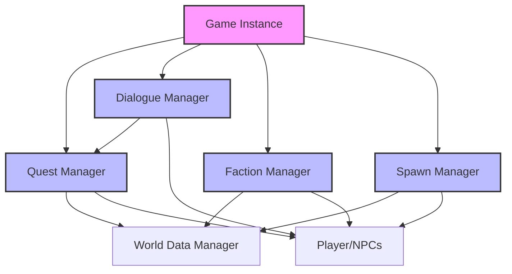

# Runtime Systems (Системы времени выполнения)

**Runtime Systems** — это глобальные менеджеры, которые работают **во время игры** и управляют всей логикой плагина. Они реализованы как **Game Instance Subsystems**, что означает, что они существуют на протяжении всей игровой сессии и доступны из любого места.

Эти системы — **сердце плагина**. Они связывают все вкладки редактора (Quests, Dialogues, NPCs, Spawners, Factions) в единую работающую экосистему.

---

## Архитектура



---

## 1. Quest Manager (`UQuestManager`)

### Назначение
Глобальный менеджер квестов, который управляет всеми квестами в игре.

### Ключевые возможности

#### A. Управление состоянием квестов
*   **StartQuest** — Активирует квест (проверяет условия активации)
*   **CompleteQuest** — Завершает квест (выдает награды)
*   **FailQuest** — Провалить квест
*   **GetQuestState** — Получить текущее состояние квеста (Inactive/Active/Completed/Failed)

#### B. Управление стадиями
*   **ActivateStage** — Активирует стадию квеста (проверяет условия)
*   **CompleteStage** — Завершает стадию (выдает награды, активирует следующие стадии)
*   **GetStageState** — Получить состояние стадии (Inactive/Active/Completed/Failed)

#### C. Система условий (Conditions)
Quest Manager автоматически проверяет условия для:
*   **Активации квестов** — Квест появится в журнале только когда условия выполнены
*   **Активации стадий** — Стадия активируется автоматически при выполнении условий
*   **Завершения стадий** — Стадия завершается автоматически при выполнении целей

Типы условий:
*   **Квестовые** — Другой квест завершен/активен
*   **Репутация** — Репутация с фракцией выше/ниже порога
*   **Инвентарь** — Предмет в инвентаре
*   **Локация** — Игрок достиг локации
*   **Враги** — Убит враг с определенным тегом
*   **Диалог** — Диалог завершен
*   **Таймер** — Прошло определенное время
*   **Кастомное событие** — Произошло игровое событие

#### D. Система действий (Actions)
Quest Manager выполняет действия при:
*   **Активации стадии** (On Stage Activated)
*   **Завершении стадии** (On Stage Completed)
*   **Получении предмета** (On Item Obtained)
*   **Убийстве врага** (On Enemy Killed)
*   **Достижении локации** (On Location Reached)
*   **Получении события** (On Game Event)
*   **Срабатывании таймера** (On Timer Elapsed)

Типы действий:
*   **Spawn Actor** — Заспавнить актора через Spawn Manager
*   **Play Sound** — Воспроизвести звук
*   **Show UI** — Показать UI-элемент
*   **Trigger Event** — Вызвать кастомное событие
*   **Custom Logic** — Вызвать Blueprint-логику через делегат

#### E. Система наград (Rewards)
*   **Опыт** — Выдача опыта игроку
*   **Предметы** — Добавление предметов в инвентарь
*   **Репутация** — Изменение репутации с фракциями
*   **Деньги** — Выдача валюты

#### F. Делегаты (Events)
Quest Manager оповещает другие системы через делегаты:
*   `OnQuestStarted` — Квест активирован
*   `OnQuestCompleted` — Квест завершен
*   `OnQuestFailed` — Квест провален
*   `OnQuestStateChanged` — Состояние квеста изменилось
*   `OnStageStateChanged` — Состояние стадии изменилось
*   `OnCustomLogicRequested` — Требуется кастомная логика

### Blueprint API

#### Получение Quest Manager
```cpp
UQuestManager* QM = UQuestManager::Get(this);
```

#### Управление квестами
```cpp
// Активировать квест
QM->StartQuest(FName("MainQuests"), "Quest_001");

// Проверить состояние
EQuestState State = QM->GetQuestState(FName("MainQuests"), "Quest_001");

// Завершить квест
QM->CompleteQuest(FName("MainQuests"), "Quest_001");
```

#### Управление стадиями
```cpp
// Активировать стадию
QM->ActivateStage(FName("MainQuests"), "Quest_001", "Stage_02");

// Завершить стадию
QM->CompleteStage(FName("MainQuests"), "Quest_001", "Stage_02");
```

#### Уведомления от внешних систем
```cpp
// Игрок получил предмет
QM->NotifyItemObtained(ItemPath, Quantity);

// Игрок убил врага
QM->NotifyEnemyKilled(EnemyActor);

// Игрок достиг локации
QM->NotifyLocationReached(LocationActor);

// Произошло кастомное событие
QM->NotifyGameEvent(FName("BossDied"), EventData);
```

---

## 2. Dialogue Manager (`UDialogueManager`)

### Назначение
Глобальный менеджер диалогов, который управляет всеми диалогами в игре.

### Ключевые возможности

#### A. Автоматический поиск диалогов
*   **RequestDialogue** — Автоматически находит подходящий диалог для NPC
*   Учитывает:
    *   Квестовые диалоги (привязанные к квестам)
    *   Bark-диалоги (случайные реплики)
    *   Приоритеты диалогов

#### B. Управление диалогами
*   **StartDialogue** — Запускает диалог
*   **SelectPlayerChoice** — Обрабатывает выбор игрока
*   Автоматическая обработка узлов:
    *   NPC Line — Реплика NPC
    *   Player Choice — Выбор игрока
    *   Smart NPC Line — Реплика с условиями
    *   Branch — Ветвление по условиям
    *   Event — Вызов события
    *   End — Завершение диалога

#### C. Интеграция с Quest Manager
*   Автоматическая проверка условий через Quest Manager
*   Автоматическое выполнение эффектов (изменение репутации, выдача предметов)
*   Автоматическая активация/завершение стадий квестов

#### D. Делегаты для UI
*   `OnShowNPCLine` — Показать реплику NPC (имя, текст)
*   `OnShowPlayerChoices` — Показать варианты ответа игрока
*   `OnHideDialogueUI` — Скрыть UI диалога

### Blueprint API

#### Получение Dialogue Manager
```cpp
UDialogueManager* DM = UDialogueManager::GetDialogueManager(this);
```

#### Запуск диалога
```cpp
// Автоматический поиск диалога для NPC
DM->RequestDialogue(PlayerActor, NPCActor);

// Или запуск конкретного диалога
DM->StartDialogue(PlayerActor, DialogueAsset);
```

#### Обработка выбора игрока
```cpp
// Игрок выбрал вариант ответа (индекс)
DM->SelectPlayerChoice(ChoiceIndex);
```

#### Подписка на события (в Blueprint)
```cpp
// Bind to OnShowNPCLine
DM->OnShowNPCLine.AddDynamic(this, &UMyWidget::ShowNPCLine);

// Bind to OnShowPlayerChoices
DM->OnShowPlayerChoices.AddDynamic(this, &UMyWidget::ShowPlayerChoices);

// Bind to OnHideDialogueUI
DM->OnHideDialogueUI.AddDynamic(this, &UMyWidget::HideDialogueUI);
```

---

## 3. Faction Manager (`UAS_FM`)

### Назначение
Глобальный менеджер фракций, который управляет репутацией и отношениями между фракциями.

### Ключевые возможности

#### A. Управление репутацией
*   **ModifyRelationStrength** — Изменить репутацию (±Delta)
*   **ForceSetRelationStrength** — Установить репутацию (точное значение)
*   **SetRelationStatus** — Установить статус отношений (Hostile/Neutral/Friendly/Allied)

#### B. Получение информации
*   **GetRelationStatus** — Получить статус отношений между фракциями
*   **GetRelationStrength** — Получить числовое значение репутации
*   **AreFactionsHostile** — Проверить, враждебны ли фракции
*   **AreFactionsFriendly** — Проверить, дружественны ли фракции

#### C. Автоматический расчет статуса
Система автоматически пересчитывает статус на основе силы отношений:
*   **Strength < -30** → Hostile (Враждебные)
*   **-30 ≤ Strength < 30** → Neutral (Нейтральные)
*   **30 ≤ Strength < 70** → Friendly (Дружественные)
*   **Strength ≥ 70** → Allied (Союзники)

#### D. Делегаты
*   `OnFactionRelationChanged` — Статус отношений изменился
*   `OnFactionRelationStrengthChanged` — Сила отношений изменилась

### Blueprint API

#### Получение Faction Manager
```cpp
UAS_FM* FM = GetGameInstance()->GetSubsystem<UAS_FM>();
```

#### Создание Global Faction ID
```cpp
// Формат: "SystemName.LocalFactionID"
FString GlobalID = UAS_FM::CreateGlobalFactionID(
    FName("MainQuests"), 
    FName("Faction_Guards")
);
```

#### Управление репутацией
```cpp
// Изменить репутацию (±Delta)
FM->ModifyRelationStrength(
    "MainQuests.Faction_Guards", 
    "MainQuests.Faction_Bandits", 
    -20  // Ухудшить отношения на 20
);

// Установить точное значение
FM->ForceSetRelationStrength(
    "MainQuests.Faction_Guards", 
    "MainQuests.Faction_Player", 
    50  // Дружественные
);
```

#### Проверка отношений
```cpp
// Получить статус
EFactionRelationStatus Status = FM->GetRelationStatus(
    "MainQuests.Faction_Guards", 
    "MainQuests.Faction_Bandits"
);

// Проверить враждебность
bool bHostile = FM->AreFactionsHostile(
    "MainQuests.Faction_Guards", 
    "MainQuests.Faction_Bandits"
);
```

---

## 4. Spawn Manager (`USpawnManager`)

### Назначение
Глобальный менеджер спавна, который управляет созданием актеров в мире.

### Ключевые возможности

#### A. Спавн через Spawn Point
*   **RequestSpawn** — Заспавнить актеров в точке спавна
*   Поддержка:
    *   Случайного выбора актеров (по весам)
    *   Случайного количества (Min/Max Count)
    *   Вложенных спавнеров (Nested Spawners)

#### B. Спавн через Spawn Zone
*   **RequestSpawnFromZone** — Заспавнить актеров в триггерной зоне
*   Автоматическая активация при входе игрока

#### C. Методы спавна
*   **On NavMesh** — Спавн на NavMesh (для наземных юнитов)
*   **In Volume** — Спавн в воздухе (для летающих врагов)
*   **Project on Surface** — Проецирование на геометрию

#### D. Кулдауны и лимиты
*   **Global Cooldown** — Кулдаун для всего Spawn Asset
*   **Config Cooldown** — Кулдаун для конкретной конфигурации
*   **Max Total Spawns** — Максимальное количество спавнов
*   **Complexity Budget** — Бюджет сложности для оптимизации

### Blueprint API

#### Получение Spawn Manager
```cpp
USpawnManager* SM = GetGameInstance()->GetSubsystem<USpawnManager>();
```

#### Спавн через Spawn Point
```cpp
// Заспавнить актеров
TArray<AActor*> SpawnedActors = SM->RequestSpawn(
    SpawnAsset,      // Spawn Asset
    SpawnPoint,      // Spawn Point
    false,           // bIgnoreCooldowns
    false            // bIgnoreLimits
);
```

#### Спавн через Spawn Zone
```cpp
// Заспавнить актеров в зоне
SM->RequestSpawnFromZone(
    SpawnZone,       // Spawn Zone
    false,           // bIgnoreCooldowns
    false            // bIgnoreLimits
);
```

---

## 5. Enhanced Input System — 🔥 KILLER FEATURE

### Назначение
Автоматическая генерация полностью настроенного Enhanced Input для Player Character.

### Ключевые особенности

**Это единственная в своем роде система**, которая программно создает:
- ✅ Input Actions с правильными типами
- ✅ Input Mapping Context с привязками клавиш
- ✅ **Input Modifiers** (Swizzle, Negate) — **программно!**
- ✅ Автоматический fallback на Legacy Input

### Компоненты

#### A. Input Generator (`FAS_QS_Player_InputGenerator`)
Создает Input Assets:
- 10 Input Actions (Move, Look, Zoom, Jump, и т.д.)
- Input Mapping Context с настроенными модификаторами
- Сохраняет всё на диск в `/Game/QuestSystem/Input/`

#### B. Input Utilities (`FAS_QS_InputUtils`)
**Уникальная утилита** для программного добавления модификаторов:
- `AddSwizzle()` — перестановка осей
- `AddNegate()` — инверсия значения
- `AddDeadZone()` — мертвая зона
- `AddScalar()` — масштабирование

#### C. Enhanced Input Component (`UPlayerInputComponent_Enhanced`)
Обрабатывает Enhanced Input во время игры:
- Загружает Input Actions
- Добавляет IMC в Enhanced Input Subsystem
- Привязывает Input Actions к callback-функциям

#### D. Player Character (`AAS_PlayerCharacter`)
Автоматический fallback:
- Проверяет доступность Enhanced Input
- Переключается на Legacy Input при необходимости
- Работает на UE 4.x и UE 5.x

### Workflow

1. Создайте Player Character через NPC Data Table
2. Система автоматически генерирует все Input Assets
3. **Игрок готов к игре сразу после создания!**

**Подробнее:** [Enhanced Input System](input_system.md) — полное описание системы

---

## 6. World Data Manager (`UAS_QS_WorldDataManager`)

### Назначение
Вспомогательный менеджер, который загружает все ассеты квестов, фракций и спавнеров из папок проекта.

### Ключевые возможности
*   **Автоматическая загрузка** всех Quest Assets из `/Game/QuestSystem/Quests/`
*   **Автоматическая загрузка** всех Faction Assets из `/Game/QuestSystem/Factions/`
*   **Автоматическая загрузка** всех Spawn Assets из `/Game/QuestSystem/Spawners/`
*   **Оповещение** других менеджеров о готовности данных

---

## Взаимодействие систем

### Пример: Квест с диалогом и спавном

1. **Quest Manager** активирует стадию квеста
2. Стадия выполняет действие **Spawn Actor** → вызывает **Spawn Manager**
3. **Spawn Manager** создает врагов в мире
4. Игрок убивает врага → вызывает `QuestManager->NotifyEnemyKilled()`
5. **Quest Manager** проверяет условия завершения стадии
6. Стадия завершается → выдается награда **Reputation** → вызывается **Faction Manager**
7. **Faction Manager** изменяет репутацию
8. Следующая стадия активируется автоматически
9. Стадия выполняет действие **Start Dialogue** → вызывает **Dialogue Manager**
10. **Dialogue Manager** запускает диалог с NPC

---

## Доступ к менеджерам из Blueprint

### Вариант 1: Через Game Instance
```cpp
UQuestManager* QM = GetGameInstance()->GetSubsystem<UQuestManager>();
UDialogueManager* DM = GetGameInstance()->GetSubsystem<UDialogueManager>();
UAS_FM* FM = GetGameInstance()->GetSubsystem<UAS_FM>();
USpawnManager* SM = GetGameInstance()->GetSubsystem<USpawnManager>();
```

### Вариант 2: Через статические функции
```cpp
// Для Dialogue Manager
UDialogueManager* DM = UDialogueManager::GetDialogueManager(this);
```

---

## Важные замечания

### 1. Game Instance Subsystems
Все менеджеры — это **Game Instance Subsystems**, что означает:
*   Они создаются **один раз** при запуске игры
*   Они существуют **на протяжении всей игровой сессии**
*   Они доступны **из любого места** (Blueprint, C++)
*   Они **автоматически уничтожаются** при завершении игры

### 2. Автоматическая инициализация
Все менеджеры инициализируются автоматически при запуске игры:
1. **World Data Manager** загружает все ассеты
2. **Quest Manager** инициализирует состояния квестов
3. **Faction Manager** инициализирует отношения фракций
4. **Dialogue Manager** готов к работе
5. **Spawn Manager** готов к работе

### 3. Сохранение и загрузка
Quest Manager и Faction Manager автоматически сохраняют свое состояние через **Save System** (см. Technical Reference).

---

**Далее:** [Technical Reference](technical_reference.md)
