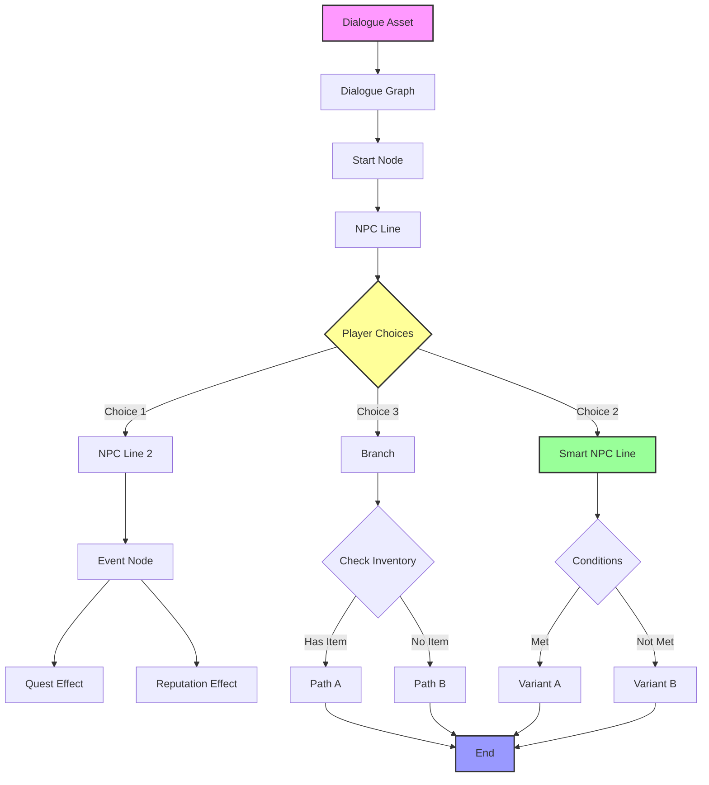
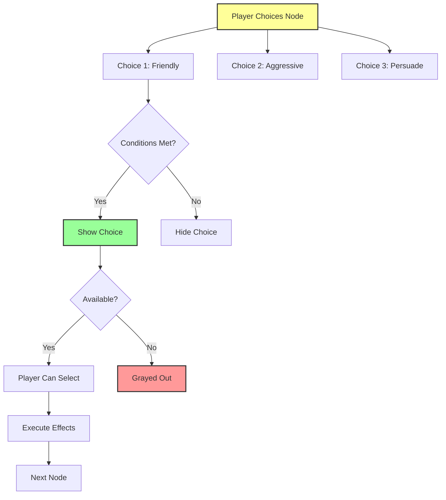
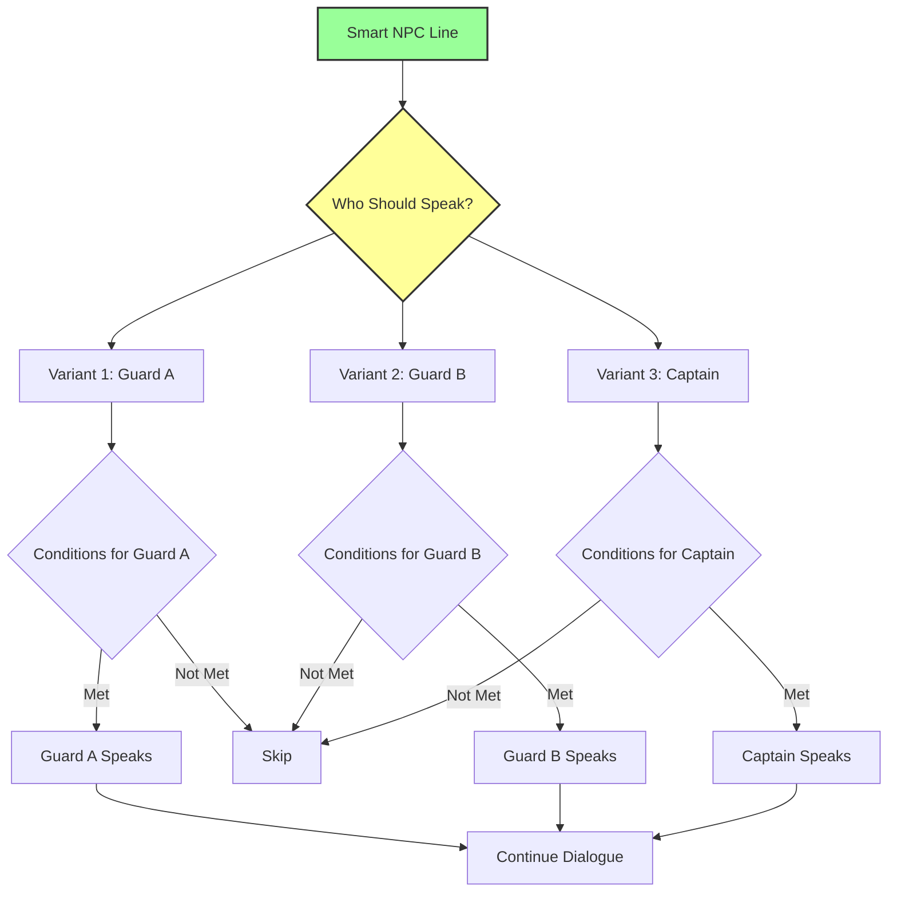
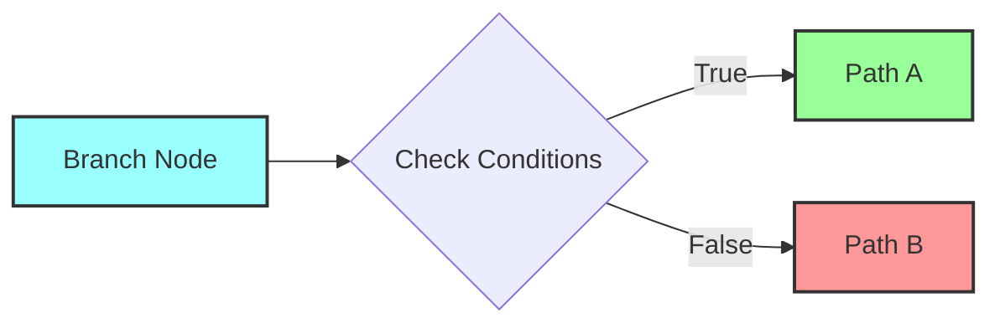
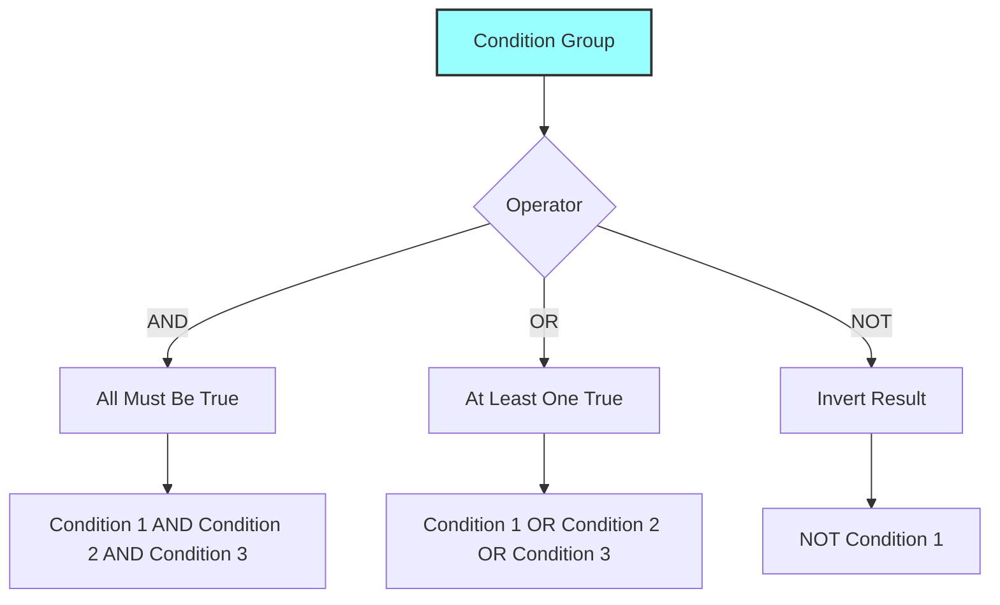
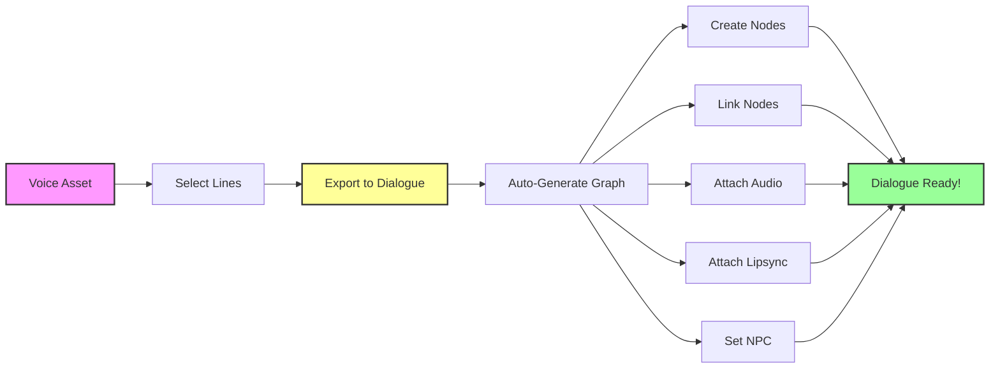

# Dialogue System — Визуальный редактор диалогов

**Dialogue System в Avatar Studio QS** — это не просто "дерево текста". Это **мощный инструмент для создания нелинейного повествования**, кинематографических сцен и живого общения с NPC.

Она объединяет визуальный граф, режиссуру катсцен, продвинутую логику условий и **автоматическую генерацию из Voice Assets** в едином интерфейсе.

---

## Проблема в обычном Unreal Engine

### Стандартный процесс создания диалогов:

1. **Создать структуру данных** для диалога (C++ или DataTable) — **1-2 часа**
2. **Написать логику ветвления** (условия, выборы игрока) — **2-3 часа**
3. **Реализовать UI** (портреты, текст, варианты ответов) — **3-4 часа**
4. **Интегрировать озвучку** (привязка аудио к репликам) — **2-3 часа**
5. **Добавить лицевую анимацию** (лип-синк) — **2-4 часа**
6. **Настроить камеры** (ракурсы для катсцен) — **1-2 часа**
7. **Интегрировать с квестами** (начало/завершение квестов) — **2-3 часа**
8. **Отладка и тестирование** — **2-3 часа**

**ИТОГО: 15-24 часа на ОДИН диалог**

И это для **каждого** диалога в игре!

---

## Решение в Avatar Studio QS

### Сколько времени нужно?

**Вариант 1: Создание вручную**
1. Создать Dialogue Asset
2. Добавить узлы в визуальном редакторе
3. Настроить условия и эффекты
4. Сохранить

**ИТОГО: 30-60 минут**

**Вариант 2: Автоматическая генерация из Voice Assets** — 🔥 **KILLER FEATURE**
1. Создать Voice Asset с репликами
2. Выбрать реплики
3. Нажать **"Export to Dialogue Graph"**

**ИТОГО: 5-10 минут!**

Система **автоматически**:
- ✅ Создает узлы диалога для каждой реплики
- ✅ Связывает узлы в правильной последовательности
- ✅ Привязывает озвучку и лицевую анимацию
- ✅ Настраивает NPC из метаданных
- ✅ Интегрируется с Quest System
- ✅ Интегрируется с Faction System
- ✅ **Диалог готов к использованию сразу после создания!**

---

## Архитектура системы



---

## Типы узлов (Node Types)

### Сравнительная таблица

| Тип узла | Назначение | Озвучка | Условия | Эффекты | Сложность |
|----------|------------|---------|---------|---------|-----------|
| **NPC Line** | Реплика NPC | ✅ | ✅ | ✅ | ⭐ |
| **Player Line** | Реплика игрока | ✅ | ✅ | ✅ | ⭐ |
| **Player Choices** | Выбор игрока | ❌ | ✅ | ✅ | ⭐⭐ |
| **Smart NPC Line** | Динамическая реплика | ✅ | ✅ | ✅ | ⭐⭐⭐⭐ |
| **Branch** | Ветвление по условиям | ❌ | ✅ | ❌ | ⭐⭐ |
| **Event** | Триггер действий | ❌ | ❌ | ✅ | ⭐ |
| **End** | Завершение диалога | ❌ | ❌ | ✅ | ⭐ |

---

### 1. 🗣️ NPC Line (Реплика NPC)

Базовый узел для реплик NPC.

**Свойства:**

| Категория | Поле | Описание |
|-----------|------|----------|
| **Content** | Speaker | Кто говорит (NPC ID) |
| | Text | Текст реплики (локализуемый) |
| **Voice** | Audio Asset | Аудио файл озвучки |
| | Lipsync Data | Данные лип-синка |
| **Presentation** | Portrait | Портрет NPC |
| | Emotion | Эмоция (Happy, Sad, Angry, и т.д.) |
| | Camera Shot | Ракурс камеры (Close-up, Medium, Wide) |
| **Logic** | Conditions | Условия показа реплики |
| | Effects | Действия при входе/выходе |

---

### 2. 👤 Player Line (Реплика игрока)

Реплика для озвученных протагонистов. Работает аналогично NPC Line.

**Особенности:**
- Автоматически использует данные Player Character
- Поддерживает несколько вариантов протагониста
- Интегрируется с Voice Assets игрока

---

### 3. 🔀 Player Choices (Выбор игрока) — Ключ к нелинейности

Узел для создания ветвящихся диалогов.



**Возможности:**

| Функция | Описание | Пример |
|---------|----------|--------|
| **Неограниченное число вариантов** | Любое количество ответов | 2-10 вариантов |
| **Скрытые ответы** | Показывать только при условиях | "Требуется Интеллект > 5" |
| **Блокировка** | Видимы, но недоступны (серые) | "Нужен ключ" |
| **Условия на каждый вариант** | Индивидуальные условия | Reputation, Items, Quests |
| **Эффекты на выбор** | Действия при выборе | Give Item, Change Reputation |
| **Иконки** | Визуальные маркеры | 💰 (торговля), ⚔️ (угроза) |

**Пример конфигурации:**

```
Choice 1: "Помогу вам" (Friendly)
  Conditions: Reputation with "Villagers" >= 0
  Effects: Change Reputation (+10)
  Icon: ❤️

Choice 2: "Заплатите мне" (Greedy)
  Conditions: None
  Effects: Give Item (Gold, 50)
  Icon: 💰

Choice 3: "Убирайтесь!" (Aggressive)
  Conditions: Player Level >= 5
  Effects: Change Reputation (-20), Start Combat
  Icon: ⚔️
  
Choice 4: "Я знаю секрет..." (Persuade)
  Conditions: Has Item ("Secret Letter")
  Available: true
  Blocked: !HasItem("Secret Letter")
  Blocked Message: "Требуется: Секретное письмо"
  Icon: 🗨️
```

---

### 4. 🧠 Smart NPC Line (Умная реплика) — 🔥 KILLER FEATURE

**Уникальный узел**, который **сам решает**, кто и что скажет.

#### Динамический спикер

Один узел может заставить говорить **любого** NPC в зависимости от ситуации.



**Пример использования:**

```
Smart NPC Line: "Приветствие стражника"

Speaker Variant 1: Guard_A
  Conditions: Guard_A is alive AND in range
  Weight: 1.0
  
Speaker Variant 2: Guard_B
  Conditions: Guard_B is alive AND in range
  Weight: 1.0
  
Speaker Variant 3: Guard_Captain
  Conditions: Guard_Captain is alive AND in range
  Weight: 2.0 (выше приоритет)
```

#### Вариативность текста

NPC может сказать одну и ту же мысль **по-разному** в зависимости от контекста.

```
Text Variant 1: "Привет, друг!"
  Conditions: Reputation >= 50
  Weight: 1.0
  
Text Variant 2: "Здравствуй."
  Conditions: Reputation >= 0 AND < 50
  Weight: 1.0
  
Text Variant 3: "Чего надо?"
  Conditions: Reputation < 0
  Weight: 1.0
  
Text Variant 4: "Рад тебя видеть, герой!"
  Conditions: Quest "SaveVillage" Completed
  Weight: 2.0 (выше приоритет)
```

#### Система весов (Weights)

Если несколько вариантов подходят, система выбирает случайный с учетом весов:

| Weight | Вероятность | Использование |
|--------|-------------|---------------|
| 0.5 | Редко | Уникальные реплики |
| 1.0 | Нормально | Стандартные реплики |
| 2.0 | Часто | Приоритетные реплики |
| 5.0 | Очень часто | Важные реплики |

---

### 5. 🌲 Branch (Ветвление)

Технический узел для проверки условий **без участия игрока**.



**Примеры использования:**

```
Branch: "Проверка предмета"
  Condition: Has Item ("Key")
  True Path: "У вас есть ключ! Проходите."
  False Path: "Вам нужен ключ."

Branch: "Проверка времени суток"
  Condition: Time Of Day = Night
  True Path: "Ночной диалог"
  False Path: "Дневной диалог"

Branch: "Проверка репутации"
  Condition: Reputation with "Guards" >= 50
  True Path: "Дружелюбный диалог"
  False Path: "Нейтральный диалог"
```

---

### 6. ⚡ Event (Событие)

Триггер геймплейных изменений.

**Доступные действия:**

| Категория | Действие | Параметры |
|-----------|----------|-----------|
| **Квесты** | Start Quest | Quest ID |
| | Complete Quest | Quest ID |
| | Activate Stage | Quest ID, Stage ID |
| | Complete Stage | Quest ID, Stage ID |
| **Инвентарь** | Give Item | Item Path, Quantity |
| | Remove Item | Item Path, Quantity |
| **Репутация** | Change Reputation | Faction ID, Delta |
| **Мир** | Set Global Flag | Flag Name, Value |
| | Trigger Event | Event Name, Data |
| **Спавн** | Spawn Actor | Spawn Asset, Location |
| **UI** | Show Message | Text, Duration |
| **Звук** | Play Sound | Sound Asset |

---

## Система условий (Conditions Engine)

Dialogue System использует **мощный движок условий** для проверки состояния мира.

### Категории условий

#### 1. Квестовые условия

| Условие | Описание | Пример |
|---------|----------|--------|
| Quest State | Состояние квеста | "Tutorial" = Completed |
| Stage State | Состояние стадии | "Quest_001.Stage_02" = Active |
| Quest Progress | Прогресс квеста | "SaveVillage" >= 50% |

#### 2. Инвентарь

| Условие | Описание | Пример |
|---------|----------|--------|
| Has Item | Наличие предмета | HasItem("Key") |
| Item Count | Количество | ItemCount("Gold") >= 100 |
| Equipment | Экипировка | HasEquipped("Sword") |

#### 3. Репутация

| Условие | Описание | Пример |
|---------|----------|--------|
| Faction Reputation | Отношение с фракцией | "Guards" >= 50 |
| Faction Status | Статус отношений | "Bandits" = Hostile |
| Reputation Delta | Изменение репутации | "Villagers" changed by +20 |

#### 4. Глобальные флаги

| Условие | Описание | Пример |
|---------|----------|--------|
| Global Flag | Булев флаг | BossDead = true |
| Global Variable | Числовая переменная | DragonKills >= 5 |

#### 5. Игрок

| Условие | Описание | Пример |
|---------|----------|--------|
| Player Level | Уровень | Level >= 10 |
| Player Health | Здоровье | Health < 50% |
| Player Class | Класс персонажа | Class = "Warrior" |

#### 6. Контекстные (Combat & Status)

| Условие | Описание | Пример |
|---------|----------|--------|
| Is Hostile | Враждебность | NPC.IsHostile = true |
| In Combat | В бою | Player.InCombat = true |
| Has Effect | Бафф/дебафф | HasEffect("Poisoned") |
| Damage Taken | Получен урон | DamageTaken > 100 |
| Damage Type | Тип урона | LastDamageType = Fire |

### Логические операторы



**Пример сложного условия:**

```
Show Choice "Помочь стражникам"
Conditions:
  AND Group:
    - Reputation with "Guards" >= 30
    - NOT Quest "BetrayGuards" Active
    OR Group:
      - Has Item ("Guard Badge")
      - Player Level >= 5
```

---

## Интеграция с Voice Assets — 🔥 KILLER FEATURE

**Одна кнопка — готовый диалог.**

### Workflow: Автоматическая генерация



### Что создается автоматически:

1. ✅ **Узлы диалога** для каждой реплики
2. ✅ **Связи между узлами** (последовательность)
3. ✅ **Привязка к NPC** (из метаданных Voice Asset)
4. ✅ **Привязка аудио** (Sound Wave)
5. ✅ **Привязка лицевой анимации** (Lipsync Data)
6. ✅ **Узел "End"** в конце цепочки

### Voice Link System

Каждая реплика хранит ссылку на исходный Voice Asset:

| Поле | Описание |
|------|----------|
| **Source Voice Asset** | Откуда взята реплика |
| **Source Line ID** | Уникальный ID реплики |
| **Auto-Update** | Автообновление при изменении Voice Asset |

**Преимущества:**
- 🔄 Централизованное обновление озвучки
- 📊 Отслеживание использования реплик
- 🔗 Синхронизация изменений текста

---

## Режимы презентации (Presentation Modes)

### Сравнительная таблица

| Режим | UI | Камера | Движение | Анимации | Использование |
|-------|----|----|----------|----------|---------------|
| **Simple** | Портрет + текст | Фиксированная | Нет | Нет | Быстрые диалоги |
| **Cinematic** | Level Sequence | Динамическая | Да | Да | Катсцены |
| **Walk and Talk** | Портрет + текст | Следящая | Да | Нет | Диалоги на ходу |

### 1. 📄 Simple (Static)

Классический режим с портретом и текстом.

**Настройки:**
- Портрет NPC (статичное изображение)
- Эмоция (меняет портрет)
- Camera Shot Tag (Close-up, Medium, Wide)

### 2. 🎬 Cinematic (Level Sequence)

Превратите диалог в катсцену **одним кликом**.

**Workflow:**
1. Создайте Level Sequence с анимациями
2. Укажите ассет в узле диалога
3. Диалог автоматически проиграет секвенцию

**Особенности:**
- Seamless Transition (плавный переход)
- Автоматический возврат управления
- Синхронизация с озвучкой

### 3. 🚶 Walk and Talk

Диалог "на ходу" — персонажи продолжают двигаться.

**Особенности:**
- NPC следует за игроком или ведет его
- Камера остается динамичной
- Игрок может прервать диалог

---

## Интеграция с Quest System

Диалоги и квесты работают **вместе**.

### Примеры интеграции

| Сценарий | Реализация |
|----------|------------|
| **Диалог начинает квест** | Event Node → Start Quest |
| **Диалог завершает стадию** | Event Node → Complete Stage |
| **Квест меняет диалог** | Conditions на узлах → Quest State |
| **Квест блокирует ответы** | Player Choice Conditions → Stage State |

**Пример:**

```
NPC Line: "Помоги мне!"
  On Exit Effects:
    - Start Quest ("SaveVillage")

Player Choices:
  Choice 1: "Помогу"
    Conditions: Quest "SaveVillage" = Active
    Effects: Activate Stage ("SaveVillage.Stage_01")
    
  Choice 2: "Уже помог"
    Conditions: Quest "SaveVillage" = Completed
    Effects: Give Item (Gold, 100)
```

---

## Dialogue Variables (Внутренние переменные)

Для сложной логики внутри одного диалога.

### Типы переменных

| Тип | Описание | Пример использования |
|-----|----------|----------------------|
| **Boolean** | Булев флаг | "MentionedKing" = true |
| **Integer** | Целое число | "RudeAnswers" = 3 |
| **Float** | Дробное число | "TrustLevel" = 0.75 |
| **String** | Строка | "PlayerName" = "Hero" |

### Пример использования

```
Player Choices Node:
  Choice 1: "Грубый ответ"
    Effects:
      - Increment Variable ("RudeAnswers")
      
Branch Node:
  Condition: Variable "RudeAnswers" >= 3
  True Path: "NPC разозлился"
  False Path: "Продолжить диалог"
```

**Важно:** Переменные живут только внутри текущего диалога и сбрасываются после завершения.

---

## Dialogue Manager (Runtime)

Dialogue System работает через **Dialogue Manager** — глобальный менеджер диалогов (Game Instance Subsystem).

### Blueprint API

```cpp
// Получить Dialogue Manager
UDialogueManager* DM = UDialogueManager::GetDialogueManager(this);

// Автоматический поиск диалога для NPC
DM->RequestDialogue(PlayerActor, NPCActor);

// Или запуск конкретного диалога
DM->StartDialogue(PlayerActor, DialogueAsset);

// Обработка выбора игрока
DM->SelectPlayerChoice(ChoiceIndex);
```

### Делегаты для UI

| Делегат | Когда вызывается | Параметры |
|---------|------------------|-----------|
| `OnShowNPCLine` | Показать реплику NPC | Speaker Name, Text, Portrait |
| `OnShowPlayerChoices` | Показать варианты ответа | Array of Choices |
| `OnHideDialogueUI` | Скрыть UI диалога | - |
| `OnDialogueStarted` | Диалог начался | Dialogue Asset |
| `OnDialogueEnded` | Диалог завершен | Dialogue Asset |

**Подписка на события:**

```cpp
// В Blueprint Widget
DM->OnShowNPCLine.AddDynamic(this, &UMyWidget::ShowNPCLine);
DM->OnShowPlayerChoices.AddDynamic(this, &UMyWidget::ShowPlayerChoices);
DM->OnHideDialogueUI.AddDynamic(this, &UMyWidget::HideDialogueUI);
```

---

## Workflow: Создание диалога

### Пример: Диалог "Торговец"

#### Вариант 1: Ручное создание

**Шаг 1:** Создать Dialogue Asset
- ID: `Dialogue_Merchant_Trade`
- Display Name: "Торговля с купцом"

**Шаг 2:** Добавить узлы

```
[Start] → [NPC Line 1] → [Player Choices] → [Branch] → [End]
```

**NPC Line 1:** "Приветствую! Что желаете?"
- Speaker: Merchant_01
- Audio: merchant_greeting.wav
- Portrait: merchant_happy

**Player Choices:**
- "Покажите товары" → [Event: Open Shop UI]
- "Есть ли работа?" → [NPC Line 2: "Да, помогите мне..."]
- "Прощайте" → [End]

**Шаг 3:** Сохранить

#### Вариант 2: Автоматическая генерация

**Шаг 1:** Создать Voice Asset
- ID: `Voice_Merchant_Greetings`
- Lines:
  1. "Приветствую! Что желаете?"
  2. "Рад вас видеть снова!"
  3. "Чем могу помочь?"

**Шаг 2:** Export to Dialogue
- Выбрать все 3 реплики
- Нажать "Export to Dialogue Graph"
- Указать NPC: Merchant_01

**Шаг 3:** Готово!
- Система создала 3 узла + End
- Привязала озвучку и лип-синк
- Диалог готов к использованию

---

## Сравнение с индустрией

| Функция | Avatar Studio QS | Unreal Engine (стандарт) | Другие плагины |
|---------|------------------|--------------------------|----------------|
| Визуальный редактор | ✅ Node Graph | ❌ Нет | ⚠️ Списки/Деревья |
| Smart NPC Line | ✅ Уникальная особенность | ❌ Нет | ❌ Нет |
| Автогенерация из Voice | ✅ Да | ❌ Нет | ❌ Нет |
| Условия на реплики | ✅ 15+ типов | ❌ Требует C++ | ⚠️ 3-5 типов |
| Интеграция с квестами | ✅ Автоматическая | ❌ Ручная | ⚠️ Ручная |
| Интеграция с репутацией | ✅ Автоматическая | ❌ Нет | ❌ Нет |
| Cinematic Mode | ✅ Level Sequence | ❌ Требует реализации | ⚠️ Базовое |
| Время создания диалога | ✅ 5-60 минут | ❌ 15-24 часа | ⚠️ 2-4 часа |

---

## Заключение

**Dialogue System в Avatar Studio QS** — это **профессиональное решение**, которое:

- 🏆 **Экономит 95% времени** — 5-60 минут вместо 15-24 часов
- 🔥 **Smart NPC Line** — уникальная система динамических реплик
- ✅ **Автогенерация** — из Voice Assets одной кнопкой
- 🎯 **Полная интеграция** — с квестами, фракциями, лип-синком
- 🎬 **Cinematic Mode** — катсцены без программирования
- 🛡️ **Надежно** — проверенная архитектура Dialogue Manager
- 🔧 **Гибко** — от простых диалогов до сложных ветвлений

Это **killer feature**, который делает Avatar Studio QS **незаменимым инструментом** для создания RPG с живыми диалогами!

---

**Далее:** [Вкладка 5: NPC и Анимации](tab_npcs.md)
