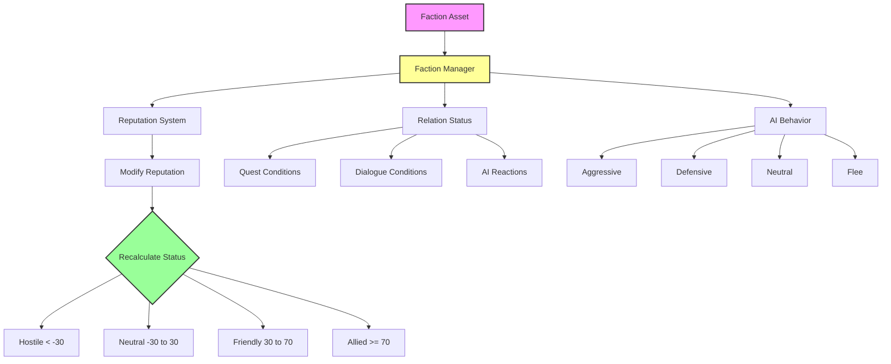
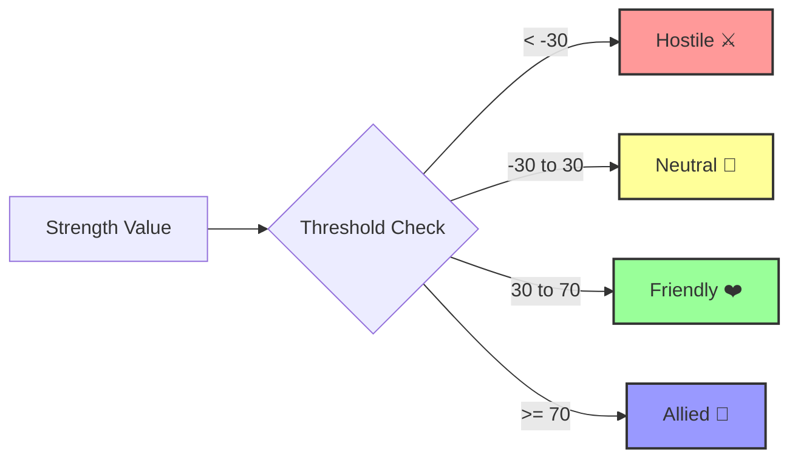
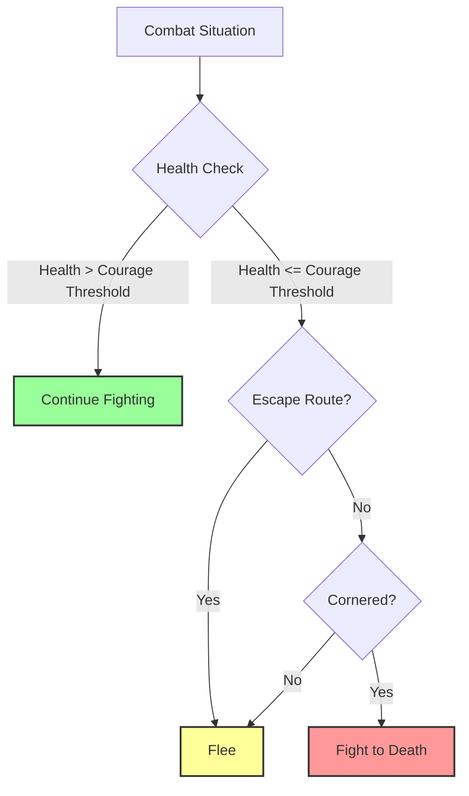
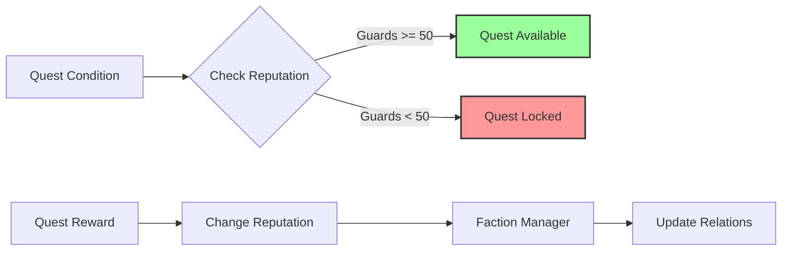

# Faction System — Система репутации и отношений

**Faction System в Avatar Studio QS** — это **динамическая система репутации**, которая управляет отношениями между фракциями, NPC и игроком в реальном времени.

Она автоматически пересчитывает статусы отношений, влияет на поведение AI и интегрируется с квестами и диалогами **без единой строчки кода**.

---

## Проблема в обычном Unreal Engine

### Стандартный процесс создания системы репутации:

1. **Создать структуру данных** для фракций (C++ или DataTable) — **1-2 часа**
2. **Реализовать систему отношений** (кто друг, кто враг) — **2-3 часа**
3. **Написать логику изменения репутации** — **1-2 часа**
4. **Автоматический пересчет статусов** (Hostile/Neutral/Friendly) — **1-2 часа**
5. **Интегрировать с AI** (враги атакуют, друзья помогают) — **2-4 часа**
6. **Интегрировать с квестами** (условия активации, награды) — **2-3 часа**
7. **Интегрировать с диалогами** (разные ветки для разной репутации) — **1-2 часа**
8. **Система сохранения** репутации — **1-2 часа**

**ИТОГО: 11-20 часов**

---

## Решение в Avatar Studio QS

### Сколько времени нужно?

1. Создать Faction Asset
2. Настроить начальные отношения
3. Настроить AI поведение
4. Сохранить

**ИТОГО: 5-10 минут!**

Система **автоматически**:
- ✅ Управляет репутацией между фракциями
- ✅ Автоматически пересчитывает статусы (Hostile/Neutral/Friendly/Allied)
- ✅ Интегрируется с AI поведением
- ✅ Интегрируется с Quest System (условия и награды)
- ✅ Интегрируется с Dialogue System (условия на реплики)
- ✅ Сохраняет состояние автоматически
- ✅ **Фракция готова к использованию сразу!**

---

## Архитектура системы



---

## Система репутации

### Статусы отношений



### Таблица статусов

| Статус | Диапазон | Иконка | Поведение AI | Примеры |
|--------|----------|--------|--------------|---------|
| **Hostile** | < -30 | ⚔️ | Атакует при обнаружении | Враги, бандиты |
| **Neutral** | -30 до 30 | 🤝 | Игнорирует | Незнакомцы, торговцы |
| **Friendly** | 30 до 70 | ❤️ | Помогает при атаке | Союзники, друзья |
| **Allied** | >= 70 | 👑 | Активно защищает | Близкие друзья, гильдия |

### Автоматический пересчет

Система **автоматически** пересчитывает статус при изменении силы отношений:

```cpp
// Изменить репутацию
FactionManager->ModifyRelationStrength("Guards", "Player", +20);

// Система автоматически:
// 1. Обновляет Strength (50 → 70)
// 2. Пересчитывает Status (Friendly → Allied)
// 3. Оповещает AI (NPC начинают активно защищать игрока)
// 4. Вызывает делегаты (UI обновляет иконку)
```

---

## Структура Faction Asset

### Основные категории

| Категория | Поля | Описание |
|-----------|------|----------|
| **Identity** | Faction ID | Уникальный идентификатор |
| | Display Name | Название для игрока (локализуемое) |
| | Description | Описание или лор фракции |
| | Icon | Иконка или герб фракции |
| **Initial Relations** | Target Faction | Другая фракция |
| | Status | Hostile/Neutral/Friendly |
| | Strength | Сила отношений (0-100) |
| **AI Behavior** | Default Behavior Preset | Шаблон поведения |
| | Courage Threshold | Порог храбрости |

---

## AI Behavior (Поведение ИИ)

Каждая фракция имеет **базовую логику поведения** для своих NPC.

### Пресеты поведения

| Preset | Описание | Когда атакует | Когда отступает | Использование |
|--------|----------|---------------|-----------------|---------------|
| **Standard_Aggressive** | Агрессивный | При обнаружении врага | Никогда | Бандиты, враги |
| **Standard_Defensive** | Оборонительный | Только в ответ | При критическом здоровье | Стражники |
| **Standard_Neutral** | Нейтральный | Только если атакован | При любой угрозе | Торговцы, мирные NPC |
| **AlwaysFlee** | Трусливый | Никогда | Всегда | Крестьяне, дети |
| **FleeUnlessCornered** | Осторожный | Только если загнан в угол | Если есть путь отступления | Разведчики |
| **Brave_NeverRetreat** | Храбрый | При обнаружении врага | Никогда | Элитные воины, боссы |

### Courage Threshold (Порог храбрости)

Для режимов с отступлением:



**Пример:**
- **Courage Threshold = 30%**
  - Здоровье > 30% → Сражается
  - Здоровье <= 30% → Пытается убежать

---

## Интеграция с другими системами

### Quest System



**Примеры использования:**

| Сценарий | Реализация |
|----------|------------|
| **Квест требует репутацию** | Activation Condition: Reputation "Guards" >= 50 |
| **Квест дает репутацию** | Reward: Change Reputation "Guards" +20 |
| **Квест портит репутацию** | Effect: Change Reputation "Bandits" -30 |

### Dialogue System

**Условия на реплики:**

```
NPC Line: "Приветствую, друг!"
  Conditions: Reputation with "Guards" >= 50

NPC Line: "Чего надо?"
  Conditions: Reputation with "Guards" >= 0 AND < 50

NPC Line: "Убирайся, преступник!"
  Conditions: Reputation with "Guards" < 0
```

**Эффекты на выборы:**

```
Player Choice: "Помогу вам"
  Effects: Change Reputation "Guards" +10

Player Choice: "Заплатите мне"
  Effects: Change Reputation "Guards" -5
```

### AI System

Фракции автоматически влияют на поведение AI:

```cpp
// NPC проверяет отношение к игроку
EFactionRelationStatus Status = FactionManager->GetRelationStatus(
    NPCFaction, 
    PlayerFaction
);

if (Status == EFactionRelationStatus::Hostile)
{
    // Атаковать игрока
    AttackTarget(Player);
}
else if (Status == EFactionRelationStatus::Friendly)
{
    // Помочь игроку
    AssistTarget(Player);
}
```

---

## Faction Manager (Runtime)

Faction System работает через **Faction Manager** (`UAS_FM`) — глобальный менеджер фракций (Game Instance Subsystem).

### Blueprint API

#### Получение Faction Manager

```cpp
UAS_FM* FM = GetGameInstance()->GetSubsystem<UAS_FM>();
```

#### Global Faction ID

Фракции идентифицируются через **Global Faction ID**:

```
Format: "SystemName.LocalFactionID"
Example: "MainQuests.Faction_Guards"
```

**Создание Global ID:**

```cpp
FString GlobalID = UAS_FM::CreateGlobalFactionID(
    FName("MainQuests"), 
    FName("Faction_Guards")
);
// Result: "MainQuests.Faction_Guards"
```

#### Управление репутацией

| Функция | Описание | Пример |
|---------|----------|--------|
| `ModifyRelationStrength` | Изменить репутацию (±Delta) | +20, -15 |
| `ForceSetRelationStrength` | Установить точное значение | 50 |
| `SetRelationStatus` | Установить статус напрямую | Hostile, Friendly |

**Примеры:**

```cpp
// Изменить репутацию (±Delta)
FM->ModifyRelationStrength(
    "MainQuests.Faction_Guards", 
    "MainQuests.Faction_Bandits", 
    -20  // Ухудшить отношения на 20
);

// Установить точное значение
FM->ForceSetRelationStrength(
    "MainQuests.Faction_Guards", 
    "MainQuests.Faction_Player", 
    50  // Дружественные
);

// Установить статус напрямую
FM->SetRelationStatus(
    "MainQuests.Faction_Guards",
    "MainQuests.Faction_Bandits",
    EFactionRelationStatus::Hostile
);
```

#### Получение информации

```cpp
// Получить статус
EFactionRelationStatus Status = FM->GetRelationStatus(
    "MainQuests.Faction_Guards", 
    "MainQuests.Faction_Bandits"
);

// Получить числовое значение
float Strength = FM->GetRelationStrength(
    "MainQuests.Faction_Guards", 
    "MainQuests.Faction_Player"
);

// Проверить враждебность
bool bHostile = FM->AreFactionsHostile(
    "MainQuests.Faction_Guards", 
    "MainQuests.Faction_Bandits"
);

// Проверить дружественность
bool bFriendly = FM->AreFactionsFriendly(
    "MainQuests.Faction_Guards", 
    "MainQuests.Faction_Player"
);
```

### Делегаты (Events)

| Делегат | Когда вызывается | Параметры |
|---------|------------------|-----------|
| `OnFactionRelationChanged` | Статус изменился | Faction A, Faction B, New Status |
| `OnFactionRelationStrengthChanged` | Сила изменилась | Faction A, Faction B, New Strength |

**Использование:**

```cpp
// Подписка на событие
FM->OnFactionRelationChanged.AddDynamic(this, &UMyClass::OnRelationChanged);

// Callback
void UMyClass::OnRelationChanged(
    FString FactionA, 
    FString FactionB, 
    EFactionRelationStatus NewStatus
)
{
    UE_LOG(LogTemp, Log, TEXT("Relation changed: %s <-> %s = %d"), 
        *FactionA, *FactionB, (int32)NewStatus);
}
```

---

## Workflow: Создание фракции

### Пример: Создание фракции "Стражники"

#### Шаг 1: Создать Faction Asset

1. Нажмите **"Create Faction"** во вкладке Factions
2. Введите ID: `Faction_Guards`

#### Шаг 2: Заполнить Identity

- **Display Name:** "Городская стража"
- **Description:** "Защитники города, поддерживающие порядок"
- **Icon:** Guard_Emblem

#### Шаг 3: Настроить Initial Relations

**Отношения с другими фракциями:**

| Target Faction | Status | Strength |
|----------------|--------|----------|
| `Faction_Bandits` | Hostile | -50 |
| `Faction_Merchants` | Friendly | 40 |
| `Faction_Player` | Neutral | 0 |

#### Шаг 4: Настроить AI Behavior

- **Default Behavior Preset:** Standard_Defensive
- **Courage Threshold:** 30%

#### Шаг 5: Сохранить

Фракция готова к использованию!

---

## Примеры использования

### Пример 1: Система репутации с игроком

```cpp
// Игрок помог стражникам
FM->ModifyRelationStrength("Guards", "Player", +15);
// Репутация: 0 → 15 (Neutral)

// Игрок выполнил квест
FM->ModifyRelationStrength("Guards", "Player", +20);
// Репутация: 15 → 35 (Friendly)

// Игрок убил стражника
FM->ModifyRelationStrength("Guards", "Player", -60);
// Репутация: 35 → -25 (Neutral, но близко к Hostile)

// Игрок атаковал капитана
FM->ModifyRelationStrength("Guards", "Player", -20);
// Репутация: -25 → -45 (Hostile)
// Теперь все стражники атакуют игрока!
```

### Пример 2: Война фракций

```cpp
// Начало войны между стражниками и бандитами
FM->SetRelationStatus("Guards", "Bandits", EFactionRelationStatus::Hostile);

// Игрок помогает стражникам
FM->ModifyRelationStrength("Guards", "Player", +30);  // Friendly
FM->ModifyRelationStrength("Bandits", "Player", -30); // Hostile

// Теперь:
// - Стражники помогают игроку
// - Бандиты атакуют игрока
```

### Пример 3: Условия квеста

```
Quest: "Вступление в гильдию"
  Activation Conditions:
    - Reputation with "Guards" >= 50
    - NOT Reputation with "Bandits" >= 0
  
  Rewards:
    - Change Reputation "Guards" +20
    - Change Reputation "Merchants" +10
```

---

## Сохранение и загрузка

Faction Manager **автоматически** сохраняет состояние всех отношений через **Save System**.

**Что сохраняется:**
- ✅ Сила отношений между всеми фракциями
- ✅ Статусы отношений
- ✅ История изменений (опционально)

**Что НЕ нужно делать вручную:**
- ❌ Писать код сохранения/загрузки
- ❌ Создавать SaveGame структуры
- ❌ Управлять файлами сохранений

Всё работает **автоматически**!

---

## Сравнение с индустрией

| Функция | Avatar Studio QS | Unreal Engine (стандарт) | Другие плагины |
|---------|------------------|--------------------------|----------------|
| Система репутации | ✅ Встроенная | ❌ Требует реализации | ⚠️ Базовая |
| Автопересчет статусов | ✅ Автоматически | ❌ Требует C++ | ⚠️ Ручной |
| Интеграция с AI | ✅ Автоматическая | ❌ Требует реализации | ⚠️ Ручная |
| Интеграция с квестами | ✅ Автоматическая | ❌ Ручная | ⚠️ Ручная |
| Интеграция с диалогами | ✅ Автоматическая | ❌ Ручная | ❌ Нет |
| Автосохранение | ✅ Да | ❌ Требует реализации | ⚠️ Базовое |
| Время создания фракции | ✅ 5-10 минут | ❌ 11-20 часов | ⚠️ 1-2 часа |

---

## Заключение

**Faction System в Avatar Studio QS** — это **профессиональное решение**, которое:

- 🏆 **Экономит 95% времени** — 5-10 минут вместо 11-20 часов
- ✅ **Автоматический пересчет** — статусы обновляются в реальном времени
- 🎯 **Полная интеграция** — с квестами, диалогами, AI
- 🤖 **AI Behavior** — 6 готовых пресетов поведения
- 🛡️ **Надежно** — проверенная архитектура Faction Manager
- 💾 **Автосохранение** — состояние сохраняется автоматически
- 🔧 **Гибко** — от простых отношений до сложных политических систем

Это **важная система**, которая делает Avatar Studio QS **полноценным решением** для создания RPG с живым миром!

---

**Далее:** [Вкладка 3: Спавнеры (Spawners)](tab_spawners.md)
