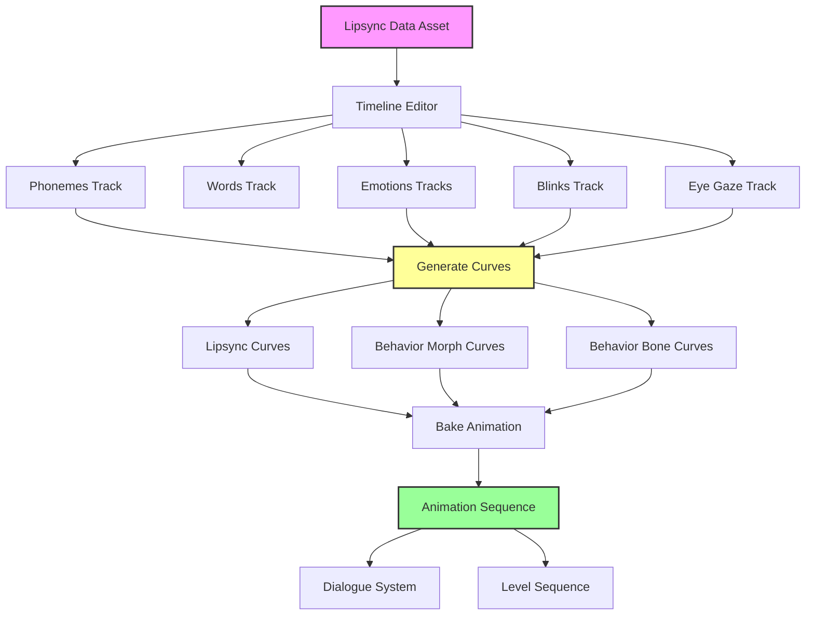
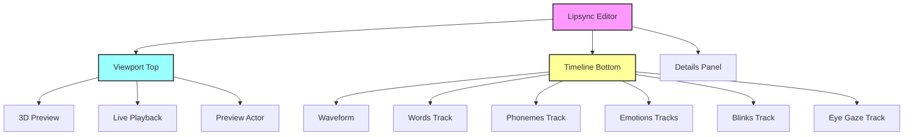
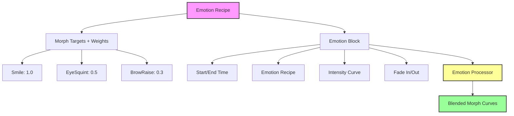
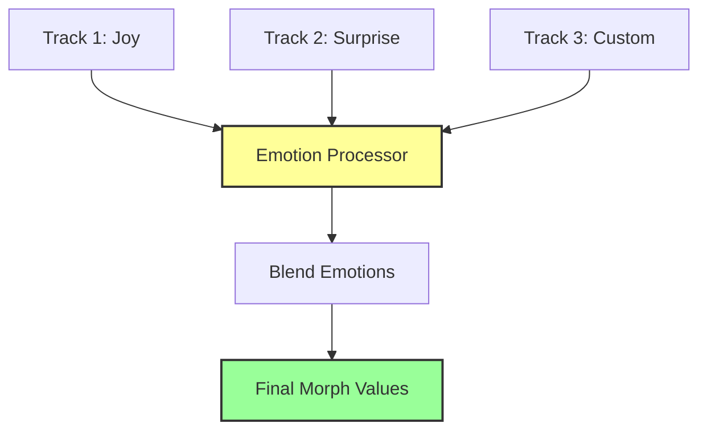
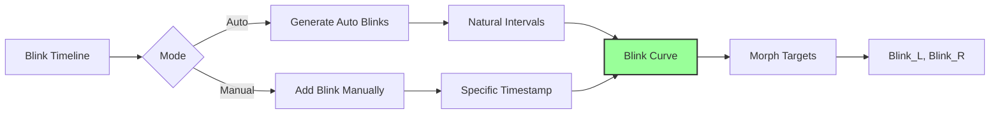
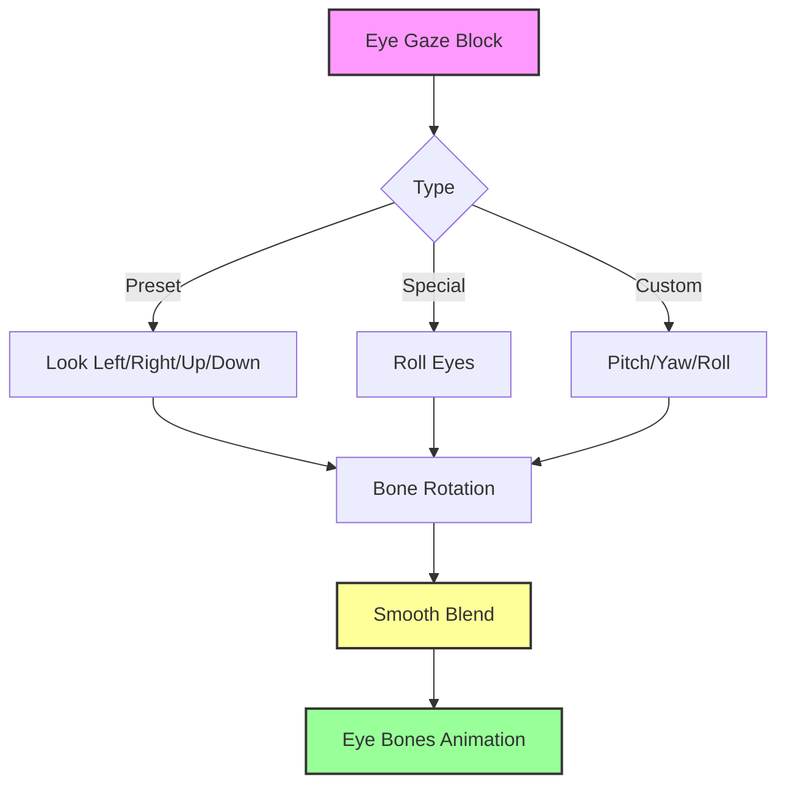
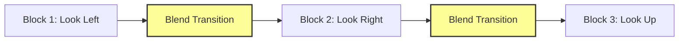
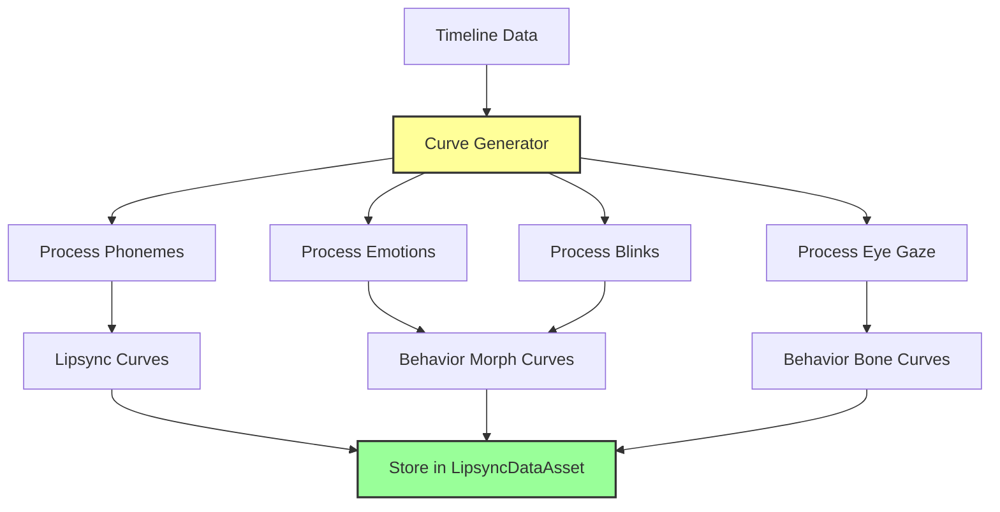
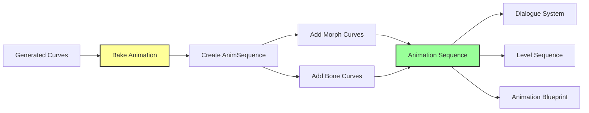
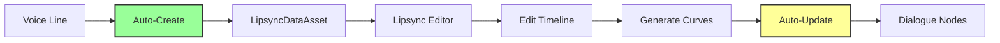

# Lipsync System — Живая лицевая анимация

**Lipsync System в Avatar Studio QS** — это не просто "рот двигается под звук". Это **полноценный инструмент** для создания живой лицевой анимации, включающий речь, эмоции, моргания и режиссуру взгляда.

Вы можете создать анимацию **автоматически** (через MFA) или вручную отредактировать каждую деталь в многодорожечном редакторе.

---

## Проблема в обычном Unreal Engine

### Стандартный процесс создания лицевой анимации:

1. **Настроить морф-таргеты** на меше — **1-2 часа**
2. **Создать Animation Sequence** вручную — **30 минут**
3. **Расставить ключи** для каждой фонемы — **2-4 часа**
4. **Добавить эмоции** (отдельные кривые) — **1-2 часа**
5. **Настроить моргания** — **30 минут**
6. **Анимировать взгляд** (кости глаз) — **1-2 часа**
7. **Синхронизация с аудио** — **1-2 часа**
8. **Экспорт и интеграция** — **30 минут**

**ИТОГО: 7-14 часов на ОДНУ реплику**

---

## Решение в Avatar Studio QS

### Сколько времени нужно?

1. Импортировать JSON из MFA (автоматически)
2. Добавить эмоции на таймлайн (опционально)
3. Нажать **"Generate Curves"**
4. Нажать **"Bake Animation"**

**ИТОГО: 2-10 минут на реплику!**

Система **автоматически**:
- ✅ Импортирует данные фонем и слов из MFA
- ✅ Конвертирует IPA фонемы в морф-таргеты
- ✅ Создает анимационные кривые для речи
- ✅ Добавляет эмоции с плавными переходами
- ✅ Генерирует моргания
- ✅ Анимирует взгляд (кости глаз)
- ✅ Экспортирует в Animation Sequence
- ✅ **Лицевая анимация готова к использованию сразу!**

---

## Архитектура системы



---

## Интерфейс редактора

### Компоненты интерфейса



### Описание компонентов

| Компонент | Описание | Функции |
|-----------|----------|---------|
| **Viewport** | 3D превью персонажа | Live playback, Preview Actor из NPC Data Table |
| **Waveform** | Визуализация звуковой волны | Синхронизация с аудио |
| **Words Track** | Временные метки слов | Автоматически от MFA, редактируемые |
| **Phonemes Track** | Временные метки фонем | Drag & Drop, Add/Delete, Intensity |
| **Emotions Tracks** | Дорожки эмоций | Множественные треки, Blend, Fade In/Out |
| **Blinks Track** | Моргания | Автоматические или ручные, Mute/Solo |
| **Eye Gaze Track** | Направление взгляда | Look Left/Right/Up/Down, Custom, Blend |

---

## Система Эмоций — 🔥 KILLER FEATURE

**Emotion Tracks** позволяют накладывать эмоции на лицевую анимацию с плавными переходами.

### Архитектура эмоций



### Emotion Recipe (Рецепт эмоции)

**Emotion Recipe** — это набор морф-таргетов и их весов, описывающий эмоцию.

**Примеры:**

| Emotion | Морф-таргеты | Веса | Описание |
|---------|--------------|------|----------|
| **Joy** | Smile, EyeSquint | 1.0, 0.5 | Радость |
| **Sadness** | Frown, BrowDown | 1.0, 0.7 | Грусть |
| **Anger** | Frown, BrowFurrow, NoseWrinkle | 1.0, 0.8, 0.6 | Гнев |
| **Surprise** | BrowRaise, EyeWide, MouthOpen | 1.0, 0.9, 0.5 | Удивление |
| **Fear** | BrowRaise, EyeWide, MouthOpen | 0.8, 1.0, 0.3 | Страх |

### Emotion Block (Блок эмоции)

**Emotion Block** — это временной отрезок на таймлайне, где применяется эмоция.

**Свойства:**

| Свойство | Описание | Пример |
|----------|----------|--------|
| **Start Time** | Начало блока | 2.5 сек |
| **End Time** | Конец блока | 5.0 сек |
| **Emotion Recipe** | Какая эмоция | Joy |
| **Intensity Curve** | Кривая силы эмоции | 0.0 → 1.0 → 0.5 |
| **Fade In** | Плавное появление | 0.2 сек |
| **Fade Out** | Плавное исчезновение | 0.3 сек |

### Множественные дорожки



**Возможности:**
- ✅ Несколько дорожек эмоций одновременно
- ✅ Эмоции смешиваются (blend) между собой
- ✅ Плавные переходы (crossfade) между блоками
- ✅ Настраиваемая длительность перехода (Blend Duration)

**Пример:**
```
Track 1: [Joy ████████████████████] (основная эмоция)
Track 2:      [Surprise ████] (кратковременная вспышка)
Result:  [Joy + Surprise blend]
```

---

## Система Морганий (Blinks)

### Типы морганий

| Тип | Описание | Использование |
|-----|----------|---------------|
| **Автоматические** | Система расставляет с естественными интервалами | Фоновые моргания |
| **Ручные** | Добавляются вручную в нужный момент | Акценты, реакции |

### Настройки дорожки

| Настройка | Описание |
|-----------|----------|
| **Mute** | Отключить дорожку (для отладки) |
| **Solo** | Показать только моргания (изолировать) |

### Workflow



---

## Система Взгляда (Eye Gaze)

**Eye Gaze Timeline** позволяет режиссировать направление взгляда персонажа.

### Eye Gaze Blocks



### Типы взгляда

| Тип | Описание | Параметры |
|-----|----------|-----------|
| **Look Left** | Смотреть влево | Preset |
| **Look Right** | Смотреть вправо | Preset |
| **Look Up** | Смотреть вверх | Preset |
| **Look Down** | Смотреть вниз | Preset |
| **Roll Eyes** | Закатить глаза | Preset |
| **Custom** | Произвольное направление | Pitch, Yaw, Roll |

### Blend между блоками



**Настройки:**
- Скорость перехода
- Кривая перехода (Linear, Ease In/Out)
- Mute/Solo для отладки

---

## Генерация Кривых (Curve Generation)

После настройки всех дорожек нажмите **"Generate Curves"**.

### Workflow генерации



### Типы кривых

#### 1. Lipsync Curves (Морф-таргеты рта)

Кривые для виземов, основанные на фонемах.

| Viseme | IPA Phonemes | Пример |
|--------|--------------|--------|
| `v_Ah` | a, ɑ, ʌ | "father" |
| `v_E` | ɛ, e | "bed" |
| `v_I` | i, ɪ | "see" |
| `v_O` | o, ɔ | "go" |
| `v_U` | u, ʊ | "boot" |
| `v_F` | f, v | "five" |
| `v_L` | l | "love" |
| `v_M` | m, b, p | "mom" |
| `v_S` | s, z, ʃ, ʒ | "see" |

#### 2. Behavior Morph Curves (Морф-таргеты поведения)

Кривые для эмоций и морганий.

| Категория | Морф-таргеты | Источник |
|-----------|--------------|----------|
| **Эмоции** | Smile, Frown, BrowRaise, EyeSquint | Emotion Blocks |
| **Моргания** | Blink_L, Blink_R | Blink Timeline |

#### 3. Behavior Bone Curves (Вращение костей)

Кривые для вращения костей глаз.

| Bone | Curves | Источник |
|------|--------|----------|
| **Eye_L** | Pitch, Yaw, Roll | Eye Gaze Blocks |
| **Eye_R** | Pitch, Yaw, Roll | Eye Gaze Blocks |

---

## Экспорт в Animation Sequence

Когда вы довольны результатом, нажмите **"Bake Animation"**.

### Workflow экспорта



### Преимущества

| Преимущество | Описание |
|--------------|----------|
| **Нулевые затраты в runtime** | Анимация запечена, не требует вычислений |
| **Совместимость** | Работает с любой системой анимации UE |
| **Переиспользование** | Одну анимацию в разных контекстах |
| **Стандартный формат** | UAnimSequence — нативный формат UE |

---

## Интеграция с другими системами

### Voice Assets



- Каждая Voice Line автоматически создает `LipsyncDataAsset`
- Редактируете липсинк здесь → изменения автоматически в диалогах
- Voice Link System обеспечивает синхронизацию

### Dialogue System

- Узлы диалога автоматически используют лицевую анимацию из Voice Link
- Никакой ручной привязки не требуется
- Изменения в Lipsync Editor сразу видны в диалогах

### NPC System

- Preview Actor загружается из NPC Data Table
- Видите, как анимация выглядит на конкретном персонаже
- Морф-таргеты автоматически маппятся на меш персонажа

---

## Workflow: Создание лицевой анимации

### Пример: Озвученная реплика с эмоциями

#### Шаг 1: Импорт данных MFA

1. Создайте Voice Line во вкладке **Voices**
2. Экспортируйте для MFA → Обработайте → Импортируйте JSON
3. Система автоматически создаст `LipsyncDataAsset` с фонемами и словами

#### Шаг 2: Открыть в Lipsync Editor

1. Перейдите во вкладку **Lipsync**
2. Выберите реплику из списка
3. Viewport покажет Preview Actor из NPC Data Table

#### Шаг 3: Проверить автоматические данные

1. **Phonemes Track** — фонемы от MFA
2. **Words Track** — слова от MFA
3. Если нужно, подправьте границы (Drag & Drop)

#### Шаг 4: Добавить эмоции

1. Создайте Emotion Block на таймлайне
2. Выберите Emotion Recipe (например, "Joy")
3. Настройте Intensity Curve (0.0 → 1.0 → 0.5)
4. Установите Fade In/Out (0.2 сек)

**Пример:**
```
Time:     [0.0────1.0────2.0────3.0────4.0]
Emotion:  [    Joy ████████████████    ]
Intensity:[0.0→1.0→1.0→1.0→0.5→0.0]
```

#### Шаг 5: Добавить моргания

1. Нажмите **"Generate Auto Blinks"** (опционально)
2. Или добавьте вручную в нужные моменты
3. Настройте Mute/Solo для отладки

#### Шаг 6: Добавить взгляд

1. Создайте Eye Gaze Block
2. Выберите тип (Look Left, Look Right, Custom)
3. Настройте Blend между блоками

**Пример:**
```
Time:     [0.0────1.0────2.0────3.0────4.0]
Gaze:     [Look Left][Look Right][Look Up]
```

#### Шаг 7: Генерация кривых

1. Нажмите **"Generate Curves"**
2. Проверьте результат в Viewport (Live Playback)
3. Если нужно, вернитесь и отредактируйте

#### Шаг 8: Экспорт

1. Нажмите **"Bake Animation"**
2. Система создаст `AnimSequence`
3. Анимация автоматически доступна в диалогах

---

## Сравнение с индустрией

| Функция | Avatar Studio QS | Unreal Engine (стандарт) | Другие плагины |
|---------|------------------|--------------------------|----------------|
| Автогенерация из MFA | ✅ Полная | ❌ Нет | ❌ Нет |
| Многодорожечный редактор | ✅ Да | ❌ Требует реализации | ⚠️ Базовый |
| Система эмоций | ✅ Уникальная | ❌ Требует реализации | ❌ Нет |
| Множественные треки эмоций | ✅ Да | ❌ Нет | ❌ Нет |
| Автоматические моргания | ✅ Да | ❌ Требует реализации | ⚠️ Базовое |
| Режиссура взгляда | ✅ Eye Gaze Timeline | ❌ Требует реализации | ❌ Нет |
| Live Preview | ✅ 3D Viewport | ⚠️ Требует настройки | ⚠️ Базовое |
| Время на реплику | ✅ 2-10 минут | ❌ 7-14 часов | ⚠️ 1-2 часа |

---

## Заключение

**Lipsync System в Avatar Studio QS** — это **профессиональное решение**, которое:

- 🏆 **Экономит 95% времени** — 2-10 минут вместо 7-14 часов
- 🔥 **Emotion Tracks** — уникальная система эмоций с blend
- ✅ **Автогенерация** — импорт из MFA, автоматические кривые
- 🎯 **Многодорожечный редактор** — фонемы, эмоции, моргания, взгляд
- 🎬 **Live Preview** — видите результат в реальном времени
- 📊 **Интеграция** — автоматическая связь с Voice Assets и Dialogues
- 🛡️ **Экспорт** — стандартный AnimSequence для UE

Это **killer feature**, который делает Avatar Studio QS **единственным в своем роде** плагином для создания живой лицевой анимации в Unreal Engine!

---

**Далее:** [Техническая справка](technical_reference.md)
