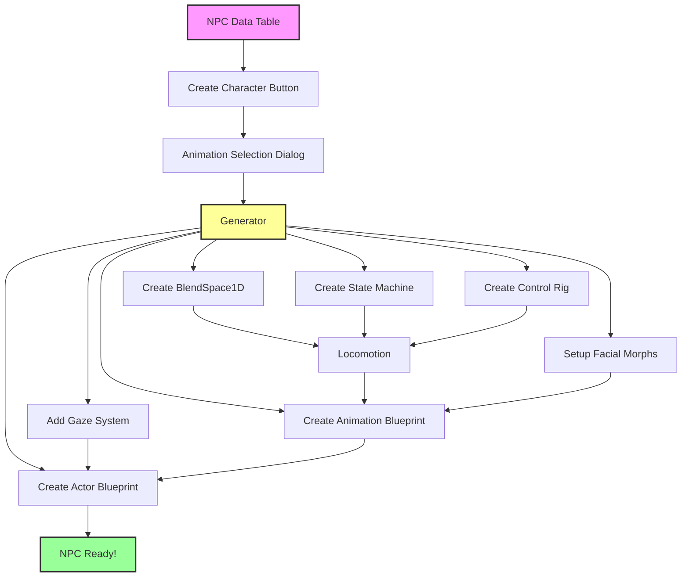
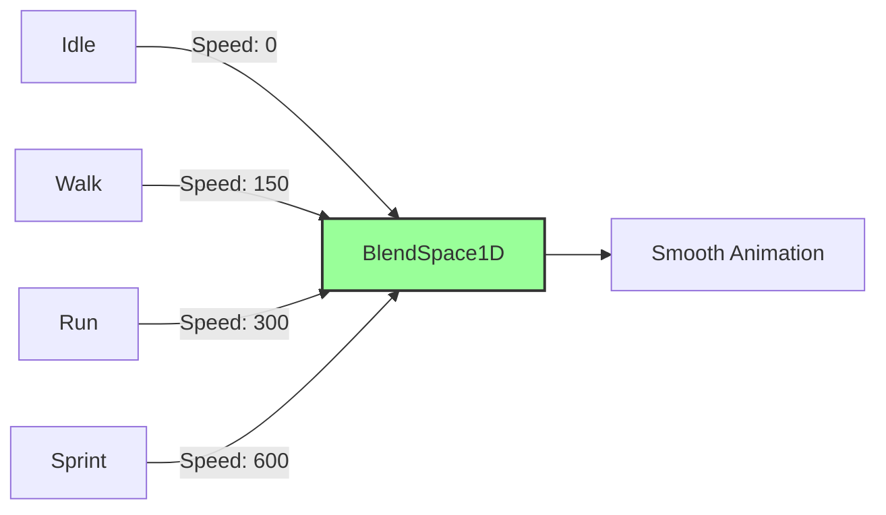
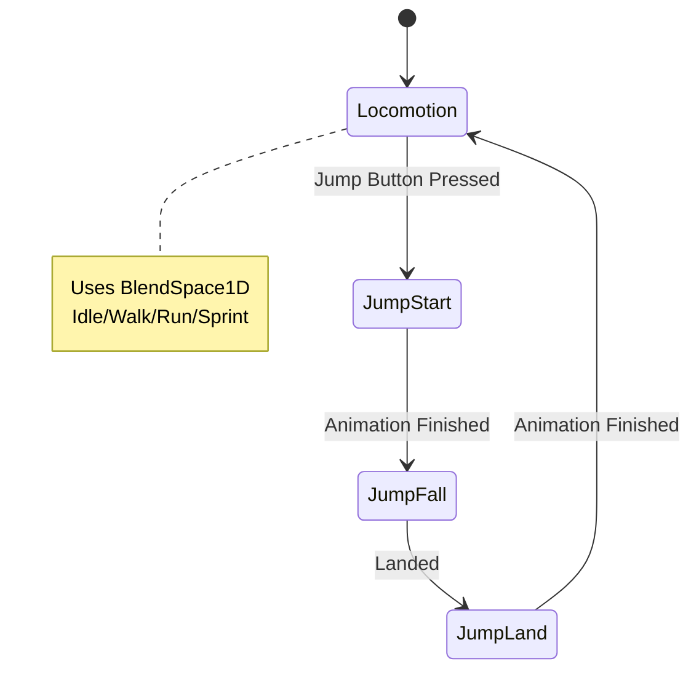
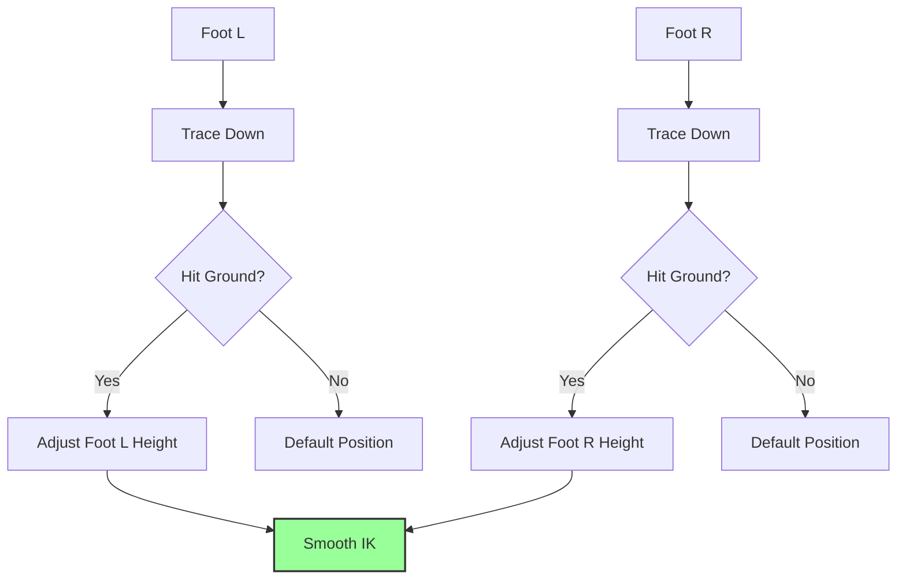
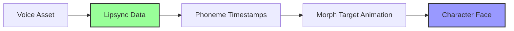
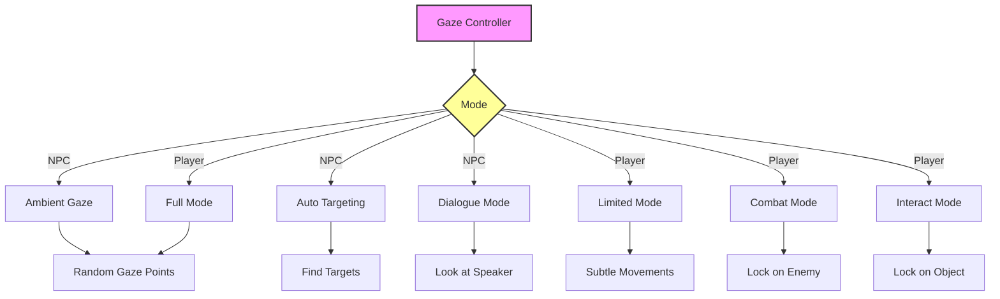
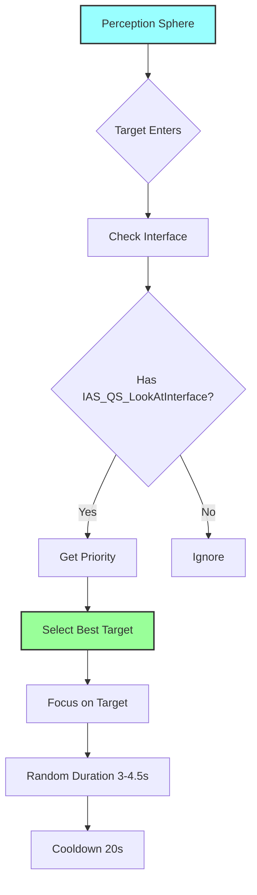
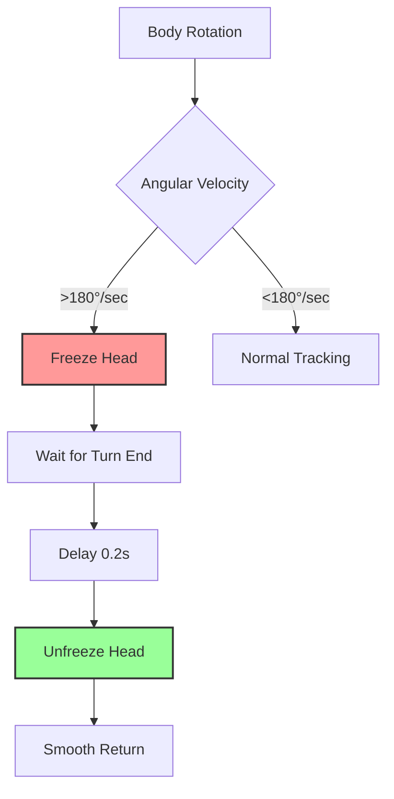
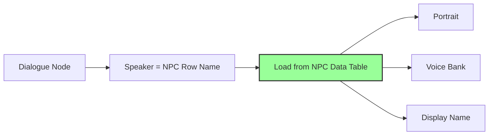

# NPC System — Фабрика персонажей

**NPC System в Avatar Studio QS** — это не просто "таблица с данными". Это **фабрика персонажей**, которая за **три клика мыши** создает полностью функционального NPC или главного героя с анимацией, логикой поведения и живым взглядом.

То, на что в обычном Unreal Engine уходят **часы ручной работы**, здесь делается **автоматически**.

---

## Проблема в обычном Unreal Engine

### Стандартный процесс создания NPC:

1. **Создать Animation Blueprint** вручную — **5 минут**
2. **Настроить BlendSpace** (Idle/Walk/Run) — **10 минут**
3. **Создать State Machine** с переходами — **20 минут**
4. **Настроить Control Rig** для IK (ноги на рельефе) — **15 минут**
5. **Добавить логику прыжков** — **10 минут**
6. **Настроить морфинг лица** для речи и эмоций — **30 минут**
7. **Реализовать систему взгляда** (Gaze System) — **2-3 часа**
8. **Создать Blueprint Actor** — **10 минут**
9. **Настроить AI поведение** — **1-2 часа**
10. **Интеграция с диалогами и квестами** — **1 час**

**ИТОГО: 6-8 часов на ОДНОГО NPC**

И это нужно повторять для **каждого** персонажа!

---

## Решение в Avatar Studio QS

### Сколько времени нужно?

1. Создать строку в NPC Data Table
2. Нажать **"Create Character"**
3. Выбрать анимации (Idle, Walk, Run)
4. Нажать **"Generate"**

**ИТОГО: 30-60 секунд!**

Система **автоматически** создает:
- ✅ **Animation Blueprint** с готовой логикой
- ✅ **BlendSpace1D** для Idle/Walk/Run/Sprint
- ✅ **State Machine** с состояниями Locomotion, Jump Start, Jump Fall, Jump Land
- ✅ **Control Rig** для IK (ноги адаптируются к рельефу)
- ✅ **Морфинг лица** (готовые морф-таргеты для эмоций и речи)
- ✅ **Gaze System** (блуждающий взгляд и автофокус)
- ✅ **Blueprint Actor** (если не существует)
- ✅ **Интеграция** с диалогами, квестами, фракциями
- ✅ **Персонаж готов к использованию сразу!**

---

## Архитектура системы



---

## Философия: Data Table + Автогенерация

Вместо создания отдельного Blueprint для каждого NPC, используется **NPC Data Table** — таблица, где каждая строка = один персонаж.

### Преимущества подхода

| Преимущество | Описание |
|--------------|----------|
| **Централизация** | Все NPC в одном месте |
| **Масштабируемость** | Легко добавить 100+ NPC |
| **Локализация** | Имена и описания локализуются автоматически |
| **Интеграция** | Автоматическая связь с диалогами, квестами, фракциями |
| **Версионирование** | Легко отслеживать изменения в Git |

---

## Автогенерация Animation Blueprint — 🔥 KILLER FEATURE

### Сравнение времени

| Задача | Обычный UE | Avatar Studio QS | Экономия |
|--------|------------|------------------|----------|
| Создать Animation Blueprint | 5 мин | **Автоматически** | 100% |
| Настроить BlendSpace | 10 мин | **Автоматически** | 100% |
| Создать State Machine | 20 мин | **Автоматически** | 100% |
| Настроить Control Rig | 15 мин | **Автоматически** | 100% |
| Добавить логику прыжков | 10 мин | **Автоматически** | 100% |
| **ИТОГО** | **~1 час** | **~1 секунда** | **99.97%** |

### Что создается автоматически

#### 1. BlendSpace1D (Locomotion)

Плавный переход между анимациями:



**Настройки:**
- Ось скорости (0-600)
- Автоматическая интерполяция
- Плавные переходы

#### 2. State Machine (Main States)



**Состояния:**

| State | Описание | Условие входа | Условие выхода |
|-------|----------|---------------|----------------|
| **Locomotion** | Основное движение | Default | Jump Button |
| **Jump Start** | Начало прыжка | Jump Button | Animation End |
| **Jump Fall** | Полет/падение | Jump Start End | Is Falling = false |
| **Jump Land** | Приземление | Landed | Animation End |

**Переходы:**
- ✅ Готовые условия для каждого перехода
- ✅ Плавные blend-ы
- ✅ Автоматическая синхронизация с Character Movement

#### 3. Control Rig (IK для ног)



**Функции:**
- Автоматическая трассировка лучей от стоп к земле
- Адаптация ног к рельефу (лестницы, склоны, неровности)
- Настроенные параметры для плавной работы
- Поддержка различных типов поверхностей

#### 4. Event Graph (Логика)

**Готовые переменные:**
- `Speed` — текущая скорость персонажа
- `IsInAir` — в воздухе или на земле
- `IsFalling` — падает ли персонаж
- `Direction` — направление движения

**Связь с Character Movement Component:**
- Автоматическое обновление переменных каждый кадр
- Синхронизация с физикой
- Оптимизированная логика

---

## Морфинг лица (Facial Morphing)

Каждый созданный персонаж автоматически получает **готовые морф-таргеты**.

### Категории морф-таргетов

| Категория | Морф-таргеты | Использование |
|-----------|--------------|---------------|
| **Речь (Виземы)** | v_Ah, v_F, v_O, v_M, v_E, v_U, v_L, v_S | Лип-синк |
| **Эмоции** | Happy, Sad, Angry, Surprised, Disgusted, Fear | Диалоги, реакции |
| **Моргание** | Blink_L, Blink_R | Автоматическое и ручное |
| **Взгляд** | EyeLook_Up, EyeLook_Down, EyeLook_L, EyeLook_R | Gaze System |

### Интеграция с Lipsync System

Морф-таргеты **автоматически связываются** с системой Lipsync:



**Результат:** Персонаж **сразу готов** к озвученным диалогам!

---

## Gaze System (Система взгляда) — 🔥 KILLER FEATURE

Каждый созданный персонаж автоматически получает компонент **`UAS_QS_LookAtControllerComponent`** — одну из самых сложных и впечатляющих систем плагина.

### Почему это важно?

В обычных играх NPC смотрят в одну точку, как манекены. **Gaze System** делает персонажей **живыми**:
- ✅ Глаза двигаются естественно
- ✅ Голова поворачивается к интересным объектам
- ✅ В диалоге персонаж смотрит на собеседника
- ✅ Игрок автоматически фокусируется на врагах и интерактивных объектах

### Архитектура Gaze System



### Режимы для NPC

#### A. Ambient Gaze (Блуждающий взгляд)

Когда у NPC нет конкретной цели, система генерирует **случайные точки для созерцания**.

**Зонирование (3 зоны):**

| Зона | Углы (Yaw/Pitch) | Длительность | Вес | Описание |
|------|------------------|--------------|-----|----------|
| **Comfort** | ±24° / ±16° | 1.2–3.0 сек | 60% | Прямо перед собой |
| **Normal** | ±40° / ±25° | 3.0–5.4 сек | 30% | Осмотр окружения |
| **Extreme** | ±50° / ±35° | 5.4–9.6 сек | 10% | Большие углы |

**Настройки:**
- **Ambient Frequency** (0-100%) — Как часто NPC смотрит по сторонам
  - 100% = Постоянно разглядывает окружение
  - 50% = Половину времени смотрит прямо
  - 0% = Всегда смотрит прямо перед собой
- **Num Ambient Gaze Points** — Количество точек (по умолчанию 8)

#### B. Auto Targeting (Автоматический поиск целей)

NPC автоматически ищет **интересные объекты** вокруг себя.

**Workflow:**



**Приоритеты:**

| Тип объекта | Приоритет | Описание |
|-------------|-----------|----------|
| **Player Character** | 100 | Наивысший приоритет |
| **Default NPC** | 80 | Другие персонажи |
| **Interactive Objects** | 50-70 | Зависит от компонента |

**Настройки:**
- **bEnableAutoTargeting** — Включить автопоиск
- **Interest Responsiveness** (0-100%) — Шанс реакции на объект
- **Default Gaze Duration Range** — Длительность взгляда (3.0–4.5 сек)
- **Target Interest Cooldown** — Кулдаун для цели (20 сек)

#### C. Dialogue Mode (Режим диалога)

При входе в диалог система автоматически переключается.

**Особенности:**
- Фокусировка на собеседнике
- Микродвижения головы (±5°) для живости
- Плавные переходы

**Настройки:**
- **bAllowMicroMovementsInDialogue** — Включить микродвижения
- **Dialogue Micro Movement Angle** — Макс. угол (5°)
- **Dialogue Micro Movement Speed** — Скорость (0.5)
- **Dialogue Micro Movement Interval** — Интервал (1.5–3.5 сек)

**API:**
```cpp
// Войти в режим диалога
LookAtController->EnterDialogueState(DialoguePartner, true);

// Выйти из режима диалога
LookAtController->ExitDialogueState();
```

### Режимы для Player Character

#### Сравнительная таблица

| Режим | Когда активен | Углы | Описание |
|-------|---------------|------|----------|
| **Limited** | Активное управление | ±15° / ±10° | Ненавязчивые движения |
| **Full** | Бездействие >5 сек | Как у NPC | Полный блуждающий взгляд |
| **Combat** | Нацелился на врага | Жесткая фокусировка | Следит за целью |
| **Interact** | Навел на объект | Жесткая фокусировка | Смотрит на объект |

**Настройки:**
- **Idle State Threshold** — Время бездействия для Full Mode (5 сек)
- **Player Limited Yaw Angle** — Угол по горизонтали (15°)
- **Player Limited Pitch Angle** — Угол по вертикали (10°)

**API:**
```cpp
// Сообщить, что персонажем управляет игрок
LookAtController->SetPlayerControlState(true);

// Сбросить таймер бездействия
LookAtController->UpdatePlayerLastInputTime();

// Установить цель высокого приоритета
LookAtController->SetHighPriorityTarget(Enemy, EPlayerGazeMode::Combat);

// Снять цель
LookAtController->ClearHighPriorityTarget(EPlayerGazeMode::Combat);
```

### Обработка поворотов тела

Система автоматически обрабатывает **резкие повороты тела**.

**Workflow:**



**Настройки:**
- **Sharp Turn Threshold** — Порог угловой скорости (180°/сек)
- **Unfreeze Delay** — Задержка перед разморозкой (0.2 сек)

### Общие настройки

| Категория | Параметр | Значение | Описание |
|-----------|----------|----------|----------|
| **Скорости** | Look At Direction Speed | 6.0 | Скорость поворота головы |
| | Look At Alpha Speed | 5.0 | Скорость вкл/выкл взгляда |
| **Ограничения** | Max Look At Distance | 500 см | Макс. расстояние до цели |
| | Max Look At Angle | 64° | Макс. угол поворота головы |
| **Другое** | Gaze Source Socket | "head" | Сокет, откуда NPC смотрит |
| | bRequireInterface | true | Требовать интерфейс для целей |

---

## Структура NPC Data Table

Каждая строка таблицы (`FNPCTableRow`) содержит:

### Основные категории

| Категория | Поля | Описание |
|-----------|------|----------|
| **🎭 Основные данные** | NPC Actor Class | Ссылка на Blueprint Actor |
| | Display Name | Локализуемое имя для UI |
| | Portrait | Портрет для диалогов |
| | bIsPlayerCharacter | Флаг "это главный герой" |
| **🎤 Озвучка** | Character Voice Banks | Массив Voice Assets |
| **🏛️ Фракции** | Faction IDs | Массив ID фракций |
| **🧬 Характеристики** | Personality Traits | Теги характера |
| | Race Tag | Раса (Human, Elf, и т.д.) |
| | Gender Tag | Пол (Male, Female) |
| | NPC Status Tag | Статус (Alive, Hostile) |

---

## Workflow: Создание NPC за 3 клика

### Пример: Создание охранника

#### Шаг 1: Создайте NPC Data Table

1. Нажмите **"Create NPC Asset"** во вкладке NPCs
2. Укажите имя: `DT_Guards`

#### Шаг 2: Добавьте строку

1. Добавьте новую строку с ID: `Guard_01`
2. Заполните основные данные:
   - **Display Name:** "Городской стражник"
   - **Portrait:** Guard_Portrait
   - **Faction IDs:** ["Guards"]
   - **Personality Traits:** ["Personality.Serious", "Personality.Loyal"]

#### Шаг 3: Нажмите "Create Character"

1. Появится диалог выбора анимаций
2. Выберите анимации:
   - **Idle:** Guard_Idle
   - **Walk:** Guard_Walk
   - **Run:** Guard_Run
   - **Jump Start:** (опционально)
   - **Jump Fall:** (опционально)
   - **Jump Land:** (опционально)
3. Нажмите **"Generate"**

#### Результат:

Система создаст:
- ✅ `ABP_Guard_01` — Animation Blueprint
- ✅ `BS_Guard_01_Locomotion` — BlendSpace
- ✅ `BP_Guard_01` — Actor Blueprint (если не существует)

**Всё готово к использованию в игре!**

---

## Поддержка Player Character

### Флаг `bIsPlayerCharacter`

Если `true`, эта строка описывает вариант протагониста.

**Дополнительные системы:**
- ✅ **Enhanced Input System** — автоматическая настройка ввода
- ✅ **Attention System** — автофокус на интерактивных объектах
- ✅ **Camera Follow** — камера следует за персонажем
- ✅ **Player Gaze Modes** — Limited/Full/Combat/Interact

### Пример: Выбор класса персонажа

Создайте NPC Data Table `DT_PlayerCharacters` с тремя строками:

| Row Name | Display Name | Class | Animations |
|----------|--------------|-------|------------|
| `Warrior` | "Воин" | BP_PlayerWarrior | Warrior_Anims |
| `Mage` | "Маг" | BP_PlayerMage | Mage_Anims |
| `Rogue` | "Разбойник" | BP_PlayerRogue | Rogue_Anims |

В начале игры игрок выбирает одну из строк, и система автоматически настраивает всё!

---

## Интеграция с другими системами

### Диалоги



- Узлы диалога ссылаются на NPC по **Row Name**
- Система автоматически подтягивает портрет, озвучку и имя

### Квесты

- Квестовые цели требуют взаимодействия с конкретным NPC (по Row Name)
- Проверка репутации использует `Faction IDs`

### Спавнеры

- Спавнеры создают NPC, загружая `NPC Actor Class` из таблицы
- Можно спавнить случайного NPC из списка

---

## Сравнение с индустрией

| Функция | Avatar Studio QS | Unreal Engine (стандарт) | Другие плагины |
|---------|------------------|--------------------------|----------------|
| Автогенерация Animation BP | ✅ Полная | ❌ Нет | ❌ Нет |
| BlendSpace автоматически | ✅ Да | ❌ Вручную | ⚠️ Шаблоны |
| State Machine автоматически | ✅ Да | ❌ Вручную | ⚠️ Шаблоны |
| Control Rig (IK) | ✅ Автоматически | ❌ Вручную | ❌ Нет |
| Gaze System | ✅ Уникальная | ❌ Требует реализации | ❌ Нет |
| Facial Morphs | ✅ Автоматически | ❌ Вручную | ⚠️ Базовое |
| Интеграция с диалогами | ✅ Автоматическая | ❌ Ручная | ⚠️ Ручная |
| Время создания NPC | ✅ 30-60 секунд | ❌ 6-8 часов | ⚠️ 1-2 часа |

---

## Заключение

**NPC System в Avatar Studio QS** — это **профессиональное решение**, которое:

- 🏆 **Экономит 99% времени** — 30-60 секунд вместо 6-8 часов
- 🔥 **Gaze System** — уникальная система живого взгляда
- ✅ **Полная автогенерация** — Animation BP, BlendSpace, State Machine, Control Rig
- 🎯 **Готово к игре** — интеграция с диалогами, квестами, фракциями
- 🎭 **Facial Morphs** — готовые морф-таргеты для речи и эмоций
- 🛡️ **Data Table подход** — масштабируемость и централизация
- 🔧 **Player Character** — поддержка главного героя с Enhanced Input

Это **killer feature**, который делает Avatar Studio QS **единственным в своем роде** плагином для создания живых персонажей в Unreal Engine!

---

**Далее:** [🔥 Enhanced Input System — KILLER FEATURE](input_system.md)
