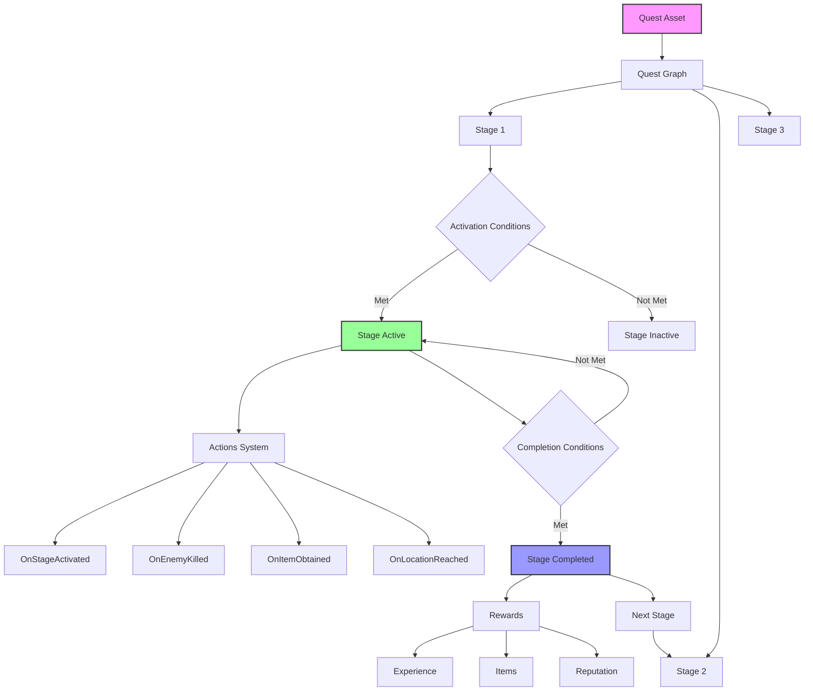
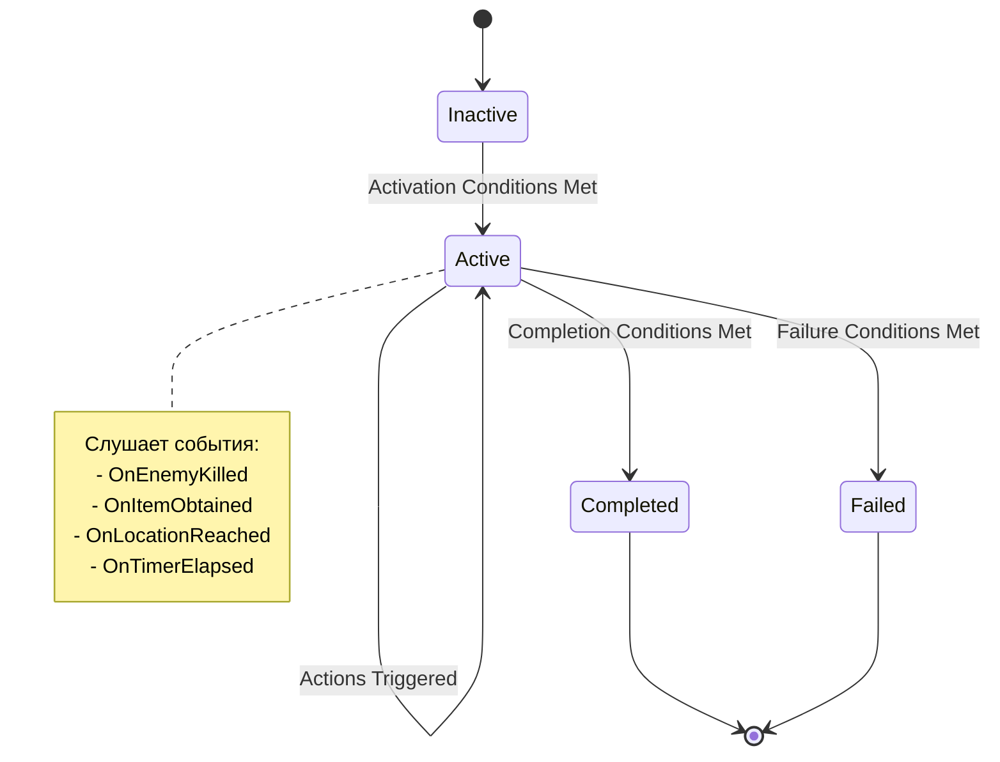
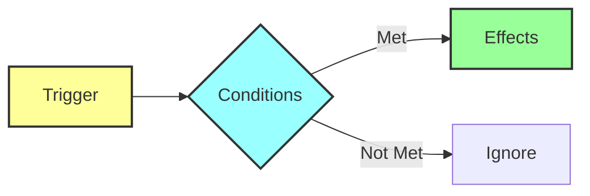
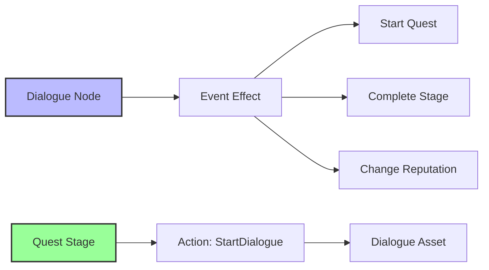
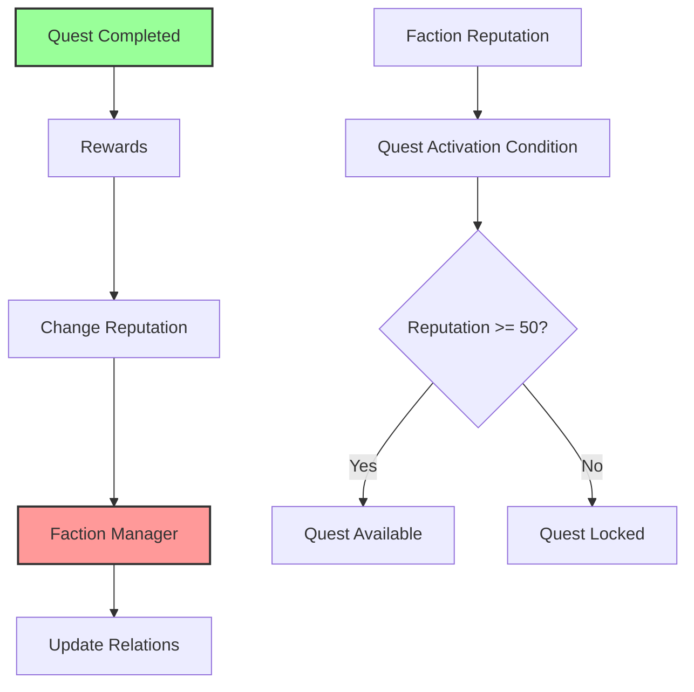

# Quest System — Визуальный редактор квестов

**Quest System в Avatar Studio QS** — это не просто "список задач". Это **полноценная событийно-ориентированная система** для создания сложных нелинейных квестов с ветвлениями, условиями и динамическими реакциями на действия игрока.

То, что в обычном Unreal Engine требует **программирования на C++** или **сложных Blueprint графов**, здесь делается **визуально** через интуитивный редактор.

---

## Проблема в обычном Unreal Engine

### Стандартный процесс создания квестов:

1. **Создать структуру данных** для квеста (C++ или Blueprint) — **30 минут**
2. **Написать логику проверки условий** (репутация, инвентарь, и т.д.) — **1-2 часа**
3. **Реализовать систему стадий** с переходами — **2-3 часа**
4. **Добавить систему наград** (опыт, предметы, репутация) — **1 час**
5. **Интегрировать с UI** (журнал квестов) — **2-3 часа**
6. **Добавить систему событий** (спавн врагов, триггеры) — **2-4 часа**
7. **Отладка и тестирование** — **2-3 часа**

**ИТОГО: 10-16 часов на ОДИН квест**

И это нужно повторять для **каждого** квеста в игре!

---

## Решение в Avatar Studio QS

### Сколько времени нужно?

1. Нажать **"Create Quest"**
2. Добавить стадии в визуальном редакторе
3. Настроить условия и награды через UI
4. Нажать **Save**

**ИТОГО: 15-30 минут на квест**

Система **автоматически**:
- ✅ Управляет состоянием квестов (Inactive/Active/Completed/Failed)
- ✅ Проверяет условия активации и завершения
- ✅ Выдает награды (опыт, предметы, репутация)
- ✅ Интегрируется с Dialogue System
- ✅ Интегрируется с Faction System
- ✅ Сохраняет прогресс автоматически
- ✅ **Квест готов к использованию сразу после создания!**

---

## Архитектура системы



---

## Интерфейс редактора

Вкладка **Quests** разделена на три части:

### 1. Quest List (Список квестов) — слева
- Древовидная структура всех квестов
- Организация по папкам (MainStory, SideQuests, и т.д.)
- Drag & Drop для перемещения
- Контекстное меню (ПКМ) для управления

### 2. Quest Graph (Граф квеста) — по центру
- Визуальный редактор логики квеста
- Узлы = Стадии квеста
- Связи = Порядок выполнения
- Start Node (зеленый) = Начало квеста

### 3. Details Panel (Панель деталей) — справа
- Свойства выбранного квеста или стадии
- Условия активации/завершения
- Награды
- Действия (Actions)

---

## Структура квеста

### Quest Properties (Свойства квеста)

| Категория | Поле | Описание |
|-----------|------|----------|
| **Developer Info** | Internal Name | Техническое имя (для кода и логов) |
| | Dev Description | Заметки для разработчиков |
| **Player Facing** | Display Name | Название для игрока (локализуемое) |
| | Display Description | Описание для журнала квестов |
| **Activation** | Activation Conditions | Когда квест становится доступен |
| **Completion** | Completion Conditions | Глобальные условия завершения |
| **Rewards** | Experience | Опыт за квест |
| | Items | Предметы в награду |
| | Reputation | Изменение репутации |
| | Money | Валюта |

---

## Stage System — 🔥 KILLER FEATURE

**Это уникальная особенность Avatar Studio QS.** Каждая стадия квеста — это не просто "галочка в списке", а **активный объект** с собственным жизненным циклом.

### Жизненный цикл стадии



### Три фазы жизни стадии

#### 1. Activation (Активация)

**Когда стадия становится активной?**

Стадия активируется автоматически при выполнении **Activation Conditions**:

| Тип условия | Описание | Пример |
|-------------|----------|--------|
| **Quest State** | Другой квест в определенном состоянии | "Tutorial" завершен |
| **Stage State** | Предыдущая стадия завершена | Stage_01 = Completed |
| **Reputation** | Репутация с фракцией | Guards > 50 |
| **Inventory** | Предмет в инвентаре | HasItem("Key") |
| **Level** | Уровень игрока | PlayerLevel >= 5 |
| **Location** | Игрок в локации | InZone("Castle") |
| **Global Flag** | Булев флаг мира | BossDead = true |
| **Time** | Время суток или таймер | TimeOfDay = Night |

**Логические операторы:**
- `AND` — Все условия должны быть выполнены
- `OR` — Хотя бы одно условие
- `NOT` — Инверсия условия

#### 2. Active State (Активное состояние) — Самое важное!

Пока стадия активна, она **слушает мир игры** и реагирует на события через **Actions System**.

##### Actions System

**Actions** — это событийно-ориентированная система, которая позволяет создавать сложную логику **без программирования**.

Каждый Action состоит из трех частей:



**1. Trigger (Триггер)** — *Когда это происходит?*

| Trigger | Описание | Параметры |
|---------|----------|-----------|
| `OnStageActivated` | Сразу при старте стадии | - |
| `OnEnemyKilled` | Когда убит враг | Enemy Tag, Count |
| `OnItemObtained` | Когда получен предмет | Item Path, Quantity |
| `OnLocationReached` | Когда игрок вошел в зону | Location Actor |
| `OnDialogueCompleted` | Когда завершен диалог | Dialogue Asset |
| `OnTimerElapsed` | По таймеру | Duration (seconds) |
| `OnGameEvent` | Кастомное событие | Event Name |

**2. Conditions (Условия)** — *Проверить перед выполнением*

Дополнительные условия для фильтрации событий:
- Проверить здоровье игрока
- Проверить время суток
- Проверить наличие предмета
- Проверить репутацию

**3. Effects (Эффекты)** — *Что сделать?*

| Effect | Описание | Параметры |
|--------|----------|-----------|
| `SpawnActor` | Заспавнить актора | Spawn Asset, Location |
| `PlaySound` | Проиграть звук | Sound Asset |
| `ShowMessage` | Показать сообщение | Text, Duration |
| `GiveItem` | Выдать предмет | Item Path, Quantity |
| `RemoveItem` | Забрать предмет | Item Path, Quantity |
| `ChangeReputation` | Изменить репутацию | Faction, Delta |
| `SetGlobalFlag` | Установить флаг | Flag Name, Value |
| `TriggerEvent` | Вызвать Blueprint событие | Event Name |
| `StartDialogue` | Запустить диалог | Dialogue Asset |
| `CompleteStage` | Завершить стадию | - |

##### Пример: Стадия "Засада"

```
Trigger: OnStageActivated
Conditions: None
Effects:
  - SpawnActor (Bandits, Location_A)
  - PlaySound (Music_Combat)
  - ShowMessage ("Засада!")

Trigger: OnEnemyKilled
Conditions: EnemyTag = "Bandit", KillCount >= 5
Effects:
  - PlaySound (Music_Victory)
  - GiveItem (Gold, 100)
  - CompleteStage
```

#### 3. Completion (Завершение)

**Когда стадия завершается?**

Стадия завершается при выполнении **Completion Conditions** (те же типы, что и для активации).

**Rewards (Награды)** выдаются автоматически при завершении:

| Тип награды | Описание |
|-------------|----------|
| **Experience** | Опыт игроку |
| **Items** | Предметы в инвентарь |
| **Reputation** | Изменение репутации с фракциями |
| **Money** | Валюта |

---

## Типы условий (Conditions)

### Сравнительная таблица

| Категория | Условие | Использование | Сложность в UE | Сложность в AS QS |
|-----------|---------|---------------|----------------|-------------------|
| **Квесты** | Quest State | Проверка состояния квеста | ⭐⭐⭐ | ⭐ |
| | Stage State | Проверка стадии | ⭐⭐⭐ | ⭐ |
| **Инвентарь** | Has Item | Наличие предмета | ⭐⭐ | ⭐ |
| | Item Count | Количество предметов | ⭐⭐ | ⭐ |
| **Репутация** | Faction Reputation | Отношение с фракцией | ⭐⭐⭐⭐ | ⭐ |
| **Локация** | In Zone | Игрок в зоне | ⭐⭐ | ⭐ |
| | Distance To | Расстояние до объекта | ⭐⭐⭐ | ⭐ |
| **Время** | Time Of Day | Время суток | ⭐⭐ | ⭐ |
| | Timer Elapsed | Таймер истек | ⭐⭐⭐ | ⭐ |
| **Игрок** | Player Level | Уровень игрока | ⭐ | ⭐ |
| | Player Health | Здоровье игрока | ⭐⭐ | ⭐ |
| **Мир** | Global Flag | Булев флаг | ⭐⭐⭐ | ⭐ |
| | Game Event | Кастомное событие | ⭐⭐⭐⭐ | ⭐ |

⭐ = Легко | ⭐⭐⭐⭐ = Требует программирования

---

## Интеграция с другими системами

### Quest Manager (Runtime)

Quest System работает через **Quest Manager** — глобальный менеджер квестов (Game Instance Subsystem).

#### Blueprint API

```cpp
// Получить Quest Manager
UQuestManager* QM = UQuestManager::Get(this);

// Активировать квест
QM->StartQuest(FName("MainQuests"), "Quest_001");

// Проверить состояние
EQuestState State = QM->GetQuestState(FName("MainQuests"), "Quest_001");

// Завершить квест
QM->CompleteQuest(FName("MainQuests"), "Quest_001");

// Активировать стадию
QM->ActivateStage(FName("MainQuests"), "Quest_001", "Stage_02");

// Завершить стадию
QM->CompleteStage(FName("MainQuests"), "Quest_001", "Stage_02");
```

#### Уведомления от внешних систем

Quest Manager **слушает** события из других систем:

```cpp
// Игрок получил предмет
QM->NotifyItemObtained(ItemPath, Quantity);

// Игрок убил врага
QM->NotifyEnemyKilled(EnemyActor);

// Игрок достиг локации
QM->NotifyLocationReached(LocationActor);

// Произошло кастомное событие
QM->NotifyGameEvent(FName("BossDied"), EventData);
```

### Интеграция с Dialogue System

Квесты и диалоги работают **вместе**:



**Примеры:**
- Диалог может **начать** квест
- Диалог может **завершить** стадию квеста
- Квест может **запустить** диалог через Action
- Квест может **изменить** доступные ветки диалога через условия

### Интеграция с Faction System

Квесты автоматически работают с репутацией:



### Интеграция с Spawn System

Квесты могут спавнить врагов и NPC:

```cpp
// Action Effect: SpawnActor
Trigger: OnStageActivated
Effect: SpawnActor
  - Spawn Asset: "Bandits_Group"
  - Spawn Point: "Location_Ambush"
```

Spawn Manager автоматически создаст акторов в указанной точке.

---

## Workflow: Создание квеста

### Пример: Квест "Спасение деревни"

#### Шаг 1: Создание квеста

1. Нажмите **"Create Quest"** на панели инструментов
2. Введите ID: `Quest_SaveVillage`
3. Заполните свойства:
   - **Display Name:** "Спасение деревни"
   - **Display Description:** "Деревню атакуют бандиты. Помогите жителям!"

#### Шаг 2: Настройка условий активации

**Activation Conditions:**
- Player Level >= 3
- Reputation with "Villagers" >= 0 (не враждебен)

#### Шаг 3: Создание стадий

##### Stage 1: "Поговорить со старостой"

**Activation Conditions:**
- Quest Started (автоматически)

**Actions:**
```
Trigger: OnStageActivated
Effects:
  - ShowMessage ("Найдите старосту деревни")
  - SetGlobalFlag ("VillageQuestActive", true)
```

**Completion Conditions:**
- Dialogue "Elder_Help" Completed

##### Stage 2: "Убить бандитов"

**Activation Conditions:**
- Stage 1 Completed

**Actions:**
```
Trigger: OnStageActivated
Effects:
  - SpawnActor ("Bandits_Group", "Village_Entrance")
  - ShowMessage ("Защитите деревню от бандитов!")

Trigger: OnEnemyKilled
Conditions: EnemyTag = "Bandit", KillCount >= 5
Effects:
  - PlaySound ("Victory_Music")
  - CompleteStage
```

**Completion Conditions:**
- Enemy Killed (Tag: "Bandit", Count: 5)

##### Stage 3: "Вернуться к старосте"

**Activation Conditions:**
- Stage 2 Completed

**Actions:**
```
Trigger: OnStageActivated
Effects:
  - ShowMessage ("Вернитесь к старосте")

Trigger: OnDialogueCompleted
Conditions: Dialogue = "Elder_Thanks"
Effects:
  - CompleteStage
```

**Completion Conditions:**
- Dialogue "Elder_Thanks" Completed

**Rewards:**
- Experience: 500
- Items: Gold (100)
- Reputation: Villagers (+20)

#### Шаг 4: Сохранение

Нажмите **Save** — квест готов!

---

## Делегаты (Events)

Quest Manager оповещает другие системы через делегаты:

| Делегат | Когда вызывается | Параметры |
|---------|------------------|-----------|
| `OnQuestStarted` | Квест активирован | Quest ID |
| `OnQuestCompleted` | Квест завершен | Quest ID |
| `OnQuestFailed` | Квест провален | Quest ID |
| `OnQuestStateChanged` | Состояние квеста изменилось | Quest ID, New State |
| `OnStageStateChanged` | Состояние стадии изменилось | Quest ID, Stage ID, New State |
| `OnCustomLogicRequested` | Требуется кастомная логика | Quest ID, Stage ID, Event Data |

**Использование в Blueprint:**

```cpp
// Подписка на событие
QuestManager->OnQuestCompleted.AddDynamic(this, &UMyClass::OnQuestDone);

// Callback
void UMyClass::OnQuestDone(FName QuestID)
{
    UE_LOG(LogTemp, Log, TEXT("Quest completed: %s"), *QuestID.ToString());
}
```

---

## Сохранение и загрузка

Quest Manager **автоматически** сохраняет состояние всех квестов через **Save System**.

**Что сохраняется:**
- ✅ Состояние квестов (Inactive/Active/Completed/Failed)
- ✅ Состояние стадий
- ✅ Прогресс целей (убито врагов, собрано предметов)
- ✅ Таймеры
- ✅ Кулдауны
- ✅ Dialogue Variables

**Что НЕ нужно делать вручную:**
- ❌ Писать код сохранения/загрузки
- ❌ Создавать SaveGame структуры
- ❌ Управлять файлами сохранений

Всё работает **автоматически**!

---

## Сравнение с индустрией

| Функция | Avatar Studio QS | Unreal Engine (стандарт) | Другие плагины |
|---------|------------------|--------------------------|----------------|
| Визуальный редактор | ✅ Граф стадий | ❌ Нет | ⚠️ Списки |
| Событийная система | ✅ Actions с триггерами | ❌ Требует C++ | ⚠️ Ограниченная |
| Условия активации | ✅ 12+ типов | ❌ Требует C++ | ⚠️ 3-5 типов |
| Интеграция с диалогами | ✅ Автоматическая | ❌ Ручная | ⚠️ Ручная |
| Интеграция с репутацией | ✅ Автоматическая | ❌ Нет | ❌ Нет |
| Автосохранение | ✅ Да | ❌ Требует реализации | ⚠️ Базовое |
| Время создания квеста | ✅ 15-30 минут | ❌ 10-16 часов | ⚠️ 2-4 часа |

---

## Расширение системы

### Добавление кастомного условия

1. Создайте Blueprint класс, наследующий `UQuestCondition`
2. Переопределите функцию `EvaluateCondition`
3. Добавьте условие в Quest Asset через Details Panel

### Добавление кастомного эффекта

1. Создайте Blueprint класс, наследующий `UQuestEffect`
2. Переопределите функцию `ExecuteEffect`
3. Добавьте эффект в Action через Details Panel

### Подписка на события квестов

```cpp
// В вашем Blueprint или C++ классе
UQuestManager* QM = UQuestManager::Get(this);

// Подписка на завершение квеста
QM->OnQuestCompleted.AddDynamic(this, &AMyActor::OnQuestDone);

// Подписка на изменение стадии
QM->OnStageStateChanged.AddDynamic(this, &AMyActor::OnStageChanged);
```

---

## Заключение

**Quest System в Avatar Studio QS** — это **профессиональное решение**, которое:

- 🏆 **Экономит 90% времени** — 15-30 минут вместо 10-16 часов
- 🔥 **Событийно-ориентированная** — Actions System для сложной логики без кода
- ✅ **Полная интеграция** — с диалогами, фракциями, спавнерами
- 🎯 **Готово к игре** — автосохранение, UI, делегаты
- 🛡️ **Надежно** — проверенная архитектура Game Instance Subsystem
- 🔧 **Расширяемо** — кастомные условия и эффекты через Blueprint

Это **killer feature**, который делает Avatar Studio QS **незаменимым инструментом** для создания RPG в Unreal Engine!

---

**Далее:** [Вкладка 2: Фракции (Factions)](tab_factions.md)
