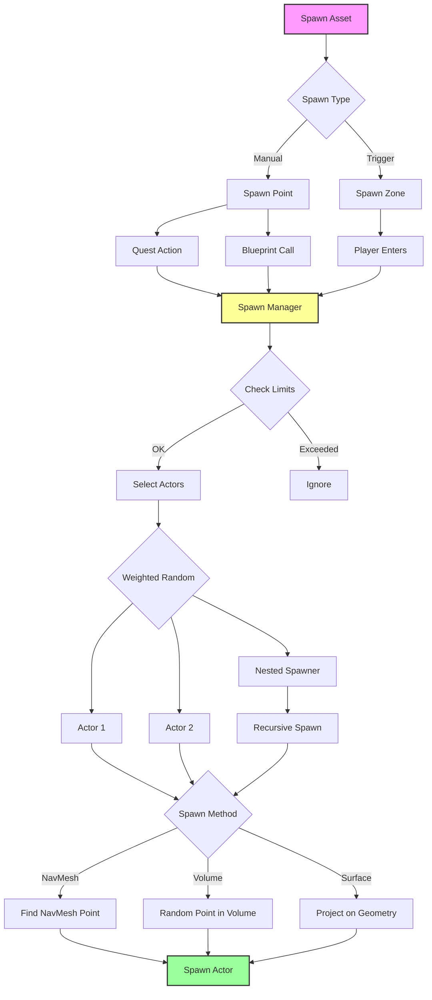
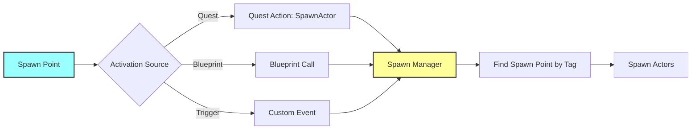
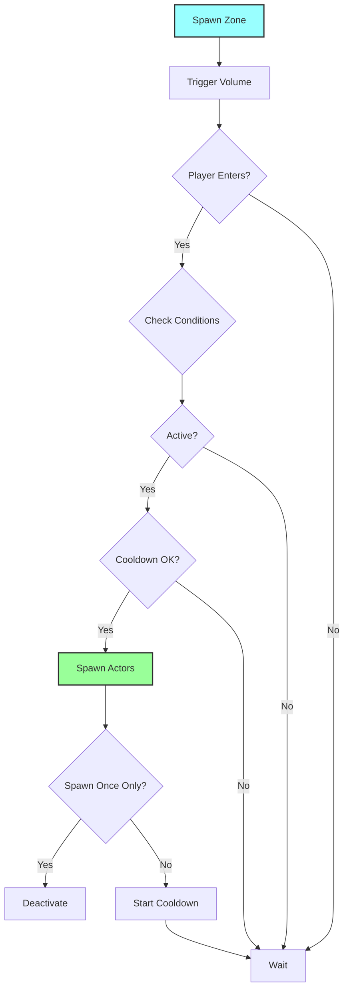
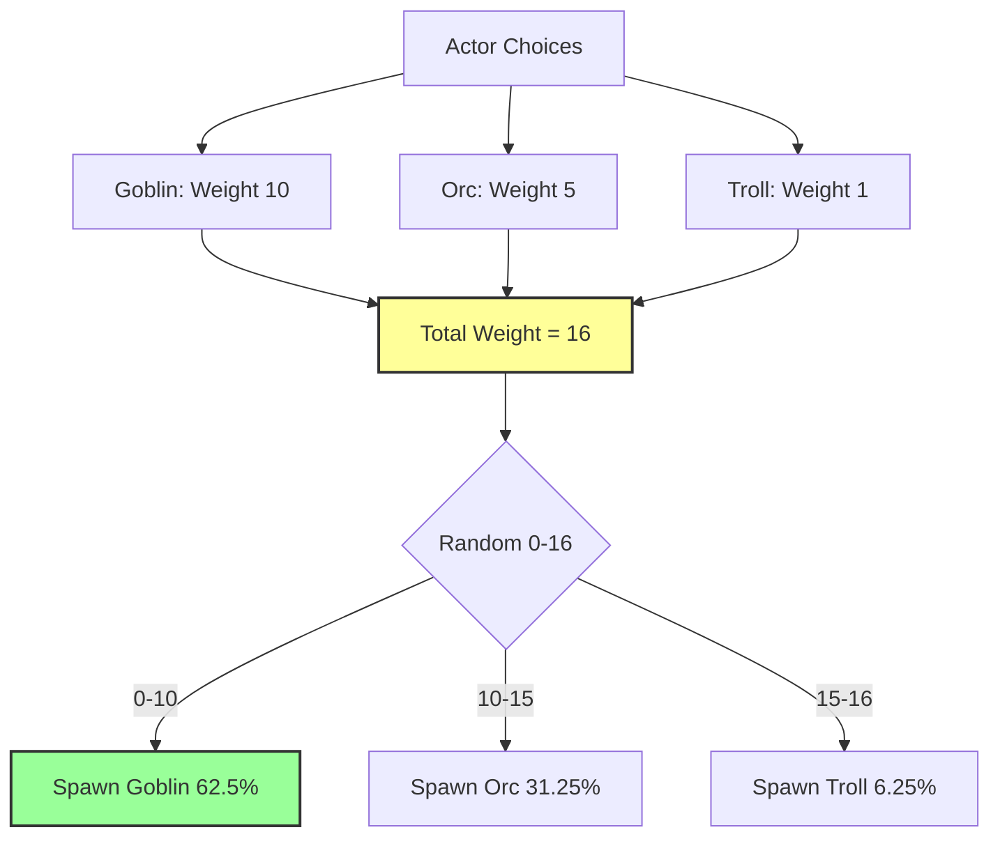
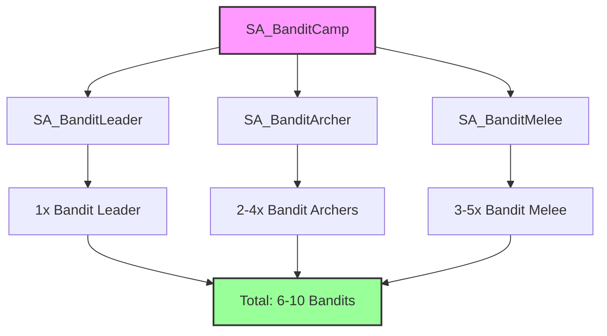
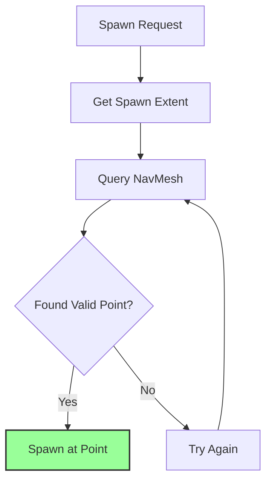
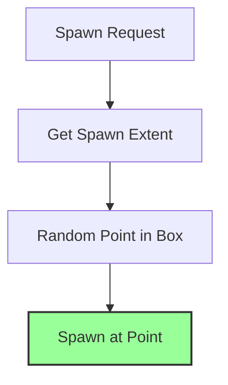
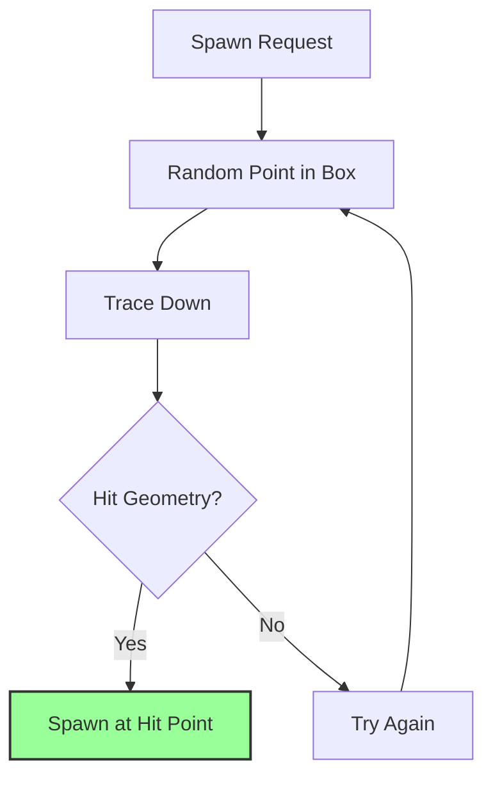
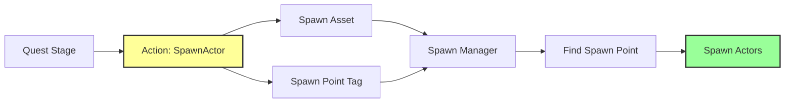
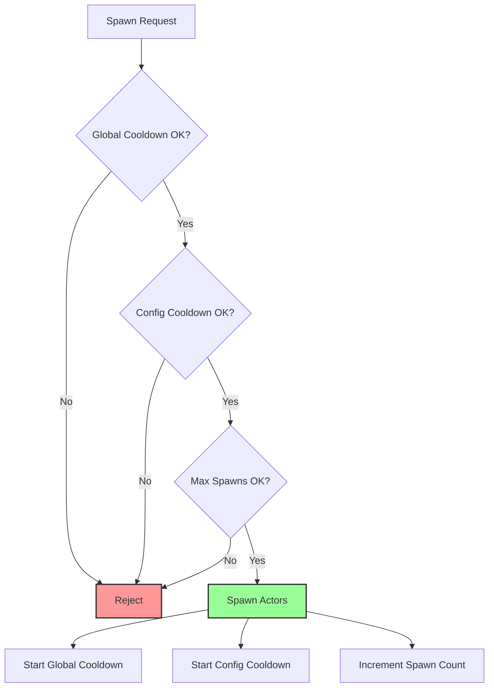

# Spawn System — Динамическое создание мира

**Spawn System в Avatar Studio QS** — это не просто "расставить врагов на карте". Это **гибкий инструмент** для создания динамичного мира, где враги, NPC и предметы появляются в нужное время, в нужном месте и в нужном количестве.

Система поддерживает **случайный выбор**, **вложенные спавнеры**, **кулдауны**, **лимиты** и **интеграцию с квестами** — всё без единой строчки кода.

---

## Проблема в обычном Unreal Engine

### Стандартный процесс создания системы спавна:

1. **Создать Blueprint для спавнера** — **30 минут**
2. **Написать логику случайного выбора** врагов — **1-2 часа**
3. **Реализовать систему весов** (вероятности) — **1-2 часа**
4. **Добавить кулдауны и лимиты** — **1-2 часа**
5. **Реализовать триггерные зоны** — **1-2 часа**
6. **Интегрировать с NavMesh** — **1 час**
7. **Интегрировать с квестами** — **2-3 часа**
8. **Создать систему вложенных спавнеров** — **2-4 часа**
9. **Отладка и тестирование** — **2-3 часа**

**ИТОГО: 11-19 часов**

---

## Решение в Avatar Studio QS

### Сколько времени нужно?

1. Создать Spawn Asset
2. Настроить Actor Choices с весами
3. Разместить Spawn Point или Spawn Zone в мире
4. Готово!

**ИТОГО: 5-10 минут!**

Система **автоматически**:
- ✅ Выбирает случайных врагов по весам
- ✅ Управляет кулдаунами и лимитами
- ✅ Спавнит на NavMesh или в воздухе
- ✅ Поддерживает вложенные спавнеры
- ✅ Интегрируется с Quest System
- ✅ Работает через триггерные зоны
- ✅ **Спавнер готов к использованию сразу!**

---

## Архитектура системы



---

## Компоненты системы

### 1. Spawn Asset — Многоразовый шаблон

**Spawn Asset** — это ассет, который описывает **что**, **сколько** и **с какой вероятностью** спавнить.

#### Преимущества подхода

| Преимущество | Описание |
|--------------|----------|
| **Переиспользование** | Один Spawn Asset в квестах, триггерах, точках |
| **Централизация** | Изменили Spawn Asset — изменения везде |
| **Вложенность** | Spawn Assets могут содержать другие Spawn Assets |
| **Масштабируемость** | Легко создать 100+ вариантов спавна |

#### Структура Spawn Asset

| Категория | Поле | Описание |
|-----------|------|----------|
| **Spawn Count** | Min Count | Минимальное количество |
| | Max Count | Максимальное количество |
| **Actor Choices** | Source Blueprint | Класс актора для спавна |
| | Weight | Вероятность выбора |
| **Nested Spawners** | Nested Spawn Asset | Другой Spawn Asset |
| | Weight | Вероятность выбора |
| **Settings** | Allow Duplicates | Разрешить дубликаты |
| | Global Seed | Детерминированный спавн |
| | Max Total Spawns | Жесткий лимит |

### 2. Spawn Point — Ручное размещение

**Spawn Point** — актор для ручного размещения в мире.



**Свойства:**

| Категория | Поле | Описание |
|-----------|------|----------|
| **Identity** | Spawn Point Tag | Уникальный тег для поиска |
| **Spawn Area** | Spawn Extent | Размер зоны спавна |
| **Spawn Method** | Method | NavMesh / Volume / Surface |
| **Visualization** | Show Debug | Показать зону в редакторе |

### 3. Spawn Zone — Триггерная зона

**Spawn Zone** — актор с триггерным объемом, который автоматически спавнит при входе игрока.



**Свойства:**

| Категория | Поле | Описание |
|-----------|------|----------|
| **Spawn Config** | Spawn Asset | Что спавнить |
| **Trigger** | Trigger Extent | Размер триггерной зоны |
| | Actor Class To Trigger | Какой класс активирует (Player) |
| **Spawn Area** | Spawn Extent | Размер зоны спавна |
| | Spawn Method | NavMesh / Volume / Surface |
| **Behavior** | bStartActive | Активна с начала |
| | bSpawnOnceOnly | Спавнить только раз |
| | Cooldown | Время между спавнами |

---

## Система весов (Weighted Random)

Spawn System использует **взвешенный случайный выбор** для определения, какой актор заспавнить.

### Как работают веса



### Таблица вероятностей

| Actor | Weight | Вероятность | Использование |
|-------|--------|-------------|---------------|
| Goblin | 10 | 62.5% | Частые враги |
| Orc | 5 | 31.25% | Средние враги |
| Troll | 1 | 6.25% | Редкие враги |

**Формула:** `Вероятность = Weight / Total Weight * 100%`

---

## Вложенные спавнеры (Nested Spawners) — 🔥 KILLER FEATURE

**Мощная функция** для создания сложных групп.

### Пример: Лагерь бандитов



**Создание:**

1. **SA_BanditLeader**
   - Min/Max Count: 1
   - Actor: BP_BanditLeader (Weight 1)

2. **SA_BanditArcher**
   - Min/Max Count: 2-4
   - Actor: BP_BanditArcher (Weight 1)

3. **SA_BanditMelee**
   - Min/Max Count: 3-5
   - Actor: BP_BanditMelee (Weight 1)

4. **SA_BanditCamp** (главный)
   - Nested Spawners:
     - SA_BanditLeader (Weight 1)
     - SA_BanditArcher (Weight 1)
     - SA_BanditMelee (Weight 1)

**Результат:** При спавне `SA_BanditCamp` система автоматически создаст 6-10 бандитов!

---

## Методы спавна (Spawn Methods)

### Сравнительная таблица

| Method | Описание | Требует NavMesh | Использование |
|--------|----------|-----------------|---------------|
| **On Ground (NavMesh)** | Случайная точка на NavMesh | ✅ Да | Наземные юниты |
| **In Volume (Flying/3D)** | Случайная точка в объеме | ❌ Нет | Летающие враги, эффекты |
| **Project on Surface** | Проекция на геометрию | ❌ Нет | Водные поверхности, сложная геометрия |

### 1. On Ground (NavMesh)



**Идеально для:** Враги, NPC, наземные юниты

### 2. In Volume (Flying/3D)



**Идеально для:** Летающие враги, дроны, эффекты

### 3. Project on Surface



**Идеально для:** Водные поверхности, сложная геометрия без NavMesh

---

## Интеграция с Quest System — 🔥 KILLER FEATURE

Spawn Points **идеально интегрированы** с системой квестов.

### Workflow



### Пример: Квест "Убить босса"

**Шаг 1:** Создать Spawn Asset

```
SA_QuestBoss:
  Min/Max Count: 1
  Actor Choices:
    - BP_DragonBoss (Weight 1)
```

**Шаг 2:** Разместить Spawn Point

```
Spawn Point:
  Tag: "SpawnPoint.BossArena"
  Spawn Extent: 500x500x200
  Spawn Method: On Ground (NavMesh)
```

**Шаг 3:** Настроить квест

```
Quest: "Убить дракона"
  Stage 1: "Войти в арену"
    On Stage Activated:
      - SpawnActor
        Spawn Asset: SA_QuestBoss
        Spawn Point Tag: "SpawnPoint.BossArena"
```

**Результат:** Когда игрок активирует квест, дракон появится в арене!

---

## Кулдауны и лимиты

### Система кулдаунов



### Типы лимитов

| Тип | Описание | Пример |
|-----|----------|--------|
| **Global Cooldown** | Кулдаун для всего Spawn Asset | 30 секунд |
| **Config Cooldown** | Кулдаун для конкретной конфигурации | 60 секунд |
| **Max Total Spawns** | Максимальное количество спавнов | 10 раз |
| **Complexity Budget** | Бюджет сложности для оптимизации | 1000 единиц |

---

## Spawn Manager (Runtime)

Spawn System работает через **Spawn Manager** (`USpawnManager`) — глобальный менеджер спавна (Game Instance Subsystem).

### Blueprint API

```cpp
// Получить Spawn Manager
USpawnManager* SM = GetGameInstance()->GetSubsystem<USpawnManager>();

// Спавн через Spawn Point
TArray<AActor*> SpawnedActors = SM->RequestSpawn(
    SpawnAsset,      // Spawn Asset
    SpawnPoint,      // Spawn Point
    false,           // bIgnoreCooldowns
    false            // bIgnoreLimits
);

// Спавн через Spawn Zone
SM->RequestSpawnFromZone(
    SpawnZone,       // Spawn Zone
    false,           // bIgnoreCooldowns
    false            // bIgnoreLimits
);
```

---

## Workflow: Создание спавнера

### Пример: Стая волков в лесу

#### Шаг 1: Создать Spawn Asset

1. Во вкладке **Spawners** нажмите **"+ Create New Spawner"**
2. Имя: `SA_WolfPack`
3. Настройки:
   - Min Count: 3
   - Max Count: 5
   - Actor Choices:
     - BP_Wolf (Weight 10)
     - BP_AlphaWolf (Weight 2)

#### Шаг 2: Разместить Spawn Zone

1. Откройте уровень
2. Перетащите `AAS_SpawnZone` в лес
3. Настройки:
   - Spawn Asset: `SA_WolfPack`
   - Trigger Extent: 1000x1000x500
   - Spawn Extent: 800x800x200
   - Spawn Method: On Ground (NavMesh)
   - bSpawnOnceOnly: false
   - Cooldown: 120 секунд

#### Шаг 3: Тестировать

Запустите игру и войдите в лес — появится стая волков!

---

## Сравнение: Spawn Point vs Spawn Zone

| Характеристика | Spawn Point | Spawn Zone |
|----------------|-------------|------------|
| **Активация** | Вручную (квест, Blueprint) | Автоматически (триггер) |
| **Контроль** | Полный (вы решаете, когда) | Частичный (игрок решает) |
| **Использование** | Квесты, скрипты, боссы | Динамичный мир, засады |
| **Кулдауны** | Управляются квестом | Встроенные |
| **Примеры** | Спавн босса в квесте | Случайные враги в локации |

---

## Сравнение с индустрией

| Функция | Avatar Studio QS | Unreal Engine (стандарт) | Другие плагины |
|---------|------------------|--------------------------|----------------|
| Система весов | ✅ Встроенная | ❌ Требует реализации | ⚠️ Базовая |
| Вложенные спавнеры | ✅ Да | ❌ Нет | ❌ Нет |
| Интеграция с квестами | ✅ Автоматическая | ❌ Ручная | ⚠️ Ручная |
| Триггерные зоны | ✅ Встроенные | ⚠️ Требует Blueprint | ⚠️ Базовые |
| Кулдауны и лимиты | ✅ Встроенные | ❌ Требует реализации | ⚠️ Базовые |
| NavMesh интеграция | ✅ Автоматическая | ⚠️ Требует Blueprint | ⚠️ Ручная |
| Время создания спавнера | ✅ 5-10 минут | ❌ 11-19 часов | ⚠️ 1-2 часа |

---

## Заключение

**Spawn System в Avatar Studio QS** — это **профессиональное решение**, которое:

- 🏆 **Экономит 95% времени** — 5-10 минут вместо 11-19 часов
- 🔥 **Вложенные спавнеры** — создание сложных групп одной кнопкой
- ✅ **Система весов** — гибкий контроль вероятностей
- 🎯 **Полная интеграция** — с квестами, триггерами, NavMesh
- 🛡️ **Кулдауны и лимиты** — встроенная оптимизация
- 🗺️ **3 метода спавна** — NavMesh, Volume, Surface
- 🔧 **Гибко** — от простых врагов до сложных лагерей

Это **важная система**, которая делает Avatar Studio QS **полноценным решением** для создания динамичного мира в RPG!

---

**Далее:** [Вкладка 4: Диалоги (Dialogues)](tab_dialogues.md)
