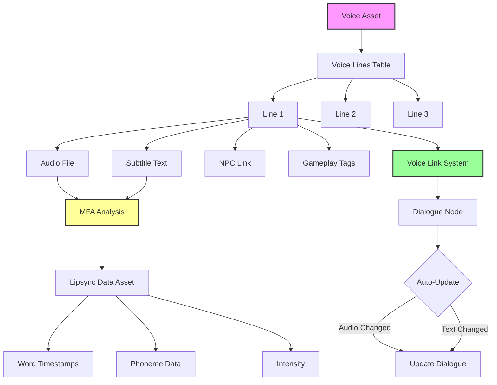
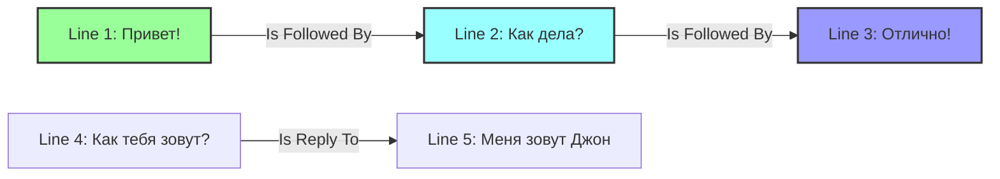
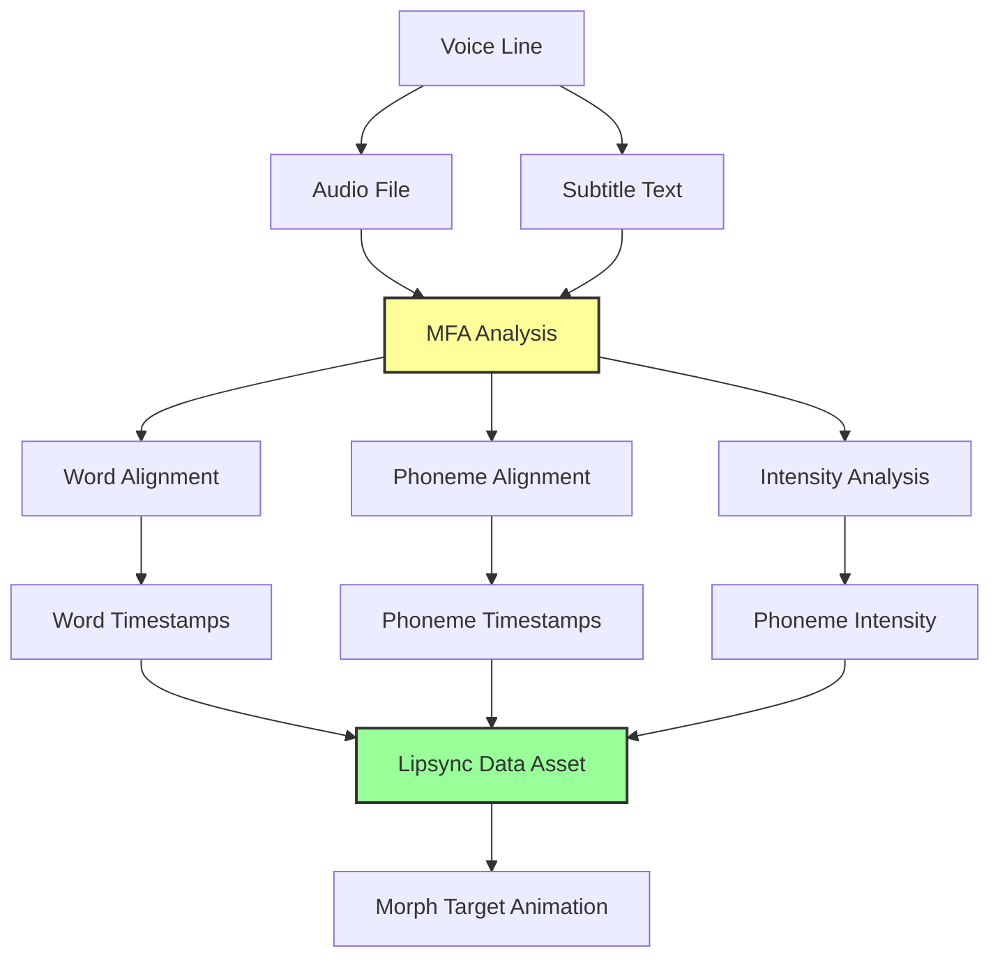
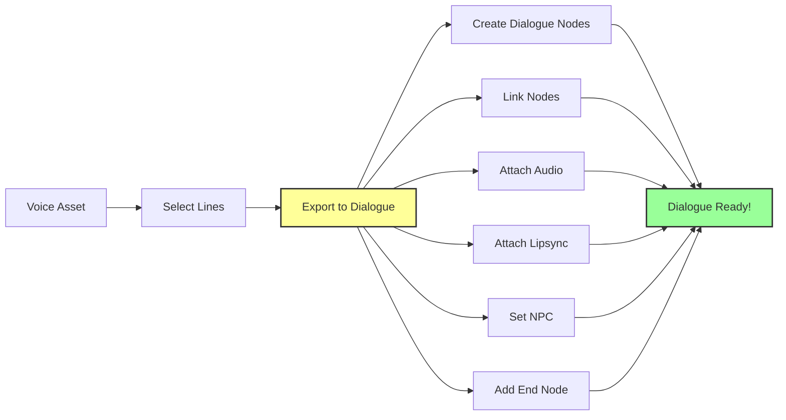
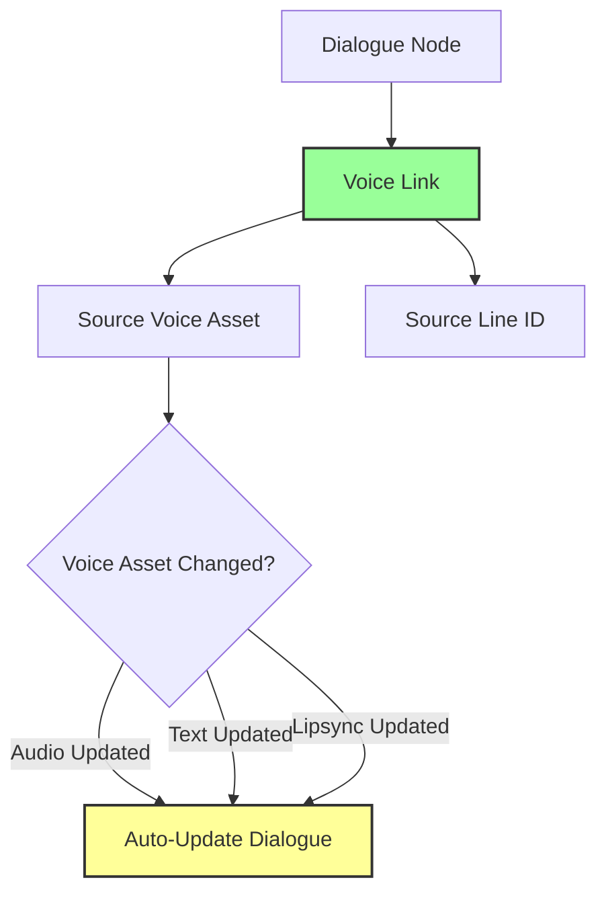
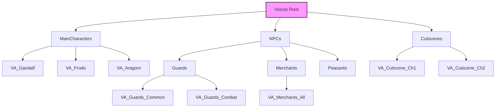
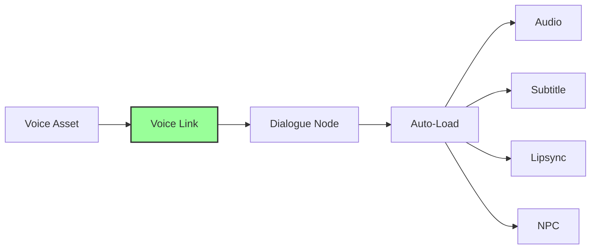
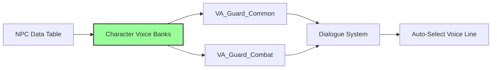

# Voice System — Централизованная озвучка

**Voice System в Avatar Studio QS** — это не просто "папка с аудио-файлами". Это **централизованное хранилище** для всей озвучки проекта с автоматической генерацией лип-синка, связыванием реплик и **экспортом в диалоги одной кнопкой**.

Вместо того чтобы разбрасывать аудио по проекту, мы собираем их в Voice Assets и связываем с NPC и диалогами **автоматически**.

---

## Проблема в обычном Unreal Engine

### Стандартный процесс работы с озвучкой:

1. **Создать структуру для хранения** аудио (папки, таблицы) — **30 минут**
2. **Записать и импортировать** аудио-файлы — **Зависит от объема**
3. **Создать субтитры** для каждой реплики — **1-2 часа**
4. **Привязать аудио к диалогам** вручную — **2-3 часа**
5. **Настроить лип-синк** для каждой реплики — **3-5 часов**
6. **Создать метаданные** (кто говорит, контекст) — **1-2 часа**
7. **Синхронизация изменений** при переозвучке — **2-4 часа**
8. **Организация и поиск** реплик — **1-2 часа**

**ИТОГО: 10-19 часов на 100 реплик**

---

## Решение в Avatar Studio QS

### Сколько времени нужно?

1. Создать Voice Asset
2. Добавить реплики (аудио + текст)
3. Нажать **"Generate Lipsync"** (автоматически)
4. Экспортировать в Dialogue Graph

**ИТОГО: 10-30 минут на 100 реплик!**

Система **автоматически**:
- ✅ Генерирует лип-синк через MFA (Montreal Forced Aligner)
- ✅ Создает субтитры из текста
- ✅ Связывает реплики с NPC
- ✅ Экспортирует в диалоги одной кнопкой
- ✅ Синхронизирует изменения автоматически
- ✅ Организует озвучку в централизованном хранилище
- ✅ **Озвучка готова к использованию сразу!**

---

## Архитектура системы



---

## Структура Voice Asset

### Что такое Voice Asset?

**Voice Asset** — это контейнер для голосовых реплик одного или нескольких персонажей.

#### Примеры организации

| Voice Asset | Содержание | Использование |
|-------------|------------|---------------|
| `VA_Guard_Common` | Обычные реплики стражников | "Стой!", "Проходи" |
| `VA_Guard_Combat` | Боевые крики | "За короля!", "Умри!" |
| `VA_Merchant_Greetings` | Приветствия торговцев | "Добро пожаловать!" |
| `VA_Gandalf` | Все реплики Гэндальфа | Главный персонаж |
| `VA_Cutscene_Ch1` | Катсцена главы 1 | Кинематографическая сцена |

---

## Структура Voice Line (Реплика)

Каждая реплика в Voice Asset содержит:

### Категории данных

| Категория | Поля | Описание |
|-----------|------|----------|
| **📝 Основные** | Line ID | Уникальный идентификатор (GUID) |
| | Subtitle | Текст реплики (субтитры) |
| | Sound Asset | Аудио-файл (.wav, .ogg) |
| **🎭 NPC Link** | Required NPC Data Table | Таблица NPC |
| | Required NPC Row Names | Массив ID NPC |
| **🏷️ Теги** | Gameplay Tags | Фильтрация (`Dialogue.Greeting`) |
| | Context Tags | Контекст (`Mood.Angry`) |
| **🎬 Анимация** | Lipsync Data Source | Ссылка на LipsyncDataAsset |
| | Emotion Blocks | Временные отрезки с эмоциями |
| | Blink Timeline | Моргания |
| | Eye Gaze Timeline | Направление взгляда |

---

## Voice Line Links — 🔥 KILLER FEATURE

**Система связывания реплик** позволяет создавать цепочки разговоров прямо в Voice Assets.

### Типы связей



### Визуализация в редакторе

**Ghost Rows (Призраки):**
- Призрак **снизу** = "Is Followed By" (продолжение)
- Призрак **сверху** = "Is Reply To" (ответ)

### Преимущества

| Преимущество | Описание |
|--------------|----------|
| **Контекст** | Видите всю цепочку в одном месте |
| **Экспорт** | Одна кнопка → готовый диалог |
| **Переиспользование** | Одна реплика в нескольких цепочках |
| **Организация** | Логическая группировка реплик |

---

## Интеграция с MFA (Montreal Forced Aligner)

Voice Assets автоматически генерируют данные для лип-синка с помощью **MFA**.

### Workflow автогенерации



### Что создается автоматически

| Данные | Описание | Использование |
|--------|----------|---------------|
| **Word Data** | Временные метки для каждого слова | Субтитры с подсветкой |
| **Phoneme Data** | Временные метки для каждой фонемы | Лип-синк (морф-таргеты) |
| **Intensity** | Сила произношения | Редуцированные звуки |
| **Lipsync Data Asset** | Готовый ассет | Привязка к Animation |

### Процесс генерации

1. Загрузите аудио-файл в реплику
2. Введите текст субтитров
3. Нажмите **"Generate Lipsync"** (или автоматически)
4. MFA анализирует аудио
5. Система создает `LipsyncDataAsset`
6. Готово! Можно редактировать во вкладке **Lipsync**

---

## Экспорт в Dialogue Graph — 🔥 KILLER FEATURE

**Одна кнопка — готовый диалог.**

### Workflow экспорта



### Пошаговый процесс

1. Во вкладке **Voices** выберите реплики
2. (Опционально) Используйте Links для выбора цепочки
3. Нажмите **"Export to Dialogue Graph"**
4. Выберите целевой Dialogue Asset (или создайте новый)

### Что создается автоматически

- ✅ Узлы диалога для каждой реплики
- ✅ Связи между узлами (последовательность)
- ✅ Привязка NPC из метаданных
- ✅ Привязка аудио и лицевой анимации
- ✅ Узел "End" в конце цепочки

### Преимущества

| Преимущество | Описание | Экономия времени |
|--------------|----------|------------------|
| **Скорость** | Диалог за секунды | 95% |
| **Централизация** | Вся озвучка в одном месте | - |
| **Синхронизация** | Изменения автоматически отражаются | 100% |
| **Переиспользование** | Одна реплика в нескольких диалогах | - |

---

## Voice Link System

Каждая реплика в диалоге хранит ссылку на исходный Voice Asset.

### Структура связи



### Поля Voice Link

| Поле | Описание |
|------|----------|
| **Source Voice Asset** | Откуда взята реплика |
| **Source Line ID** | Уникальный ID реплики в банке |
| **Auto-Update** | Автообновление при изменении |

### Преимущества

- 🔄 **Централизованное обновление** озвучки
- 📊 **Отслеживание использования** реплик
- 🔗 **Синхронизация изменений** текста
- 🎯 **Единый источник правды** для озвучки

---

## Организация Voice Assets

### Рекомендуемая структура



### Стратегии организации

| Стратегия | Когда использовать | Пример |
|-----------|-------------------|--------|
| **По персонажам** | Главные персонажи | `VA_Gandalf`, `VA_Frodo` |
| **По категориям** | Второстепенные NPC | `VA_Guards_Common` |
| **По сценам** | Катсцены | `VA_Cutscene_Chapter1` |
| **По контексту** | Боевые/мирные реплики | `VA_Guards_Combat` |

---

## Интеграция с другими системами

### Dialogue System



- Узлы диалога ссылаются на Voice Assets через **Voice Link**
- Изменения в Voice Asset автоматически синхронизируются
- Один Voice Asset может использоваться в нескольких диалогах

### NPC System



- NPC Data Table хранит массив **Character Voice Banks**
- Система автоматически выбирает подходящую реплику из банков NPC
- Поддержка нескольких Voice Assets на одного NPC

### Lipsync System

- Каждая реплика автоматически создает `LipsyncDataAsset`
- Редактирование во вкладке **Lipsync**
- Экспорт в Animation Sequence

---

## Workflow: Создание Voice Asset

### Пример: Озвучка стражников

#### Шаг 1: Создать Voice Asset

1. Во вкладке **Voices** нажмите **"+ Create Voice Asset"**
2. Имя: `VA_Guards_Common`

#### Шаг 2: Добавить реплики

| Line ID | Subtitle | Audio | NPC |
|---------|----------|-------|-----|
| 001 | "Стой! Кто идет?" | guard_halt.wav | Guard_01, Guard_02 |
| 002 | "Проходи" | guard_pass.wav | Guard_01, Guard_02 |
| 003 | "Здесь нельзя проходить" | guard_nopass.wav | Guard_01, Guard_02 |

#### Шаг 3: Генерация лип-синка

1. Выберите все реплики
2. Нажмите **"Generate Lipsync"**
3. MFA автоматически создаст `LipsyncDataAsset` для каждой реплики

#### Шаг 4: Связывание реплик (опционально)

```
Line 001: "Стой! Кто идет?"
  ↓ Is Followed By
Line 002: "Проходи"
```

#### Шаг 5: Экспорт в диалог

1. Выберите цепочку реплик
2. Нажмите **"Export to Dialogue Graph"**
3. Выберите `Dialogue_Guard_Checkpoint`
4. Готово! Диалог создан автоматически

---

## Gameplay Tags для Voice Lines

### Категории тегов

| Категория | Примеры | Использование |
|-----------|---------|---------------|
| **Dialogue** | `Dialogue.Greeting`, `Dialogue.Farewell` | Тип диалога |
| **Combat** | `Combat.Taunt`, `Combat.Victory` | Боевые реплики |
| **Mood** | `Mood.Angry`, `Mood.Happy` | Эмоциональное состояние |
| **Location** | `Location.Tavern`, `Location.Castle` | Контекст места |
| **Quest** | `Quest.MainStory`, `Quest.SideQuest` | Связь с квестами |

### Использование в Smart NPC Line

```
Smart NPC Line: "Приветствие"
  Text Variant 1: "Привет, друг!"
    Conditions: Gameplay Tag = "Mood.Happy"
  
  Text Variant 2: "Чего надо?"
    Conditions: Gameplay Tag = "Mood.Neutral"
```

---

## Сравнение с индустрией

| Функция | Avatar Studio QS | Unreal Engine (стандарт) | Другие плагины |
|---------|------------------|--------------------------|----------------|
| Централизованное хранилище | ✅ Voice Assets | ❌ Разбросанные файлы | ⚠️ DataTables |
| Автогенерация лип-синка | ✅ MFA интеграция | ❌ Требует реализации | ❌ Нет |
| Voice Link System | ✅ Автосинхронизация | ❌ Ручная | ❌ Нет |
| Экспорт в диалоги | ✅ Одна кнопка | ❌ Ручная привязка | ❌ Нет |
| Связывание реплик | ✅ Voice Line Links | ❌ Нет | ❌ Нет |
| Метаданные (NPC, теги) | ✅ Встроенные | ❌ Требует реализации | ⚠️ Базовые |
| Время на 100 реплик | ✅ 10-30 минут | ❌ 10-19 часов | ⚠️ 2-4 часа |

---

## Заключение

**Voice System в Avatar Studio QS** — это **профессиональное решение**, которое:

- 🏆 **Экономит 95% времени** — 10-30 минут вместо 10-19 часов
- 🔥 **Voice Line Links** — создание цепочек разговоров
- ✅ **Автогенерация лип-синка** — MFA интеграция
- 🎯 **Экспорт в диалоги** — одна кнопка → готовый диалог
- 🔗 **Voice Link System** — автоматическая синхронизация
- 📊 **Централизация** — вся озвучка в одном месте
- 🛡️ **Метаданные** — NPC, теги, контекст

Это **killer feature**, который делает Avatar Studio QS **единственным в своем роде** плагином для работы с озвучкой в Unreal Engine!

---

**Далее:** [Вкладка 7: Липсинк (Lipsync)](tab_lipsync.md)
