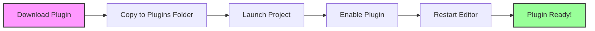
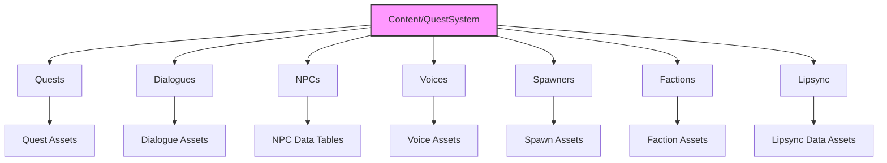
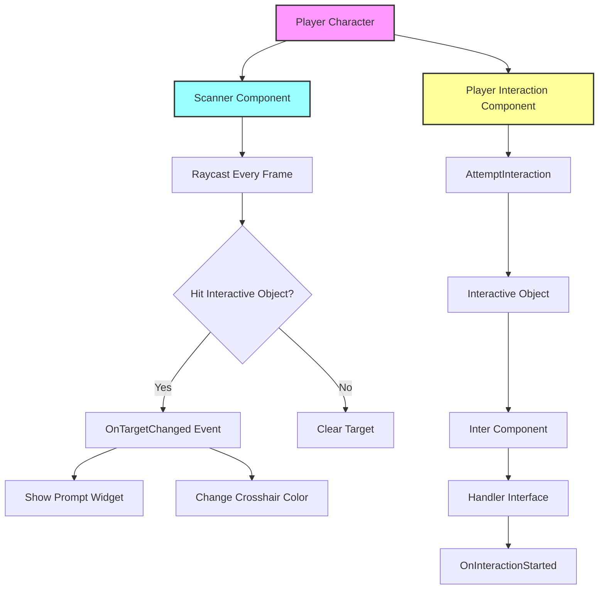
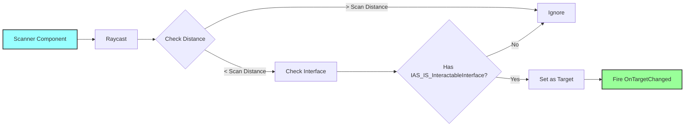
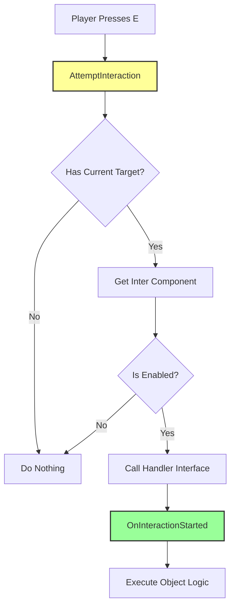
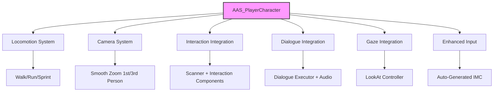
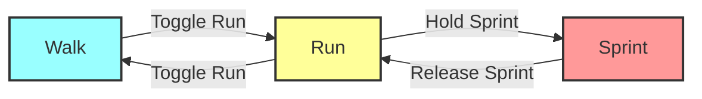
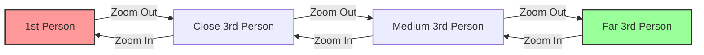
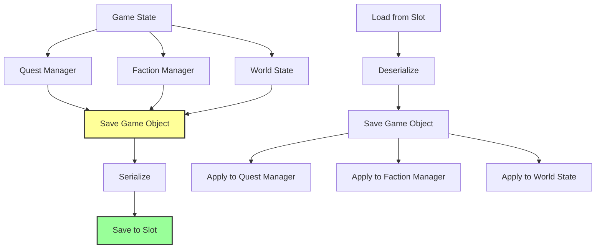
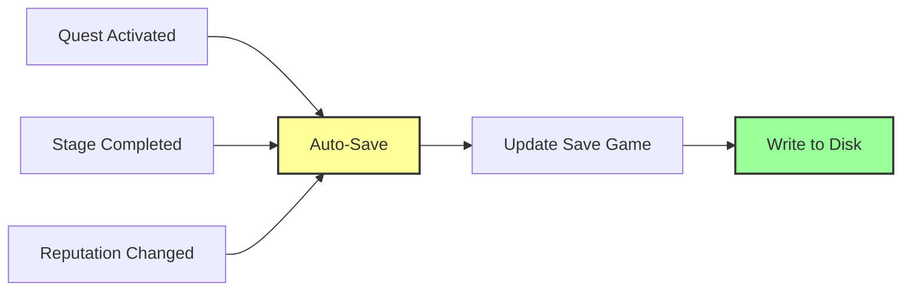

# Technical Reference — Техническая справка

**Technical Reference** — это справочник по установке, настройке и использованию технических компонентов Avatar Studio QS.

Здесь вы найдете информацию об Interaction System, Player Character, Save System и решении проблем.

---

## Установка (Installation)

### Процесс установки



### Пошаговая инструкция

| Шаг | Действие | Описание |
|-----|----------|----------|
| **1** | Копирование | Поместите `Avatar_Studio_QS` в `Plugins/` вашего проекта |
| **2** | Активация | `Edit → Plugins` → Найдите **Avatar Studio QS** → Включите |
| **3** | Перезапуск | Перезапустите Unreal Editor |
| **4** | Проверка | Откройте главное окно плагина |

---

## Структура файлов (File Structure)

### Организация контента



### Описание папок

| Папка | Содержимое | Примеры |
|-------|------------|---------|
| `/Quests` | Ассеты квестов | `Q_MainStory_01`, `Q_SideQuest_Guards` |
| `/Dialogues` | Ассеты диалогов | `DLG_Guard_Checkpoint`, `DLG_Merchant_Shop` |
| `/NPCs` | Таблицы NPC | `DT_Guards`, `DT_Merchants`, `DT_PlayerCharacters` |
| `/Voices` | Профили голоса и аудио | `VA_Guard_Common`, `VA_Gandalf` |
| `/Spawners` | Конфигурации спавнеров | `SA_BanditGroup`, `SA_WolfPack` |
| `/Factions` | Ассеты фракций | `Faction_Guards`, `Faction_Bandits` |
| `/Lipsync` | Данные лип-синка | `LDA_Guard_001`, `LDA_Merchant_Greeting` |

---

## Interaction System — Система взаимодействия

**Interaction System** — готовая система для взаимодействия игрока с объектами в мире.

### Архитектура системы



### Компоненты системы

#### Player-Side Components

| Компонент | Назначение | Ключевые функции |
|-----------|------------|------------------|
| **Scanner Component** | Трассировка луча от камеры | `ScanForInteractables()`, `OnTargetChanged` |
| **Player Interaction Component** | Управление взаимодействием | `AttemptInteraction()`, UI management |
| **Crosshair Widget** | Прицел в центре экрана | Color change, animations |
| **Prompt Widget** | Подсказка "Нажмите E" | Auto-update text, positioning |

#### Object-Side Components

| Компонент | Назначение | Настройки |
|-----------|------------|-----------|
| **Inter Component** | Делает объект интерактивным | Interaction Text, Tag, bIsEnabled |
| **Point Component** | Точка для UI-подсказок | World position for prompt |
| **Handler Interface** | Логика взаимодействия | `OnInteractionStarted()`, `OnInteractionEnded()` |

### Scanner Component

**Функции:**



**Настройки:**

| Параметр | Значение по умолчанию | Описание |
|----------|----------------------|----------|
| **Scan Distance** | 500 см | Дистанция трассировки |
| **Scan Frequency** | Every Frame | Частота сканирования |
| **Trace Channel** | Visibility | Канал трассировки |

### Player Interaction Component

**Workflow:**



### Workflow: Создание интерактивного объекта

#### Шаг 1: Добавить компоненты на Player

1. Откройте Blueprint Player Character
2. Добавьте компоненты:
   - `UAS_IS_ScannerComponent`
   - `UAS_IS_PlayerInteractionComponent`
3. Настройте UI виджеты (Crosshair, Prompt)

#### Шаг 2: Создать интерактивный объект

1. Создайте Blueprint Actor (например, `BP_Door`)
2. Добавьте компоненты:
   - `UAS_IS_InterComponent` (настройте Interaction Text: "Открыть дверь")
   - `UAS_IS_PointComponent` (опционально, для позиционирования UI)

#### Шаг 3: Реализовать интерфейс

1. Добавьте интерфейс `IAS_IS_HandlerInterface`
2. Реализуйте функции:

```cpp
// C++ пример
void ABP_Door::OnInteractionStarted_Implementation(AActor* Interactor)
{
    // Открыть дверь
    OpenDoor();
}

void ABP_Door::OnInteractionEnded_Implementation(AActor* Interactor)
{
    // Закрыть дверь (опционально)
    CloseDoor();
}
```

**Blueprint пример:**

```
Event OnInteractionStarted
  ↓
[Open Door Animation]
  ↓
[Play Sound]
  ↓
[Disable Inter Component]
```

---

## Player Character (`AAS_PlayerCharacter`)

**AAS_PlayerCharacter** — готовый класс Player Character с полной интеграцией всех систем плагина.

### Архитектура Player Character



### Locomotion System

**Режимы передвижения:**



**Настройки скорости:**

| Режим | Скорость | Клавиша | Описание |
|-------|----------|---------|----------|
| **Walk** | 200 | Toggle Run | Ходьба |
| **Run** | 600 | Default | Бег (по умолчанию) |
| **Sprint** | 900 | Hold Sprint | Спринт (зажать) |

### Camera System

**Плавный зум:**



**Настройки:**

| Параметр | Значение | Описание |
|----------|----------|----------|
| **MinZoomLength** | 50 см | Минимальная дистанция (1-е лицо) |
| **MaxZoomLength** | 800 см | Максимальная дистанция (3-е лицо) |
| **ZoomStep** | 40 см | Шаг зума (колесо мыши) |
| **ThirdPersonCameraSocketOffsetY** | 40 см | Смещение (через плечо) |
| **ThirdPersonCameraSocketOffsetZ** | 60 см | Высота камеры |

### Встроенные компоненты

| Компонент | Система | Назначение |
|-----------|---------|------------|
| `UAS_IS_ScannerComponent` | Interaction | Сканирование интерактивных объектов |
| `UAS_IS_PlayerInteractionComponent` | Interaction | Управление взаимодействием |
| `UBPC_DialogueExecutor` | Dialogue | Исполнение диалогов |
| `UAudioComponent` | Dialogue | Воспроизведение озвучки |
| `UAS_QS_LookAtControllerComponent` | Gaze | Система живого взгляда |

### Gaze Integration

**Режимы взгляда для Player:**

| Режим | Когда активен | Углы | Описание |
|-------|---------------|------|----------|
| **Limited** | Активное управление | ±15° / ±10° | Ненавязчивые движения |
| **Full** | Бездействие >5 сек | Как у NPC | Полный блуждающий взгляд |
| **Combat** | Нацелился на врага | Жесткая фокусировка | Следит за целью |
| **Interact** | Навел на объект | Жесткая фокусировка | Смотрит на объект |

### Workflow: Создание Player Character

#### Шаг 1: Создать Blueprint

1. Создайте Blueprint на основе `AAS_PlayerCharacter`
2. Имя: `BP_MyPlayerCharacter`

#### Шаг 2: Настроить меш и анимации

1. Выберите Skeletal Mesh
2. Настройте Animation Blueprint
3. Убедитесь, что есть анимации: Idle, Walk, Run, Sprint, Jump

#### Шаг 3: Настроить Input Bindings

**Project Settings → Input:**

| Binding | Type | Key | Description |
|---------|------|-----|-------------|
| **Move** | Axis | W/A/S/D | Движение |
| **Look** | Axis | Mouse X/Y | Взгляд |
| **Jump** | Action | Space | Прыжок |
| **Interact** | Action | E | Взаимодействие |
| **ToggleRun** | Action | Shift | Переключение ходьба/бег |
| **Sprint** | Action | Ctrl | Спринт (зажать) |

#### Шаг 4: Настроить UI

1. Создайте виджеты для Crosshair и Prompt
2. Назначьте их в `UAS_IS_PlayerInteractionComponent`

---

## Save System — Система сохранения

**Save System** — автоматическая система сохранения состояния квестов, репутации и мира.

### Архитектура Save System



### Класс: `UAvatar_Studio_QS_RT_SaveGame`

**Содержимое:**

| Категория | Данные | Описание |
|-----------|--------|----------|
| **Quest Progress** | Active Quests, Completed Stages | Состояние всех квестов |
| **Faction Reputation** | Relation Strengths, Statuses | Репутация со всеми фракциями |
| **Inventory** | Items, Quantities | Инвентарь игрока (опционально) |
| **World State** | Opened Doors, Collected Items | Состояние мира |

### Автоматическое сохранение



**Триггеры автосохранения:**
- ✅ Квест активирован
- ✅ Стадия завершена
- ✅ Репутация изменена
- ✅ Важное событие в мире

### Ручное сохранение/загрузка

#### Сохранение

```cpp
// 1. Создать объект сохранения
UAvatar_Studio_QS_RT_SaveGame* SaveGameObject = Cast<UAvatar_Studio_QS_RT_SaveGame>(
    UGameplayStatics::CreateSaveGameObject(UAvatar_Studio_QS_RT_SaveGame::StaticClass())
);

// 2. Заполнить данными из Quest Manager
UQuestManager* QM = GetGameInstance()->GetSubsystem<UQuestManager>();
QM->PopulateSaveData(SaveGameObject);

// 3. Заполнить данными из Faction Manager
UAS_FM* FM = GetGameInstance()->GetSubsystem<UAS_FM>();
FM->PopulateSaveData(SaveGameObject);

// 4. Сохранить в слот
UGameplayStatics::SaveGameToSlot(SaveGameObject, "SaveSlot_01", 0);
```

#### Загрузка

```cpp
// 1. Загрузить из слота
UAvatar_Studio_QS_RT_SaveGame* LoadedGame = Cast<UAvatar_Studio_QS_RT_SaveGame>(
    UGameplayStatics::LoadGameFromSlot("SaveSlot_01", 0)
);

if (LoadedGame)
{
    // 2. Применить данные к Quest Manager
    UQuestManager* QM = GetGameInstance()->GetSubsystem<UQuestManager>();
    QM->ApplyLoadedData(LoadedGame);
    
    // 3. Применить данные к Faction Manager
    UAS_FM* FM = GetGameInstance()->GetSubsystem<UAS_FM>();
    FM->ApplyLoadedData(LoadedGame);
}
```

### Важные замечания

| Аспект | Описание |
|--------|----------|
| **Слоты** | Поддержка нескольких сохранений ("SaveSlot_01", "SaveSlot_02") |
| **Автосохранение** | Quest Manager автоматически сохраняет прогресс (опционально) |
| **Сериализация** | Бинарный формат Unreal Engine |
| **Совместимость** | Работает на всех платформах UE |

---

## Решение проблем (Troubleshooting)

### Липсинк не генерируется

| Проблема | Решение |
|----------|---------|
| **MFA не найден** | Проверьте путь в `Project Settings → Avatar Studio QS → MFA Path` |
| **Неправильный формат аудио** | Используйте `.wav` (16-bit, 44.1kHz рекомендуется) |
| **Текст не соответствует аудио** | Убедитесь, что субтитры точно соответствуют речи |
| **Словари не найдены** | Скачайте словари для нужных языков в `MFA/pretrained_models` |

### NPC не спавнится

| Проблема | Решение |
|----------|---------|
| **Неправильный NPC ID** | Проверьте Spawn Asset, убедитесь что NPC ID существует в таблице |
| **Нет NavMesh** | Для спавна на земле требуется NavMesh, добавьте Nav Mesh Bounds Volume |
| **Spawn Point вне мира** | Убедитесь что Spawn Point размещен в валидной области |
| **Spawn Method неправильный** | Для наземных юнитов используйте "On Ground (NavMesh)" |

### Квест не активируется

| Проблема | Решение |
|----------|---------|
| **Условия не выполнены** | Проверьте Activation Conditions квеста |
| **Репутация недостаточна** | Проверьте требования к репутации |
| **Квест уже завершен** | Проверьте состояние квеста в Quest Manager |
| **Неправильный Quest ID** | Убедитесь что Quest ID уникален и правильно указан |

### Диалог не запускается

| Проблема | Решение |
|----------|---------|
| **NPC не имеет Dialogue Executor** | Добавьте компонент `UBPC_DialogueExecutor` на NPC |
| **Dialogue Asset не найден** | Проверьте ссылку на Dialogue Asset |
| **Условия не выполнены** | Проверьте условия на узлах диалога |
| **Voice Link сломан** | Проверьте Voice Link в узлах диалога |

### Interaction не работает

| Проблема | Решение |
|----------|---------|
| **Scanner не добавлен** | Добавьте `UAS_IS_ScannerComponent` на Player Character |
| **Interaction Component не добавлен** | Добавьте `UAS_IS_PlayerInteractionComponent` на Player Character |
| **Inter Component отключен** | Проверьте `bIsEnabled` на `UAS_IS_InterComponent` |
| **Интерфейс не реализован** | Реализуйте `IAS_IS_HandlerInterface` на интерактивном объекте |
| **Дистанция слишком большая** | Проверьте `Scan Distance` в Scanner Component |

---

## Runtime Systems

Для подробной информации о runtime-системах см. [Runtime Systems](runtime_systems.md):

- **Quest Manager** — Управление квестами
- **Dialogue Manager** — Управление диалогами
- **Faction Manager** — Управление репутацией
- **Spawn Manager** — Управление спавном

---

## Заключение

**Technical Reference** предоставляет всю необходимую информацию для:

- ✅ **Установки и настройки** плагина
- ✅ **Использования Interaction System** для создания интерактивных объектов
- ✅ **Настройки Player Character** с полной интеграцией систем
- ✅ **Работы с Save System** для сохранения прогресса
- ✅ **Решения проблем** при разработке

Используйте этот справочник как **quick reference** при работе с Avatar Studio QS!

---

[Вернуться на главную](index.md)
